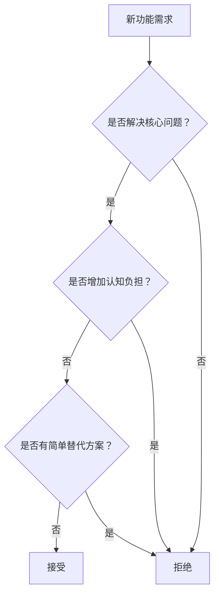

# Chapter 1: 简约即美 - Excalidraw 的核心设计哲学

> "简约不是缺少什么，而是找到真正重要的东西。" - 约翰·马里奇

---

## 🎨 引子：一个令人深思的现象

### 设计界的"悖论"

在这个功能过载的时代，我们看到一个有趣的现象：

**功能越复杂的产品，用户满意度反而越低**

- 🔴 **Photoshop**：数百个功能，但大多数用户只使用 10%
- 🔴 **Office Word**：工具栏密密麻麻，用户却经常找不到需要的功能
- 🔴 **传统 CAD 软件**：专业强大，但学习曲线陡峭

**而 Excalidraw 这样的"简单"工具却获得了巨大成功**

- 🟢 **功能极简**：只有最基础的绘图工具
- 🟢 **学习成本低**：几分钟就能上手
- 🟢 **用户粘性高**：用户愿意持续使用

### 核心问题：为什么简约设计更有力量？

这背后体现的是什么样的设计哲学？Excalidraw 的简约选择给我们什么启发？

---

## 🧠 核心设计哲学：认知负担最小化

### 1. 人类认知的局限性

#### 认知心理学的发现

人类的认知资源是有限的，这是 Excalidraw 设计哲学的科学基础：

**认知负担理论（Cognitive Load Theory）告诉我们：**
- 人类工作记忆只能同时处理 7±2 个信息单元
- 选择过多会导致"选择悖论"（Choice Paradox）
- 认知负担过重会严重影响创造力和决策质量

#### Excalidraw 的设计应用

**设计决策：工具栏只显示 10 个核心工具**

```
传统画板工具：
[选择][矩形][圆形][线条][文本][图片][层级][对齐][分布][旋转][翻转][样式][滤镜][动画]...
认知负担：高 ❌

Excalidraw 工具栏：
[选择][矩形][菱形][圆形][箭头][线条][手绘][文本][图片][橡皮擦]
认知负担：低 ✅
```

**设计哲学体现：**
- 每个工具都有明确唯一的用途
- 工具数量控制在认知舒适区内
- 避免功能重叠带来的选择困扰

### 2. 手绘风格的深层哲学意义

#### 为什么选择"不完美"？

**传统设计思路：** 追求像素级完美，线条笔直，颜色精准
**Excalidraw 哲学：** 拥抱"不完美"，让手绘感成为特色

#### 手绘风格的心理学价值

**降低心理门槛的设计策略：**

1. **"草稿心态"的激发**
   ```
   精美图形 → 用户心理："我不能破坏这个完美"
   手绘风格 → 用户心理："这只是草稿，可以随意修改"
   ```

2. **创造性思维的释放**
   - 研究表明：过于精美的模板会抑制创新思维
   - 手绘风格暗示"这还可以改进"
   - 鼓励用户专注于**内容表达**而非**视觉完美**

3. **协作友好的视觉语言**
   ```
   精确线条 → "这是最终版本，不要动"
   手绘线条 → "这是讨论稿，欢迎修改"
   ```

#### 技术实现服务于哲学理念

**RoughJS 的选择不是技术决策，而是哲学表达：**

```javascript
// Excalidraw 的粗糙度设计（源码：packages/common/src/constants.ts:436-440）
export const ROUGHNESS = {
  architect: 0,  // 建筑师模式：完全光滑，无手绘感
  artist: 1,     // 艺术家模式（默认）：适度的手绘感，平衡专业与亲和
  cartoonist: 2, // 漫画家模式：明显的手绘感，强调随意和创意
} as const;

// 实际渲染时，RoughJS 将这些值应用到绘制参数
// 默认元素使用 roughness: 1（artist），既有手绘风格又保持可读性
// Frame 使用 roughness: 0，确保辅助元素不抢镜
```

**设计智慧：技术选择必须服务于用户心理需求，而非炫耀技术能力**

**三级粗糙度的设计哲学：**
1. **architect (0)**: 用于辅助元素（如 Frame 边框），不干扰主内容
2. **artist (1)**: 默认值，最常用，在手绘感和专业性之间取得平衡
3. **cartoonist (2)**: 强调创意表达，适合头脑风暴和快速草图

### 3. 功能约束的创新价值

#### "做减法"的设计艺术

**Excalidraw 不支持的功能及其哲学原因：**

| 常见功能 | Excalidraw 选择 | 设计哲学 |
|---------|------------------|----------|
| **复杂图层面板** | ⚠️ 简化支持 | 支持 z-index 层级排序（前移/后移），但不提供复杂的图层面板 UI。通过快捷键（Cmd+[/]）实现基本的层级管理，避免层级思维的复杂性 |
| **精确定位** | ❌ 不支持 | 手绘精神：大概位置比精确像素更符合思维习惯 |
| **复杂样式** | ❌ 极简支持 | 减少样式选择的认知负担，专注内容创作 |
| **高级动画** | ❌ 不支持 | 静态表达的清晰性胜过动态效果的炫酷 |
| **模板库** | ❌ 不支持 | 白纸开始更能激发原创思维 |

#### 约束激发创造力

**设计心理学原理：适度约束能够激发创造力**

**案例分析：俳句的启发**
```
俳句：严格的 5-7-5 音节限制
结果：激发了无数经典作品

Excalidraw：严格的功能限制
结果：用户发现了创新的使用方式
```

**用户创新实例：**
- 用基础形状组合复杂图形
- 用箭头元素创建流程图
- 用手绘线条表达情感

#### 设计启发：约束是创新的朋友

**在产品设计中的应用：**
1. **有意识地设置功能边界**
2. **让用户在约束中发挥创造力**
3. **简单工具的组合胜过复杂工具的堆砌**

---

## 🎯 简约设计的核心原则

### 原则1：单一职责原则

**每个工具只做一件事，但做到最好**

```
❌ 错误设计：万能工具
一个工具包含：选择、移动、缩放、旋转、复制...
结果：功能混乱，用户困惑

✅ 正确设计：专用工具
选择工具：只负责选择
移动通过拖拽自然实现
缩放通过句柄直观操作
```

### 原则2：渐进式复杂度

**基础操作要极简，高级功能要隐藏**

```
层次1：基础工具一目了然
层次2：右键菜单提供更多选项
层次3：快捷键满足高级用户需求
```

### 原则3：直觉优于学习

**用户不应该需要学习工具，工具应该理解用户**

**设计对比：**
```
传统CAD：需要记住命令
Excalidraw：操作符合直觉

画矩形：
传统：输入"RECT"命令 → 输入坐标 → 确认
Excalidraw：选择矩形工具 → 拖拽完成
```

### 原则4：视觉层次的清晰

**重要的显眼，次要的收起，不重要的去掉**

**信息架构优先级：**
```
P0：核心工具（始终可见）
P1：常用功能（右键菜单）
P2：设置选项（设置面板）
P3：高级功能（快捷键）
```

---

## 💡 简约设计的实现策略

### 策略1：功能减法的系统方法

#### 功能评估框架

**每增加一个功能都要回答的问题：**

1. **核心价值问题**："这个功能是否直接服务于用户的核心需求？"
2. **认知负担问题**："这个功能是否增加了用户的学习成本？"
3. **维护成本问题**："这个功能是否值得长期维护和支持？"
4. **替代方案问题**："用户能否用现有功能组合实现相同目标？"

#### Excalidraw 的实际应用

**功能取舍的具体案例：**

```markdown
要不要支持复杂图层面板？

✅ 核心价值：可以，支持复杂图形组织
❌ 认知负担：增加层级管理的复杂性
❌ 维护成本：需要复杂的UI和逻辑
✅ 替代方案：基础的 z-index 排序（前移/后移）+ 群组功能

结论：支持基础的层级排序（sendBackward, bringForward, sendToBack, bringToFront），
     但不提供复杂的图层面板 UI，用简化的快捷键操作 + 群组功能实现
```

### 策略2：交互简化的设计方法

#### 减少操作步骤

**传统流程 vs Excalidraw 流程：**

```
创建并编辑文本：

传统软件：
1. 选择文本工具
2. 点击画布确定位置
3. 输入文本内容
4. 选择文本样式
5. 调整位置和大小

Excalidraw：
1. 选择文本工具
2. 点击画布直接输入
3. 完成
（样式使用合理默认值，位置支持拖拽调整）
```

#### 合并相关操作

**设计思想：让相关操作在同一个上下文中完成**

```
选择元素后：
- 移动：直接拖拽
- 缩放：句柄操作
- 复制：Ctrl+拖拽
- 删除：Delete键

无需切换工具，一个上下文解决所有需求
```

### 策略3：默认选择的智慧

#### 聪明的默认值

**减少配置，增加可用性：**

```
颜色默认值（源码：packages/common/src/constants.ts:458-466）：
- 黑色描边(#1e1e1e)：符合手绘习惯（COLOR_PALETTE.black）
- 透明填充(transparent)：避免遮挡其他元素（COLOR_PALETTE.transparent）
- 描边粗细为2：平衡清晰度和美观（strokeWidth: 2）
- 填充样式为solid：简单直接（fillStyle: "solid"）
- 粗糙度为1(artist)：适度的手绘感（roughness: ROUGHNESS.artist）
- 不透明度100%：默认完全可见（opacity: 100）

字体默认值（源码：packages/common/src/constants.ts:227-228）：
- Excalifont手绘字体：专为手绘风格设计的自定义字体（DEFAULT_FONT_FAMILY: FONT_FAMILY.Excalifont）
- 字号20px：可读性良好（DEFAULT_FONT_SIZE: 20）
- 左对齐：符合阅读习惯（DEFAULT_TEXT_ALIGN: "left"）
- 顶部对齐：符合自然排版（DEFAULT_VERTICAL_ALIGN: "top"）
```

#### 上下文智能

**根据用户行为智能调整默认行为：**

```
智能行为示例（源码：packages/excalidraw/components/App.tsx:5492-5680）：

1. 连续创建同类型元素：保持当前工具激活状态

2. 双击(handleCanvasDoubleClick)上下文智能：
   - 双击空白画布 → 在点击位置创建文本元素（startTextEditing）
   - 双击容器(container) → 在容器中心创建绑定文本
   - 双击线条/箭头 → 进入线条编辑模式（actionToggleLinearEditor）
   - 双击图片元素 → 进入图片裁剪模式（startImageCropping）
   - 双击组内元素 → 进入组编辑模式，选择该元素
   - 双击嵌入元素(iframe/embeddable) → 激活嵌入内容

3. 拖拽时按住修饰键的智能行为：
   - 按住 Shift：保持宽高比/角度约束（SHIFT_LOCKING_ANGLE: Math.PI/12）
   - 按住 Ctrl/Cmd：创建副本而非移动
   - 按住 Alt：从中心点缩放

4. 多元素绘制模式（multiElement）：
   - 创建线条/箭头时保持工具激活
   - 支持连续添加控制点
   - 双击或按 Enter 完成绘制
```

---

## 🔍 设计哲学的深层思考

### 思考1：简约与功能缺失的边界

#### 哲学辨析

**简约不等于功能缺失，而是价值聚焦**

```
功能缺失：用户想要的功能做不了
简约设计：用户核心需求都能高效完成

判断标准：
- 用户是否能完成核心任务？✅
- 用户是否感到受限？❌
- 用户是否愿意推荐？✅
```

#### 设计边界的把握

**在什么情况下需要增加功能？**

1. **核心用户工作流程被阻断**
2. **大量用户反馈同一需求**
3. **竞争产品形成明显优势**
4. **技术条件允许无缝集成**

### 思考2：简约设计的商业价值

#### 开发成本的优化

```
复杂产品：
- 开发周期：长
- 维护成本：高
- Bug 风险：高
- 团队协作：复杂

简约产品：
- 开发周期：短
- 维护成本：低
- Bug 风险：低
- 团队协作：简单
```

#### 用户价值的最大化

**简约设计的商业回报：**

1. **降低获客成本**：易用性提高转化率
2. **提高用户留存**：学习成本低，使用门槛低
3. **增强口碑传播**：用户愿意推荐简单易用的产品
4. **减少支持成本**：问题少，支持需求少

### 思考3：团队文化与简约设计

#### 设计文化的建立

**如何在团队中建立简约设计文化：**

1. **价值观统一**：全团队理解"少即是多"的哲学
2. **决策框架**：建立功能增减的标准流程
3. **用户导向**：所有决策都回到用户价值
4. **持续优化**：定期审视和简化现有功能

#### 抵御功能膨胀

**功能膨胀的常见原因及对策：**

```
原因1：客户定制化需求
对策：区分核心需求和个性化需求

原因2：竞品功能对比
对策：聚焦自身价值主张，不盲从

原因3：团队技术炫技
对策：技术选择服务于用户价值

原因4：缺乏设计约束
对策：建立功能评估和审核机制
```

---

## 🚀 设计启发与应用指导

### 启发1：从用户角度重新审视产品

#### 自我检查清单

**对于产品经理/设计师：**
- [ ] 我的产品是否有用户学不会的功能？
- [ ] 用户是否经常找不到需要的功能？
- [ ] 新用户能否在 5 分钟内完成核心操作？
- [ ] 我是否因为技术可行就增加了功能？

**对于开发者：**
- [ ] 我的代码架构是否追求了不必要的复杂度？
- [ ] 用户界面是否直观反映了底层逻辑？
- [ ] 技术选择是否优先考虑了用户体验？
- [ ] 性能优化是否让用户感受到价值？

### 启发2：建立功能决策的价值框架

#### 决策模型



#### 实践工具

**功能评估打分表：**

| 评估维度 | 权重 | 评分(1-5) | 加权得分 |
|---------|------|----------|----------|
| 解决核心痛点 | 40% | _ | _ |
| 使用频率预期 | 25% | _ | _ |
| 实现复杂度 | 20% | _ | _ |
| 维护成本 | 15% | _ | _ |
| **总分** | 100% | - | _ |

**决策标准：总分 > 3.5 分才考虑实现**

### 启发3：简约设计的渐进式实施

#### 现有产品的简约改造

**第一步：功能审计**
1. 列出所有功能特性
2. 分析每个功能的使用数据
3. 识别低频、重复、复杂功能

**第二步：分层简化**
1. 隐藏低频功能到高级菜单
2. 合并重复功能
3. 简化复杂功能的操作流程

**第三步：用户验证**
1. A/B 测试简化方案
2. 收集用户反馈
3. 持续迭代优化

#### 新产品的简约起步

**MVP 设计原则：**
1. **确定单一核心价值**
2. **只实现核心用户路径**
3. **用最简单的方式实现**
4. **预留扩展空间但不预设功能**

---

## 🎭 章节总结：简约设计的智慧

### 核心设计哲学的本质

**Excalidraw 成功的根本原因不是技术优秀，而是设计哲学深刻：**

1. **认知友好**：尊重人类认知局限，减少心理负担
2. **价值聚焦**：专注核心需求，拒绝功能膨胀
3. **体验优先**：技术选择服务于用户体验
4. **约束创新**：用限制激发用户和开发者的创造力

### 可复用的设计原则

**适用于任何产品设计的核心原则：**

1. **做减法胜过做加法**：每个功能都要证明自己的价值
2. **直觉胜过学习**：符合用户心智模型的设计最有效
3. **约束激发创造**：适当限制能带来意想不到的创新
4. **默认值的智慧**：聪明的默认选择减少用户决策负担

### 设计思考的方法论

**面临设计选择时的思考框架：**

1. **用户价值导向**：这个选择对用户有什么价值？
2. **认知成本评估**：这会增加多少学习和使用成本？
3. **长期维护考虑**：我们能长期支持这个选择吗？
4. **简化替代探索**：有没有更简单的方式达成目标？

---

## 🤔 思考与讨论

### 思考题

1. **价值观思考**：在你的工作中，是否也存在"功能越多越好"的误区？
2. **设计应用**：如何在你负责的产品中应用"认知负担最小化"原则？
3. **边界把握**：如何判断一个功能是"必需的简化"还是"过度的删减"？
4. **团队文化**：如何说服团队接受"做减法"的设计理念？

### 实践练习

**练习1：产品功能审计**
- 选择一个你熟悉的产品
- 列出其所有功能特性
- 用 Excalidraw 的简约原则评估每个功能
- 提出简化建议

**练习2：简约设计方案**
- 针对一个复杂的工作流程
- 设计一个 Excalidraw 风格的简约解决方案
- 对比分析两种方案的优劣

---

## 👆 下一章预告

**Chapter 2: 协作优先 - 产品价值观的设计体现**

我们将探讨：
- 为什么实时协作比功能丰富更有价值？
- 开源策略如何体现在产品设计中？
- 如何设计让协作变得自然的用户体验？
- 数据主权理念如何转化为设计决策？

---

> 💡 **记住**：伟大的设计不是添加更多功能，而是让用户忘记产品的存在，专注于自己想要表达的内容。
>
> **简约不是缺少什么，而是找到真正重要的东西。**