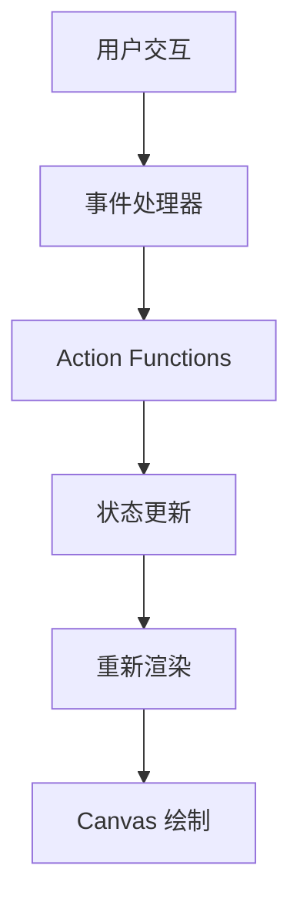

# Chapter 2.1: Excalidraw 项目结构分析

## 概述

在掌握了 Canvas 基础知识后，现在我们开始深入分析 Excalidraw 项目的整体架构。理解项目结构是提取最小化核心的第一步，也是后续开发工作的基础。

## 项目架构概览

Excalidraw 采用 **Monorepo** 架构，使用 Yarn Workspaces 管理多个相关包：

```
excalidraw/
├── packages/
│   ├── excalidraw/           # 核心 React 组件库
│   ├── common/               # 通用工具和类型定义
│   ├── element/              # 元素相关逻辑
│   ├── math/                 # 数学计算工具
│   └── utils/                # 实用工具函数
├── excalidraw-app/           # 完整的 Web 应用
├── examples/                 # 集成示例
└── dev-guide/                # 开发文档（我们正在创建的）
```

## 核心包分析

### 1. @excalidraw/excalidraw 包

这是最核心的包，包含了所有主要功能：

```typescript
// packages/excalidraw/index.ts
export { Excalidraw } from "./components/Excalidraw";
export { getSceneVersion } from "./element";
export { serializeAsJSON, loadFromBlob } from "./data";
export { exportToCanvas, exportToBlob } from "./scene/export";
```

#### 主要目录结构：

```
packages/excalidraw/
├── components/
│   ├── Excalidraw.tsx        # 主组件入口
│   ├── App.tsx               # 应用主逻辑
│   └── ...                   # 其他UI组件
├── actions/                  # 用户操作处理
├── element/                  # 元素定义和操作
├── scene/                    # 场景管理
├── renderer/                 # 渲染器
├── utils/                    # 工具函数
└── types.ts                  # TypeScript 类型定义
```

### 2. @excalidraw/element 包

专门处理元素相关的逻辑：

```typescript
// packages/element/index.ts
export { newElement } from "./newElement";
export { duplicateElement } from "./duplicateElement";
export { isTextElement, isLinearElement } from "./typeChecks";
export { getElementAbsoluteCoords } from "./bounds";
```

### 3. @excalidraw/math 包

数学计算相关功能：

```typescript
// packages/math/index.ts
export { rotate, rotatePoint } from "./math";
export { getDistance, getDistanceBetweenPoints } from "./geometry";
export { isPointInPolygon } from "./collision";
```

### 4. @excalidraw/utils 包

通用工具函数：

```typescript
// packages/utils/index.ts
export { debounce, throttle } from "./timing";
export { generateId } from "./id";
export { clamp, round } from "./number";
```

## 关键文件深度分析

### 主入口：Excalidraw.tsx

```typescript
// packages/excalidraw/components/Excalidraw.tsx
import React, { forwardRef, useImperativeHandle } from "react";
import { App } from "./App";
import { ExcalidrawAPIRefValue, ExcalidrawProps } from "../types";

const Excalidraw = forwardRef<ExcalidrawAPIRefValue, ExcalidrawProps>(
  (props, ref) => {
    const appRef = useRef<ExcalidrawAPIRefValue>(null);

    useImperativeHandle(
      ref,
      () => ({
        // 暴露的 API 方法
        updateScene: appRef.current?.updateScene || (() => {}),
        getSceneElements: appRef.current?.getSceneElements || (() => []),
        // ... 更多 API
      }),
      []
    );

    return <App ref={appRef} {...props} />;
  }
);
```

### 应用核心：App.tsx

App.tsx 是整个应用的核心逻辑所在：

```typescript
// packages/excalidraw/components/App.tsx
export const App = forwardRef<ExcalidrawAPIRefValue, AppProps>(
  (props, ref) => {
    // 状态管理
    const [appState, setAppState] = useState<AppState>(defaultAppState);
    const [elements, setElements] = useState<readonly ExcalidrawElement[]>([]);

    // Canvas 引用
    const canvasRef = useRef<HTMLCanvasElement>(null);
    const interactiveCanvasRef = useRef<HTMLCanvasElement>(null);

    // 渲染循环
    useEffect(() => {
      const render = () => {
        renderScene({
          canvas: canvasRef.current,
          appState,
          elements,
          // ... 其他参数
        });
      };

      render();
    }, [appState, elements]);

    // 事件处理
    const handlePointerDown = (event: React.PointerEvent) => {
      // 处理鼠标/触摸按下事件
    };

    return (
      <div className="excalidraw">
        <canvas
          ref={canvasRef}
          onPointerDown={handlePointerDown}
          // ... 其他事件处理器
        />
      </div>
    );
  }
);
```

## 数据流架构

### 单向数据流

Excalidraw 遵循 React 的单向数据流模式：



### 状态管理结构

```typescript
// 应用状态
interface AppState {
  // 视口状态
  zoom: Zoom;
  scrollX: number;
  scrollY: number;

  // 编辑状态
  editingElement: ExcalidrawElement | null;
  selectedElementIds: Record<string, true>;

  // 工具状态
  activeTool: ToolType;

  // UI 状态
  isLoading: boolean;
  errorMessage: string | null;
}

// 元素数组
type Elements = readonly ExcalidrawElement[];
```

## 渲染架构

### 双 Canvas 架构

Excalidraw 使用双 Canvas 系统优化性能：

```typescript
// 静态 Canvas - 渲染稳定元素
const staticCanvas = canvasRef.current;

// 交互 Canvas - 渲染正在编辑的元素和UI
const interactiveCanvas = interactiveCanvasRef.current;
```

### 渲染流程

```typescript
// packages/excalidraw/scene/render.ts
export const renderScene = (renderConfig: RenderConfig) => {
  const { canvas, appState, elements } = renderConfig;

  // 1. 清除画布
  clearCanvas(canvas);

  // 2. 设置视口变换
  applyViewportTransform(canvas, appState);

  // 3. 渲染元素
  elements.forEach(element => {
    renderElement(canvas, element, appState);
  });

  // 4. 渲染UI覆盖层
  renderUI(canvas, appState);
};
```

## 事件系统架构

### 事件处理管道

```typescript
// 事件流：原始事件 → 标准化 → 处理 → 状态更新
const eventPipeline = {
  1: "原始浏览器事件",
  2: "坐标转换和标准化",
  3: "命中测试和目标识别",
  4: "具体操作处理",
  5: "状态更新和重渲染"
};
```

### 坐标系统

Excalidraw 维护多个坐标系统：

```typescript
// 屏幕坐标 (Screen Coordinates)
interface ScreenCoords {
  x: number; // 相对于 viewport
  y: number;
}

// 场景坐标 (Scene Coordinates)
interface SceneCoords {
  x: number; // 经过缩放和平移的世界坐标
  y: number;
}

// 坐标转换函数
const screenToScene = (screenCoords: ScreenCoords, appState: AppState): SceneCoords => {
  return {
    x: (screenCoords.x - appState.scrollX) / appState.zoom.value,
    y: (screenCoords.y - appState.scrollY) / appState.zoom.value,
  };
};
```

## Action 系统

### Action 模式

Excalidraw 使用 Action 模式处理用户操作：

```typescript
// packages/excalidraw/actions/types.ts
export interface Action {
  name: string;
  perform: (
    elements: readonly ExcalidrawElement[],
    appState: AppState,
    formData: any
  ) => {
    elements?: readonly ExcalidrawElement[];
    appState?: Partial<AppState>;
    commitToHistory?: boolean;
  };
}

// 示例：删除元素 Action
export const actionDeleteSelected: Action = {
  name: "deleteSelected",
  perform: (elements, appState) => {
    const selectedIds = appState.selectedElementIds;
    return {
      elements: elements.filter(el => !selectedIds[el.id]),
      appState: { selectedElementIds: {} },
      commitToHistory: true,
    };
  },
};
```

## 插件化架构

### 扩展点设计

```typescript
// 工具扩展点
interface ToolExtension {
  name: string;
  icon: React.ComponentType;
  handlePointerDown: (event: PointerEvent) => void;
  handlePointerMove: (event: PointerEvent) => void;
  handlePointerUp: (event: PointerEvent) => void;
}

// 元素类型扩展点
interface ElementTypeExtension {
  type: string;
  render: (element: ExcalidrawElement, renderConfig: RenderConfig) => void;
  hitTest: (element: ExcalidrawElement, point: Point) => boolean;
}
```

## 性能优化架构

### 渲染优化策略

```typescript
// 1. 脏矩形检测
const getDirtyElements = (elements: Elements, lastElements: Elements) => {
  // 找出需要重绘的元素
};

// 2. 视口裁剪
const getElementsInViewport = (elements: Elements, viewport: Viewport) => {
  // 只渲染可见元素
};

// 3. 元素缓存
const elementCache = new Map<string, ImageData>();
```

## 实际源码分析练习

让我们分析一个具体的源码文件来深入理解架构：

### 分析 element/newElement.ts

```bash
# 在项目根目录执行
find . -name "newElement.ts" -type f
```

这个文件展示了 Excalidraw 如何创建新元素：

```typescript
// packages/element/newElement.ts
export const newElement = (
  opts: {
    type: ExcalidrawElement["type"];
    x?: number;
    y?: number;
    width?: number;
    height?: number;
    // ... 更多属性
  }
): ExcalidrawElement => {
  const base: Omit<ExcalidrawElement, "type"> = {
    id: randomId(),
    x: opts.x ?? 0,
    y: opts.y ?? 0,
    width: opts.width ?? 0,
    height: opts.height ?? 0,
    angle: opts.angle ?? 0,
    strokeColor: opts.strokeColor ?? "#000000",
    backgroundColor: opts.backgroundColor ?? "transparent",
    // ... 更多默认值
    seed: opts.seed ?? 1,
    groupIds: opts.groupIds ?? [],
    roundness: null,
    isDeleted: false,
    link: null,
    locked: false,
  };

  return {
    ...base,
    type: opts.type,
  } as ExcalidrawElement;
};
```

## 架构设计原则

### 1. 关注点分离

- **渲染逻辑**：独立的 renderer 模块
- **业务逻辑**：actions 和 element 模块
- **状态管理**：集中在 App 组件
- **工具函数**：分离到 utils 包

### 2. 可扩展性

- 插件化的工具系统
- 可扩展的元素类型
- 模块化的渲染器

### 3. 性能优先

- 双 Canvas 架构
- 脏矩形检测
- 增量渲染
- 对象池

## 小结

通过本章的分析，我们了解了：

1. **Monorepo 架构**：如何组织大型前端项目
2. **模块化设计**：功能如何合理分层
3. **数据流管理**：单向数据流的实现
4. **渲染架构**：双 Canvas 系统的设计思路
5. **事件系统**：复杂交互的处理方式
6. **性能策略**：大量元素的优化方案

在下一章中，我们将深入分析核心模块的依赖关系，为提取最小化核心做准备。

## 实践任务

1. **项目结构探索**：
   ```bash
   # 分析项目依赖
   cat package.json | grep -A 20 "dependencies"

   # 查看各包大小
   du -sh packages/*
   ```

2. **源码阅读**：
   - 阅读 `packages/excalidraw/components/App.tsx`
   - 理解主要的事件处理函数
   - 分析状态更新逻辑

3. **架构图绘制**：
   - 画出 Excalidraw 的模块依赖图
   - 标识出核心模块和可选模块
   - 思考最小化核心需要哪些模块

下一章我们将分析这些模块之间的具体依赖关系。