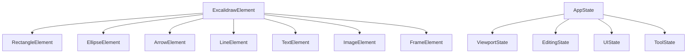

# Chapter 2.3: 数据结构与类型定义分析

## 概述

Excalidraw 使用 TypeScript 构建，拥有完整的类型系统。理解其数据结构和类型定义是掌握架构的关键，也是构建类型安全的最小核心的基础。本章将深入分析核心数据结构的设计思路和实现细节。

## 核心数据结构概览

### 类型定义层次结构



## 基础类型定义

### 基础几何类型

```typescript
// packages/excalidraw/types.ts

// 点坐标
export type Point = readonly [number, number];

// 向量
export interface Vector {
  x: number;
  y: number;
}

// 矩形边界
export interface Bounds {
  minX: number;
  minY: number;
  maxX: number;
  maxY: number;
  width: number;
  height: number;
}

// 变换矩阵
export type TransformMatrix = readonly [
  number, number, number,  // a, c, e
  number, number, number   // b, d, f
];

// 缩放信息
export interface Zoom {
  value: number;
  translation: {
    x: number;
    y: number;
  };
}
```

## ExcalidrawElement 核心类型

### 基础元素接口

```typescript
// packages/element/src/types.ts - 实际源码定义
type _ExcalidrawElementBase = Readonly<{
  id: string;              // 唯一标识符（使用 nanoid 生成）
  x: number;               // X 坐标（场景坐标系）
  y: number;               // Y 坐标（场景坐标系）
  width: number;           // 宽度
  height: number;          // 高度
  angle: Radians;          // 旋转角度（弧度类型，品牌类型确保类型安全）
  strokeColor: string;     // 边框颜色（十六进制或颜色名）
  backgroundColor: string; // 填充颜色
  fillStyle: FillStyle;    // 填充样式："hachure" | "cross-hatch" | "solid" | "zigzag"
  strokeWidth: number;     // 边框宽度（像素）
  strokeStyle: StrokeStyle; // 边框样式："solid" | "dashed" | "dotted"
  roughness: number;       // 手绘粗糙度（0-2，用于 roughjs）
  opacity: number;         // 透明度（0-100）
  seed: number;            // 随机种子（用于 roughjs 确定性渲染）
  version: number;         // 版本号（递增，用于协作冲突解决）
  versionNonce: number;    // 版本随机数（用于确定性协调，即使 version 相同）
  isDeleted: boolean;      // 删除标记（软删除，用于协作）
  link: string | null;     // 链接地址（可点击跳转）
  locked: boolean;         // 锁定状态（防止编辑）
  groupIds: readonly GroupId[]; // 所属组ID数组（从深到浅排序）
  frameId: string | null;  // 所属框架ID（frame 或 magicframe）
  /**
   * ⚠️ 关键字段：分数索引（fractional-indexing）
   * 用于多人协作时的元素排序，避免索引冲突
   * 格式如 "a0", "a1", "a0V" 等，可以在任意两个索引间插入新值
   * 可能为 null（新创建的元素尚未分配索引）
   * 依赖库: fractional-indexing@3.2.0
   */
  index: FractionalIndex | null;
  roundness: {             // 圆角设置
    type: RoundnessType;   // "legacy" | "proportional-radius" | "adaptive-radius"
    value?: number;        // 圆角半径值（可选）
  } | null;
  boundElements: readonly BoundElement[] | null; // 绑定的元素（箭头、文本等）
  updated: number;         // 最后更新时间戳（epoch ms）
  customData?: Record<string, any>; // 自定义数据扩展（可选字段）
}>;
```

### 元素类型系统

```typescript
// ============ 实际的元素类型定义 ============
// 源文件: packages/element/src/types.ts (2025年1月，最新源码验证)

// 选择框元素（用于多选操作）
export type ExcalidrawSelectionElement = _ExcalidrawElementBase & {
  type: "selection";
};

// 基础几何元素
export type ExcalidrawRectangleElement = _ExcalidrawElementBase & {
  type: "rectangle";
};

export type ExcalidrawEllipseElement = _ExcalidrawElementBase & {
  type: "ellipse";
};

export type ExcalidrawDiamondElement = _ExcalidrawElementBase & {
  type: "diamond";
};

// 通用几何元素联合类型（这些元素没有额外属性）
export type ExcalidrawGenericElement =
  | ExcalidrawSelectionElement
  | ExcalidrawRectangleElement
  | ExcalidrawDiamondElement
  | ExcalidrawEllipseElement;

// 文本元素（完整字段定义）
export type ExcalidrawTextElement = _ExcalidrawElementBase & {
  type: "text";
  fontSize: number;
  fontFamily: FontFamilyValues;
  text: string;
  textAlign: TextAlign;
  verticalAlign: VerticalAlign;
  containerId: ExcalidrawGenericElement["id"] | null;  // 注意：只能包含在通用几何元素中
  originalText: string;
  /**
   * If `true` the width will fit the text. If `false`, the text will
   * wrap to fit the width.
   * @default true
   */
  autoResize: boolean;
  /**
   * Unitless line height (aligned to W3C). To get line height in px, multiply
   * with font size (using `getLineHeightInPx` helper).
   */
  lineHeight: number & { _brand: "unitlessLineHeight" };
};

// 线性元素基类（arrow 和 line 的共同父类型）
export type ExcalidrawLinearElement = _ExcalidrawElementBase & {
  type: "line" | "arrow";
  points: readonly LocalPoint[];
  lastCommittedPoint: LocalPoint | null;
  startBinding: PointBinding | null;
  endBinding: PointBinding | null;
  startArrowhead: Arrowhead | null;
  endArrowhead: Arrowhead | null;
};

// ⚠️ 关键字段：线条元素包含 polygon 字段
export type ExcalidrawLineElement = ExcalidrawLinearElement & {
  type: "line";
  polygon: boolean;  // 是否是多边形（闭合路径），注意这是非可选字段！
};

// ⚠️ 关键字段：箭头元素包含 elbowed 字段
export type ExcalidrawArrowElement = ExcalidrawLinearElement & {
  type: "arrow";
  elbowed: boolean;  // 是否是肘形箭头（直角转折，类似流程图连接线），注意这是非可选字段！
};

// 自由绘制元素
export type ExcalidrawFreeDrawElement = _ExcalidrawElementBase & {
  type: "freedraw";
  points: readonly LocalPoint[];
  pressures: readonly number[];
  simulatePressure: boolean;
  lastCommittedPoint: LocalPoint | null;
};

// 图像裁剪信息类型
export type ImageCrop = {
  x: number;
  y: number;
  width: number;
  height: number;
  naturalWidth: number;
  naturalHeight: number;
};

// ⚠️ 关键字段：图像元素包含 scale 和 crop 字段
export type ExcalidrawImageElement = _ExcalidrawElementBase & {
  type: "image";
  fileId: FileId | null;
  /** whether respective file is persisted */
  status: "pending" | "saved" | "error";
  /** X and Y scale factors <-1, 1>, used for image axis flipping */
  scale: [number, number];  // X 和 Y 缩放因子，用于图像翻转
  /** whether an element is cropped */
  crop: ImageCrop | null;   // 裁剪信息，可以为 null
};

// 框架元素
export type ExcalidrawFrameElement = _ExcalidrawElementBase & {
  type: "frame";
  name: string | null;
};

// 魔法框架元素（AI生成）
export type ExcalidrawMagicFrameElement = _ExcalidrawElementBase & {
  type: "magicframe";
  name: string | null;
};

// 框架类元素联合类型
export type ExcalidrawFrameLikeElement =
  | ExcalidrawFrameElement
  | ExcalidrawMagicFrameElement;

// 嵌入式元素
export type ExcalidrawEmbeddableElement = _ExcalidrawElementBase & {
  type: "embeddable";
};

// AI 生成数据类型
export type MagicGenerationData =
  | { status: "pending" }
  | { status: "done"; html: string }
  | { status: "error"; message?: string; code: string };

// iframe 元素
export type ExcalidrawIframeElement = _ExcalidrawElementBase & {
  type: "iframe";
  customData?: { generationData?: MagicGenerationData };
};

// iframe 类元素联合类型
export type ExcalidrawIframeLikeElement =
  | ExcalidrawIframeElement
  | ExcalidrawEmbeddableElement;

// ============ 主要联合类型 ============
/**
 * ExcalidrawElement should be JSON serializable and (eventually) contain
 * no computed data. The list of all ExcalidrawElements should be shareable
 * between peers and contain no state local to the peer.
 *
 * 源自: packages/element/src/types.ts:206
 */
export type ExcalidrawElement =
  | ExcalidrawGenericElement
  | ExcalidrawTextElement
  | ExcalidrawLinearElement      // 基类，包含 line 和 arrow
  | ExcalidrawArrowElement       // 具体的 arrow 类型（包含 elbowed 字段）
  | ExcalidrawFreeDrawElement
  | ExcalidrawImageElement
  | ExcalidrawFrameElement
  | ExcalidrawMagicFrameElement
  | ExcalidrawIframeElement
  | ExcalidrawEmbeddableElement;

// 排除选择框元素的类型
export type ExcalidrawNonSelectionElement = Exclude<
  ExcalidrawElement,
  ExcalidrawSelectionElement
>;
```

### 样式相关类型

```typescript
// 填充样式
export type FillStyle = "hachure" | "cross-hatch" | "solid" | "zigzag";

// 边框样式
export type StrokeStyle = "solid" | "dashed" | "dotted";

// 字体系列
export type FontFamily = 1 | 2 | 3 | 4; // 分别对应不同字体

// 文本对齐
export type TextAlign = "left" | "center" | "right";
export type VerticalAlign = "top" | "middle" | "bottom";

// 箭头类型
export type Arrowhead = "arrow" | "bar" | "circle" | "circle_outline" | "triangle" | "triangle_outline" | null;

// 圆角类型
export type RoundnessType = "legacy" | "proportional-radius" | "adaptive-radius";
```

## AppState 应用状态类型

### 核心应用状态

```typescript
// packages/excalidraw/types.ts - 实际源码中的 AppState
export interface AppState {
  // UI 控制状态
  contextMenu: {
    items: ContextMenuItems;
    top: number;
    left: number;
  } | null;
  showWelcomeScreen: boolean;
  isLoading: boolean;
  errorMessage: React.ReactNode;

  // 活动元素状态
  activeEmbeddable: {
    element: NonDeletedExcalidrawElement;
    state: "hover" | "active";
  } | null;

  // 元素创建和编辑状态
  newElement: NonDeleted<ExcalidrawNonSelectionElement> | null;
  resizingElement: NonDeletedExcalidrawElement | null;
  multiElement: NonDeleted<ExcalidrawLinearElement> | null;
  selectionElement: NonDeletedExcalidrawElement | null;
  editingTextElement: NonDeletedExcalidrawElement | null;

  // 工具状态（复杂结构）
  activeTool: {
    lastActiveTool: ActiveTool | null;    // 上一个工具
    locked: boolean;                      // 工具锁定
    fromSelection: boolean;               // 从选择工具切换
  } & ActiveTool;

  // 笔输入支持
  penMode: boolean;
  penDetected: boolean;

  // 绑定和交互
  isBindingEnabled: boolean;
  startBoundElement: NonDeleted<ExcalidrawBindableElement> | null;
  suggestedBindings: SuggestedBinding[];
  frameToHighlight: NonDeleted<ExcalidrawFrameLikeElement> | null;

  // 帧渲染配置
  frameRendering: {
    enabled: boolean;
    name: boolean;
    outline: boolean;
    clip: boolean;
  };
  editingFrame: string | null;

  // 选择状态
  selectedElementIds: Readonly<{ [id: string]: true }>;
  hoveredElementIds: Readonly<{ [id: string]: true }>;
  previousSelectedElementIds: { [id: string]: true };
  selectedGroupIds: { [groupId: string]: boolean };
  editingGroupId: GroupId | null;
  selectedElementsAreBeingDragged: boolean;

  // 视口和变换
  zoom: Zoom;
  scrollX: number;
  scrollY: number;
  width: number;
  height: number;
  offsetTop: number;
  offsetLeft: number;

  // 当前绘制属性
  currentItemStrokeColor: string;
  currentItemBackgroundColor: string;
  currentItemFillStyle: ExcalidrawElement["fillStyle"];
  currentItemStrokeWidth: number;
  currentItemStrokeStyle: ExcalidrawElement["strokeStyle"];
  currentItemRoughness: number;
  currentItemOpacity: number;
  currentItemFontFamily: FontFamilyValues;
  currentItemFontSize: number;
  currentItemTextAlign: TextAlign;
  currentItemStartArrowhead: Arrowhead | null;
  currentItemEndArrowhead: Arrowhead | null;
  currentItemRoundness: StrokeRoundness;
  currentItemArrowType: "sharp" | "round" | "elbow";

  // 导出配置
  exportBackground: boolean;
  exportEmbedScene: boolean;
  exportWithDarkMode: boolean;
  exportScale: number;

  // 视图和主题
  viewBackgroundColor: string;
  theme: Theme;
  zenModeEnabled: boolean;
  viewModeEnabled: boolean;
  gridModeEnabled: boolean;
  gridSize: number;
  gridStep: number;

  // UI 弹窗和菜单
  openMenu: "canvas" | "shape" | null;
  openPopup: "canvasBackground" | "elementBackground" | "elementStroke"
             | "fontFamily" | "compactTextProperties" | "compactStrokeStyles"
             | "compactOtherProperties" | "compactArrowProperties" | null;
  openSidebar: { name: SidebarName; tab?: SidebarTabName } | null;
  openDialog: null
    | { name: "imageExport" | "help" | "jsonExport" }
    | { name: "ttd"; tab: "text-to-diagram" | "mermaid" }
    | { name: "commandPalette" }
    | { name: "elementLinkSelector"; sourceElementId: ExcalidrawElement["id"] };

  // 交互状态
  cursorButton: "up" | "down";
  lastPointerDownWith: PointerType;
  isRotating: boolean;
  isResizing: boolean;
  name: string | null;

  // 协作
  collaborators: Map<SocketId, Collaborator>;

  // 其他功能
  toast: { message: string; closable?: boolean; duration?: number } | null;
  elementsToHighlight: NonDeleted<ExcalidrawElement>[] | null;
  shouldCacheIgnoreZoom: boolean;
  scrolledOutside: boolean;
}
```

### 工具类型定义

```typescript
// 工具类型
export const TOOL_TYPE = {
  selection: "selection",
  rectangle: "rectangle",
  ellipse: "ellipse",
  diamond: "diamond",
  arrow: "arrow",
  line: "line",
  freedraw: "freedraw",
  text: "text",
  image: "image",
  eraser: "eraser",
  hand: "hand",
  frame: "frame",
  magicframe: "magicframe",
  embeddable: "embeddable",
  laser: "laser",
} as const;

export type ToolType = typeof TOOL_TYPE[keyof typeof TOOL_TYPE];
```

## 数据结构设计原则

### 1. 不可变性 (Immutability)

```typescript
// 使用 readonly 确保数据不可变性
export type Elements = readonly ExcalidrawElement[];

// 元素更新函数返回新对象
export const mutateElement = (
  element: ExcalidrawElement,
  updates: Partial<ExcalidrawElement>,
  informMutation = true
): ExcalidrawElement => {
  // 返回新对象，不修改原对象
  return {
    ...element,
    ...updates,
    updated: Date.now(),
  };
};
```

### 2. 类型安全性

```typescript
// 使用联合类型确保类型安全
export const isTextElement = (element: ExcalidrawElement): element is ExcalidrawTextElement => {
  return element.type === "text";
};

export const isLinearElement = (element: ExcalidrawElement): element is ExcalidrawLinearElement => {
  return element.type === "arrow" || element.type === "line";
};

// 类型守卫函数
export const isExcalidrawElement = (element: any): element is ExcalidrawElement => {
  return (
    element?.type &&
    typeof element.x === "number" &&
    typeof element.y === "number" &&
    typeof element.width === "number" &&
    typeof element.height === "number"
  );
};
```

### 3. 扩展性设计

```typescript
// 使用泛型支持扩展
export interface ExcalidrawElementBase<T extends ElementType> {
  type: T;
  // ... 通用属性
}

// 支持自定义元素类型
export interface CustomElement extends ExcalidrawElementBase<"custom"> {
  customType: string;
  customData: Record<string, any>;
}

// 元素工厂函数支持扩展
export type ElementFactory<T extends ExcalidrawElement> = (
  opts: Partial<T>
) => T;
```

## 序列化和反序列化

### JSON 序列化

```typescript
// packages/excalidraw/data/json.ts
export interface ExcalidrawDataState {
  type: "excalidraw";
  version: number;
  source: string;
  elements: readonly ExcalidrawElement[];
  appState: Partial<AppState>;
  files?: BinaryFiles;
}

export const serializeAsJSON = (
  elements: readonly ExcalidrawElement[],
  appState: Partial<AppState>,
  files?: BinaryFiles,
  source?: string
): string => {
  const data: ExcalidrawDataState = {
    type: "excalidraw",
    version: EXPORT_DATA_TYPES.excalidraw,
    source: source || "https://excalidraw.com",
    elements: elements,
    appState: cleanAppStateForExport(appState),
    files,
  };

  return JSON.stringify(data, null, 2);
};
```

### 版本兼容性处理

```typescript
// 数据迁移接口
export interface DataMigration {
  version: number;
  migrate: (data: any) => any;
}

// 版本迁移示例
export const migrations: DataMigration[] = [
  {
    version: 2,
    migrate: (data) => {
      // 将旧版本的 strokeSharpness 迁移到 roundness
      return {
        ...data,
        elements: data.elements.map((element: any) => {
          if ("strokeSharpness" in element) {
            const { strokeSharpness, ...rest } = element;
            return {
              ...rest,
              roundness: strokeSharpness === "round" ? { type: "proportional-radius" } : null,
            };
          }
          return element;
        }),
      };
    },
  },
];
```

## 性能优化的数据结构

### 空间分割数据结构

```typescript
// 四叉树用于快速空间查询
export class Quadtree<T extends { x: number; y: number; width: number; height: number }> {
  private bounds: Bounds;
  private maxObjects: number;
  private maxLevels: number;
  private level: number;
  private objects: T[];
  private nodes: Quadtree<T>[];

  constructor(bounds: Bounds, maxObjects = 10, maxLevels = 5, level = 0) {
    this.bounds = bounds;
    this.maxObjects = maxObjects;
    this.maxLevels = maxLevels;
    this.level = level;
    this.objects = [];
    this.nodes = [];
  }

  insert(object: T): void {
    if (this.nodes.length) {
      const index = this.getIndex(object);
      if (index !== -1) {
        this.nodes[index].insert(object);
        return;
      }
    }

    this.objects.push(object);

    if (this.objects.length > this.maxObjects && this.level < this.maxLevels) {
      if (!this.nodes.length) {
        this.split();
      }

      let i = 0;
      while (i < this.objects.length) {
        const index = this.getIndex(this.objects[i]);
        if (index !== -1) {
          this.nodes[index].insert(this.objects.splice(i, 1)[0]);
        } else {
          i++;
        }
      }
    }
  }

  retrieve(bounds: Bounds): T[] {
    const returnObjects: T[] = [...this.objects];

    if (this.nodes.length) {
      const index = this.getIndex(bounds);
      if (index !== -1) {
        returnObjects.push(...this.nodes[index].retrieve(bounds));
      } else {
        this.nodes.forEach(node => {
          returnObjects.push(...node.retrieve(bounds));
        });
      }
    }

    return returnObjects;
  }
}
```

### 缓存优化数据结构

```typescript
// 元素边界缓存
export class ElementBoundsCache {
  private cache = new Map<string, Bounds>();
  private elementVersions = new Map<string, number>();

  getBounds(element: ExcalidrawElement): Bounds {
    const cacheKey = element.id;
    const currentVersion = element.versionNonce;
    const cachedVersion = this.elementVersions.get(cacheKey);

    if (cachedVersion === currentVersion) {
      const cached = this.cache.get(cacheKey);
      if (cached) {
        return cached;
      }
    }

    // 计算边界
    const bounds = this.calculateBounds(element);

    // 更新缓存
    this.cache.set(cacheKey, bounds);
    this.elementVersions.set(cacheKey, currentVersion);

    return bounds;
  }

  private calculateBounds(element: ExcalidrawElement): Bounds {
    // 边界计算逻辑
    return {
      minX: element.x,
      minY: element.y,
      maxX: element.x + element.width,
      maxY: element.y + element.height,
      width: element.width,
      height: element.height,
    };
  }

  invalidate(elementId: string): void {
    this.cache.delete(elementId);
    this.elementVersions.delete(elementId);
  }

  clear(): void {
    this.cache.clear();
    this.elementVersions.clear();
  }
}
```

## 最小化核心数据结构

### 简化的元素类型

```typescript
// 最小化核心所需的元素类型
export interface MinimalElement {
  id: string;
  type: "rectangle" | "ellipse" | "arrow" | "line" | "text";
  x: number;
  y: number;
  width: number;
  height: number;
  strokeColor: string;
  backgroundColor: string;
  strokeWidth: number;
  points?: readonly Point[]; // 仅线性元素需要
  text?: string; // 仅文本元素需要
}

// 简化的应用状态
export interface MinimalAppState {
  zoom: number;
  scrollX: number;
  scrollY: number;
  selectedElementIds: Record<string, true>;
  activeTool: "selection" | "rectangle" | "ellipse" | "arrow" | "line" | "text";
}

// 简化的场景数据
export interface MinimalScene {
  elements: MinimalElement[];
  appState: MinimalAppState;
}
```

### 类型转换工具

```typescript
// 完整类型到最小类型的转换
export const toMinimalElement = (element: ExcalidrawElement): MinimalElement => {
  const base: MinimalElement = {
    id: element.id,
    type: element.type as MinimalElement["type"],
    x: element.x,
    y: element.y,
    width: element.width,
    height: element.height,
    strokeColor: element.strokeColor,
    backgroundColor: element.backgroundColor,
    strokeWidth: element.strokeWidth,
  };

  if (isLinearElement(element)) {
    base.points = element.points;
  }

  if (isTextElement(element)) {
    base.text = element.text;
  }

  return base;
};

// 最小类型到完整类型的转换
export const fromMinimalElement = (minElement: MinimalElement): ExcalidrawElement => {
  const baseProperties = {
    id: minElement.id,
    x: minElement.x,
    y: minElement.y,
    width: minElement.width,
    height: minElement.height,
    angle: 0,
    strokeColor: minElement.strokeColor,
    backgroundColor: minElement.backgroundColor,
    fillStyle: "solid" as const,
    strokeWidth: minElement.strokeWidth,
    strokeStyle: "solid" as const,
    roughness: 1,
    opacity: 100,
    seed: Math.floor(Math.random() * 1000000),
    versionNonce: Math.floor(Math.random() * 1000000),
    isDeleted: false,
    link: null,
    locked: false,
    groupIds: [],
    frameId: null,
    index: "a0" as FractionalIndex,
    roundness: null,
    boundElements: null,
    updated: Date.now(),
  };

  switch (minElement.type) {
    case "rectangle":
      return { ...baseProperties, type: "rectangle" };
    case "ellipse":
      return { ...baseProperties, type: "ellipse" };
    case "arrow":
    case "line":
      return {
        ...baseProperties,
        type: minElement.type,
        points: minElement.points || [[0, 0], [minElement.width, minElement.height]],
        lastCommittedPoint: null,
        startBinding: null,
        endBinding: null,
        startArrowhead: null,
        endArrowhead: minElement.type === "arrow" ? "arrow" : null,
      };
    case "text":
      return {
        ...baseProperties,
        type: "text",
        fontSize: 16,
        fontFamily: 1,
        text: minElement.text || "",
        baseline: 0,
        textAlign: "left",
        verticalAlign: "top",
        containerId: null,
        originalText: minElement.text || "",
        autoResize: true,
        lineHeight: 1.25,
      };
    default:
      throw new Error(`Unknown element type: ${minElement.type}`);
  }
};
```

## 数据验证和错误处理

### 运行时类型检查

```typescript
// 数据验证工具
export class DataValidator {
  static validateElement(element: any): element is ExcalidrawElement {
    if (!element || typeof element !== "object") {
      return false;
    }

    // 检查必需属性
    const requiredProps = ["id", "type", "x", "y", "width", "height"];
    for (const prop of requiredProps) {
      if (!(prop in element)) {
        console.error(`Missing required property: ${prop}`);
        return false;
      }
    }

    // 检查数值属性
    const numericProps = ["x", "y", "width", "height", "angle", "strokeWidth"];
    for (const prop of numericProps) {
      if (prop in element && typeof element[prop] !== "number") {
        console.error(`Property ${prop} must be a number`);
        return false;
      }
    }

    // 检查元素类型
    const validTypes = Object.values(ELEMENT_TYPES);
    if (!validTypes.includes(element.type)) {
      console.error(`Invalid element type: ${element.type}`);
      return false;
    }

    return true;
  }

  static sanitizeElement(element: any): ExcalidrawElement | null {
    if (!this.validateElement(element)) {
      return null;
    }

    // 确保数值范围正确
    return {
      ...element,
      x: Number.isFinite(element.x) ? element.x : 0,
      y: Number.isFinite(element.y) ? element.y : 0,
      width: Math.max(0, Number.isFinite(element.width) ? element.width : 0),
      height: Math.max(0, Number.isFinite(element.height) ? element.height : 0),
      strokeWidth: Math.max(0, Number.isFinite(element.strokeWidth) ? element.strokeWidth : 1),
      opacity: Math.max(0, Math.min(100, element.opacity || 100)),
    };
  }
}
```

## 实践任务

### 1. 类型分析练习

```typescript
// 创建一个工具分析现有数据结构
class TypeAnalyzer {
  analyzeElement(element: ExcalidrawElement) {
    console.log("Element Analysis:");
    console.log("- Type:", element.type);
    console.log("- Required memory:", this.calculateMemoryUsage(element));
    console.log("- Serialized size:", JSON.stringify(element).length);
  }

  private calculateMemoryUsage(element: ExcalidrawElement): number {
    // 简化的内存使用计算
    const baseSize = 200; // 基础对象大小
    const stringSize = (element.id || "").length + (element.strokeColor || "").length;
    const arraySize = (element.groupIds?.length || 0) * 8;

    return baseSize + stringSize + arraySize;
  }
}
```

### 2. 最小化核心实验

```typescript
// 实现一个最小化的 Excalidraw 克隆
class MinimalExcalidrawCore {
  private elements: MinimalElement[] = [];
  private appState: MinimalAppState = {
    zoom: 1,
    scrollX: 0,
    scrollY: 0,
    selectedElementIds: {},
    activeTool: "selection",
  };

  addElement(element: Partial<MinimalElement>): void {
    const newElement: MinimalElement = {
      id: this.generateId(),
      type: "rectangle",
      x: 0,
      y: 0,
      width: 100,
      height: 100,
      strokeColor: "#000000",
      backgroundColor: "transparent",
      strokeWidth: 1,
      ...element,
    };

    this.elements.push(newElement);
  }

  serialize(): string {
    return JSON.stringify({
      elements: this.elements,
      appState: this.appState,
    });
  }

  deserialize(data: string): void {
    const parsed = JSON.parse(data);
    this.elements = parsed.elements || [];
    this.appState = { ...this.appState, ...parsed.appState };
  }

  private generateId(): string {
    return Date.now().toString(36) + Math.random().toString(36).substr(2);
  }
}
```

## 小结

通过本章分析，我们深入了解了：

1. **类型系统设计**：完整的 TypeScript 类型定义
2. **数据结构原则**：不可变性、类型安全性、扩展性
3. **性能优化**：空间分割、缓存机制
4. **最小化策略**：简化的数据结构设计
5. **数据验证**：运行时类型检查和错误处理

下一章我们将分析元素系统的具体实现，了解如何操作和管理这些数据结构。