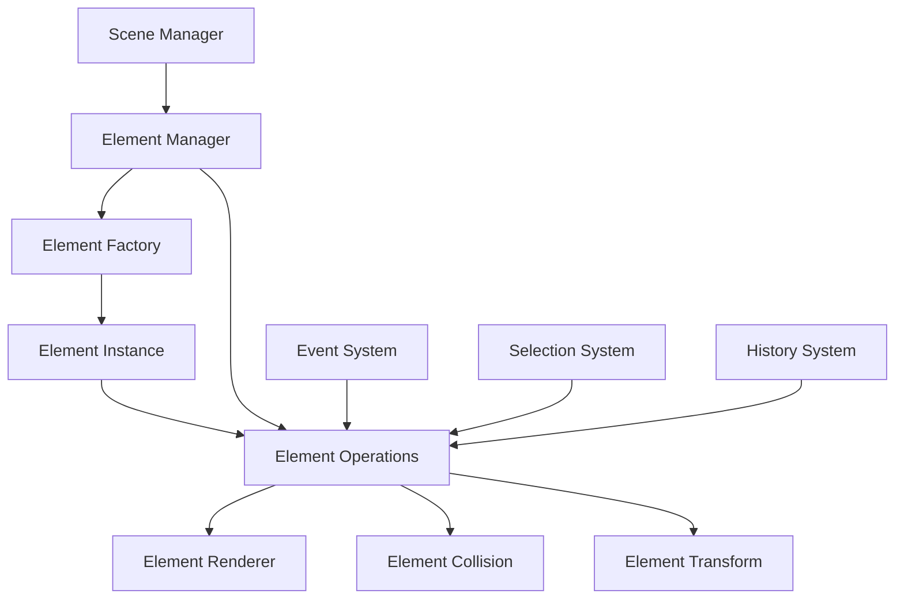

# Chapter 2.4: 元素系统架构分析

## 概述

元素系统是 Excalidraw 的核心，负责创建、管理、操作和渲染所有图形元素。理解元素系统的架构对于构建最小化核心至关重要。本章将深入分析元素的生命周期、操作模式和扩展机制。

## 元素系统架构概览

### 元素系统组件关系



## 元素创建系统

### 元素工厂模式

```typescript
// 源文件: packages/element/src/newElement.ts (实际源码，2025年1月验证)

// 元素构造选项类型（大部分字段都是可选的）
export type ElementConstructorOpts = MarkOptional<
  Omit<ExcalidrawGenericElement, "id" | "type" | "isDeleted" | "updated">,
  | "width"
  | "height"
  | "angle"
  | "groupIds"
  | "frameId"
  | "index"
  | "boundElements"
  | "seed"
  | "version"
  | "versionNonce"
  | "link"
  | "strokeStyle"
  | "fillStyle"
  | "strokeColor"
  | "backgroundColor"
  | "roughness"
  | "strokeWidth"
  | "roundness"
  | "locked"
  | "opacity"
  | "customData"
>;

// 核心元素创建函数（内部实现）
const _newElementBase = <T extends ExcalidrawElement>(
  type: T["type"],
  {
    x,
    y,
    strokeColor = DEFAULT_ELEMENT_PROPS.strokeColor,
    backgroundColor = DEFAULT_ELEMENT_PROPS.backgroundColor,
    fillStyle = DEFAULT_ELEMENT_PROPS.fillStyle,
    strokeWidth = DEFAULT_ELEMENT_PROPS.strokeWidth,
    strokeStyle = DEFAULT_ELEMENT_PROPS.strokeStyle,
    roughness = DEFAULT_ELEMENT_PROPS.roughness,
    opacity = DEFAULT_ELEMENT_PROPS.opacity,
    width = 0,
    height = 0,
    angle = 0 as Radians,
    groupIds = [],
    frameId = null,
    index = null,  // 注意：默认为 null，会在后续处理中生成
    roundness = null,
    boundElements = null,
    link = null,
    locked = DEFAULT_ELEMENT_PROPS.locked,
    customData,
    ...rest
  }: ElementConstructorOpts & { type?: T["type"] },
): Omit<T, "type"> => {
  const element = {
    id: rest.id || randomId(),
    type,
    x,
    y,
    width,
    height,
    angle,
    strokeColor,
    backgroundColor,
    fillStyle,
    strokeWidth,
    strokeStyle,
    roughness,
    opacity,
    groupIds,
    frameId,
    index,
    roundness,
    seed: rest.seed ?? randomInteger(),
    version: rest.version || 1,
    versionNonce: rest.versionNonce ?? randomInteger(),
    isDeleted: false,
    boundElements,
    updated: getUpdatedTimestamp(),
    link,
    locked,
    ...(customData ? { customData } : {}),
  };

  return element as Omit<T, "type">;
};
```

### 特定元素工厂函数

```typescript
// 矩形元素创建
export const newRectangleElement = (
  opts: ElementConstructorOpts
): ExcalidrawRectangleElement => {
  return newElement({
    type: "rectangle",
    ...opts,
  });
};

// 文本元素创建
export const newTextElement = (
  opts: ElementConstructorOpts & {
    text?: string;
    fontSize?: number;
    fontFamily?: FontFamily;
    textAlign?: TextAlign;
    verticalAlign?: VerticalAlign;
  }
): ExcalidrawTextElement => {
  const {
    text = "",
    fontSize = DEFAULT_FONT_SIZE,
    fontFamily = DEFAULT_FONT_FAMILY,
    textAlign = "left",
    verticalAlign = "top",
    autoResize = true,
    lineHeight = DEFAULT_LINE_HEIGHT,
    ...elementProps
  } = opts;

  return newElement({
    type: "text",
    fontSize,
    fontFamily,
    text,
    textAlign,
    verticalAlign,
    autoResize,
    lineHeight,
    baseline: 0,
    containerId: null,
    originalText: text,
    ...elementProps,
  });
};

// 箭头元素创建
export const newArrowElement = (
  opts: ElementConstructorOpts & {
    points?: readonly Point[];
    startArrowhead?: Arrowhead;
    endArrowhead?: Arrowhead;
  }
): ExcalidrawArrowElement => {
  const {
    points = [[0, 0], [0, 0]],
    startArrowhead = null,
    endArrowhead = "arrow",
    ...elementProps
  } = opts;

  return newElement({
    type: "arrow",
    points,
    lastCommittedPoint: null,
    startBinding: null,
    endBinding: null,
    startArrowhead,
    endArrowhead,
    ...elementProps,
  });
};
```

## 元素操作系统

### 元素变更 (Mutation)

```typescript
// 源文件: packages/element/src/mutateElement.ts (实际源码，2025年1月验证)

/**
 * 元素变更函数 - 用于不可变更新元素
 *
 * 注意：这是 Excalidraw 中最常用的元素更新函数
 * - 自动更新 versionNonce 和 updated 时间戳
 * - 对特殊元素类型（如 elbowed arrow）有特殊处理
 * - 需要传入 elementsMap 以便处理元素之间的关系
 */
export const mutateElement = <TElement extends Mutable<ExcalidrawElement>>(
  element: TElement,
  elementsMap: ElementsMap,  // 注意：需要传入元素映射表
  updates: ElementUpdate<TElement>,
  options?: {
    isDragging?: boolean;
  },
) => {
  let didChange = false;

  // 特殊处理：肘形箭头需要重新计算点位
  const { points, fixedSegments, startBinding, endBinding, fileId } = updates as any;

  if (
    isElbowArrow(element) &&
    (Object.keys(updates).length === 0 ||
      typeof points !== "undefined" ||
      typeof fixedSegments !== "undefined" ||
      typeof startBinding !== "undefined" ||
      typeof endBinding !== "undefined")
  ) {
    // 肘形箭头的特殊逻辑
    updates = {
      ...updates,
      angle: 0 as Radians,
      ...updateElbowArrowPoints(
        {
          ...element,
          x: updates.x || element.x,
          y: updates.y || element.y,
          // ... 更多特殊处理
        },
        elementsMap,
      ),
    };
  }

  // 检查是否有实际变更
  for (const key in updates) {
    const value = (updates as any)[key];
    if (typeof value !== "undefined") {
      if (
        (element as any)[key] === value &&
        // 特殊处理 points 数组比较
        (key !== "points" ||
          (element as any).points?.length === value.length)
      ) {
        continue;
      }
      didChange = true;
      break;
    }
  }

  if (!didChange) {
    return element;
  }

  // 创建更新后的元素
  const updated: TElement = {
    ...element,
    ...updates,
    updated: getUpdatedTimestamp(),
    version: element.version + 1,
    versionNonce: randomInteger(),
  };

  return updated;
};

/**
 * 创建新元素（基于现有元素）
 * 这是一个辅助函数，用于创建元素的副本并应用更新
 */
export const newElementWith = <T extends ExcalidrawElement>(
  element: T,
  updates: Partial<T>,
): T => {
  return {
    ...element,
    ...updates,
    updated: getUpdatedTimestamp(),
  };
};
```

### 元素复制和删除

```typescript
// packages/element/duplicateElement.ts
export const duplicateElement = <TElement extends ExcalidrawElement>(
  editingGroupId: string | null,
  groupIdMapForOperation: Map<string, string>,
  element: TElement,
  overrides?: Partial<TElement>
): TElement => {
  let copy: TElement = {
    ...element,
    id: randomId(),
    seed: randomInteger(),
    versionNonce: randomInteger(),
    ...overrides,
  };

  // 处理组ID映射
  if (copy.groupIds.length) {
    const newGroupIds = copy.groupIds.map(groupId =>
      groupIdMapForOperation.get(groupId) || groupId
    );
    copy = { ...copy, groupIds: newGroupIds };
  }

  // 处理文本容器绑定
  if (isTextElement(copy) && copy.containerId) {
    const newContainerId = groupIdMapForOperation.get(copy.containerId);
    if (newContainerId) {
      copy = { ...copy, containerId: newContainerId };
    }
  }

  // 处理线性元素绑定
  if (isLinearElement(copy)) {
    const newStartBinding = copy.startBinding
      ? {
          ...copy.startBinding,
          elementId: groupIdMapForOperation.get(copy.startBinding.elementId) || copy.startBinding.elementId,
        }
      : null;

    const newEndBinding = copy.endBinding
      ? {
          ...copy.endBinding,
          elementId: groupIdMapForOperation.get(copy.endBinding.elementId) || copy.endBinding.elementId,
        }
      : null;

    copy = {
      ...copy,
      startBinding: newStartBinding,
      endBinding: newEndBinding,
    };
  }

  return copy;
};
```

## 元素几何系统

### 边界计算

```typescript
// packages/element/bounds.ts
export const getElementAbsoluteCoords = (
  element: ExcalidrawElement,
  includeBoundText = false
): [number, number, number, number, number, number] => {
  if (isLinearElement(element)) {
    return getLinearElementAbsoluteCoords(element);
  } else if (isTextElement(element)) {
    return getTextElementAbsoluteCoords(element);
  } else {
    return getElementBounds(element);
  }
};

// 获取元素边界框
export const getElementBounds = (element: ExcalidrawElement): Bounds => {
  let minX = Infinity;
  let minY = Infinity;
  let maxX = -Infinity;
  let maxY = -Infinity;

  if (isLinearElement(element)) {
    const points = getLinearElementRotatedPoints(element);

    points.forEach(([x, y]) => {
      minX = Math.min(minX, x);
      minY = Math.min(minY, y);
      maxX = Math.max(maxX, x);
      maxY = Math.max(maxY, y);
    });
  } else {
    const [x1, y1, x2, y2] = getElementAbsoluteCoords(element);
    minX = x1;
    minY = y1;
    maxX = x2;
    maxY = y2;
  }

  return {
    minX,
    minY,
    maxX,
    maxY,
    width: maxX - minX,
    height: maxY - minY,
  };
};

// 检查点是否在元素内
export const isPointWithinElementBounds = (
  element: ExcalidrawElement,
  point: Point
): boolean => {
  const bounds = getElementBounds(element);
  const [x, y] = point;

  return (
    x >= bounds.minX &&
    x <= bounds.maxX &&
    y >= bounds.minY &&
    y <= bounds.maxY
  );
};
```

### 变换系统

```typescript
// packages/element/transform.ts
export const transformElement = (
  element: ExcalidrawElement,
  transform: TransformMatrix
): ExcalidrawElement => {
  if (isLinearElement(element)) {
    return transformLinearElement(element, transform);
  } else if (isTextElement(element)) {
    return transformTextElement(element, transform);
  } else {
    return transformRectangularElement(element, transform);
  }
};

// 旋转元素
export const rotateElement = (
  element: ExcalidrawElement,
  angle: number,
  center: Point
): ExcalidrawElement => {
  const [cx, cy] = center;
  const rotatedPoint = rotate(
    element.x + element.width / 2,
    element.y + element.height / 2,
    cx,
    cy,
    angle
  );

  return mutateElement(element, {
    x: rotatedPoint[0] - element.width / 2,
    y: rotatedPoint[1] - element.height / 2,
    angle: element.angle + angle,
  });
};

// 缩放元素
export const resizeElement = (
  element: ExcalidrawElement,
  nextWidth: number,
  nextHeight: number,
  shouldMaintainAspectRatio = false
): ExcalidrawElement => {
  if (shouldMaintainAspectRatio) {
    const aspectRatio = element.width / element.height;
    if (Math.abs(nextWidth / nextHeight - aspectRatio) > 0.01) {
      if (Math.abs(nextWidth - element.width) > Math.abs(nextHeight - element.height)) {
        nextHeight = nextWidth / aspectRatio;
      } else {
        nextWidth = nextHeight * aspectRatio;
      }
    }
  }

  let updates: Partial<ExcalidrawElement> = {
    width: nextWidth,
    height: nextHeight,
  };

  // 处理特殊元素类型
  if (isLinearElement(element)) {
    updates = {
      ...updates,
      points: rescalePoints(element.points, nextWidth, nextHeight, element.width, element.height),
    };
  } else if (isTextElement(element) && element.autoResize) {
    // 自动调整大小的文本元素不需要手动调整尺寸
    return element;
  }

  return mutateElement(element, updates);
};
```

## 元素渲染系统

### 渲染调度器

```typescript
// packages/excalidraw/renderer/renderElement.ts
export const renderElement = (
  element: ExcalidrawElement,
  context: CanvasRenderingContext2D,
  appState: AppState,
  rc: RoughCanvas
): void => {
  const generator = rc.generator;

  // 设置通用样式
  context.globalAlpha = element.opacity / 100;

  // 应用变换
  context.save();

  if (element.angle !== 0) {
    const centerX = element.x + element.width / 2;
    const centerY = element.y + element.height / 2;
    context.translate(centerX, centerY);
    context.rotate(element.angle);
    context.translate(-centerX, -centerY);
  }

  // 根据元素类型进行渲染
  switch (element.type) {
    case "rectangle":
      renderRectangleElement(element, context, generator);
      break;
    case "ellipse":
      renderEllipseElement(element, context, generator);
      break;
    case "arrow":
    case "line":
      renderLinearElement(element, context, generator);
      break;
    case "text":
      renderTextElement(element, context, appState);
      break;
    case "image":
      renderImageElement(element, context);
      break;
    case "freedraw":
      renderFreeDrawElement(element, context);
      break;
  }

  context.restore();
};

// 矩形渲染
const renderRectangleElement = (
  element: ExcalidrawRectangleElement,
  context: CanvasRenderingContext2D,
  generator: RoughGenerator
): void => {
  const options: Options = {
    stroke: element.strokeColor,
    fill: element.backgroundColor !== "transparent" ? element.backgroundColor : undefined,
    fillStyle: element.fillStyle,
    strokeWidth: element.strokeWidth,
    roughness: element.roughness,
    seed: element.seed,
  };

  // 处理圆角
  if (element.roundness) {
    const radius = getCornerRadius(element.roundness, element);
    const roughRectangle = generator.rectangle(
      element.x,
      element.y,
      element.width,
      element.height,
      {
        ...options,
        curveFitting: radius > 0 ? 0.9 : 1,
      }
    );
    context.stroke(new Path2D(roughRectangle.path));
  } else {
    const roughRectangle = generator.rectangle(
      element.x,
      element.y,
      element.width,
      element.height,
      options
    );
    context.stroke(new Path2D(roughRectangle.path));
  }
};
```

### 性能优化渲染

```typescript
// 渲染缓存系统
export class RenderCache {
  private cache = new Map<string, {
    canvas: HTMLCanvasElement;
    version: number;
    bounds: Bounds;
  }>();

  getRenderCache(element: ExcalidrawElement): HTMLCanvasElement | null {
    const cacheKey = element.id;
    const cached = this.cache.get(cacheKey);

    if (cached && cached.version === element.versionNonce) {
      return cached.canvas;
    }

    return null;
  }

  setRenderCache(element: ExcalidrawElement, canvas: HTMLCanvasElement): void {
    const bounds = getElementBounds(element);

    this.cache.set(element.id, {
      canvas,
      version: element.versionNonce,
      bounds,
    });
  }

  invalidateElement(elementId: string): void {
    this.cache.delete(elementId);
  }

  clearCache(): void {
    this.cache.clear();
  }
}

// 使用缓存的渲染函数
export const renderElementWithCache = (
  element: ExcalidrawElement,
  context: CanvasRenderingContext2D,
  appState: AppState,
  rc: RoughCanvas,
  renderCache: RenderCache
): void => {
  // 检查缓存
  const cachedCanvas = renderCache.getRenderCache(element);

  if (cachedCanvas) {
    // 使用缓存的渲染结果
    context.drawImage(cachedCanvas, element.x, element.y);
    return;
  }

  // 创建离屏画布进行渲染
  const bounds = getElementBounds(element);
  const offscreenCanvas = document.createElement("canvas");
  const offscreenContext = offscreenCanvas.getContext("2d")!;

  offscreenCanvas.width = bounds.width + 20; // 添加边距
  offscreenCanvas.height = bounds.height + 20;

  // 渲染到离屏画布
  offscreenContext.translate(-bounds.minX + 10, -bounds.minY + 10);
  renderElement(element, offscreenContext, appState, new RoughCanvas(offscreenCanvas));

  // 缓存结果
  renderCache.setRenderCache(element, offscreenCanvas);

  // 绘制到主画布
  context.drawImage(offscreenCanvas, bounds.minX - 10, bounds.minY - 10);
};
```

## 碰撞检测系统

### 点碰撞检测

```typescript
// packages/element/collision.ts
export const hitTestElement = (
  element: ExcalidrawElement,
  point: Point,
  threshold = 10
): boolean => {
  const [x, y] = point;

  // 快速边界检查
  if (!isPointWithinElementBounds(element, point)) {
    return false;
  }

  switch (element.type) {
    case "rectangle":
    case "ellipse":
    case "diamond":
    case "image":
    case "frame":
      return hitTestRectangularElement(element, point);

    case "arrow":
    case "line":
      return hitTestLinearElement(element, point, threshold);

    case "text":
      return hitTestTextElement(element, point);

    case "freedraw":
      return hitTestFreeDrawElement(element, point, threshold);

    default:
      return false;
  }
};

// 线性元素碰撞检测
const hitTestLinearElement = (
  element: ExcalidrawLinearElement,
  point: Point,
  threshold: number
): boolean => {
  const [x, y] = point;
  const points = getLinearElementRotatedPoints(element);

  for (let i = 0; i < points.length - 1; i++) {
    const [x1, y1] = points[i];
    const [x2, y2] = points[i + 1];

    const distance = distanceToLine([x1, y1], [x2, y2], [x, y]);
    if (distance <= threshold) {
      return true;
    }
  }

  return false;
};

// 距离到线段的计算
const distanceToLine = (
  start: Point,
  end: Point,
  point: Point
): number => {
  const [x1, y1] = start;
  const [x2, y2] = end;
  const [x, y] = point;

  const A = x - x1;
  const B = y - y1;
  const C = x2 - x1;
  const D = y2 - y1;

  const dot = A * C + B * D;
  const lenSq = C * C + D * D;

  if (lenSq === 0) {
    return Math.sqrt(A * A + B * B);
  }

  let param = dot / lenSq;

  let xx: number;
  let yy: number;

  if (param < 0) {
    xx = x1;
    yy = y1;
  } else if (param > 1) {
    xx = x2;
    yy = y2;
  } else {
    xx = x1 + param * C;
    yy = y1 + param * D;
  }

  const dx = x - xx;
  const dy = y - yy;

  return Math.sqrt(dx * dx + dy * dy);
};
```

### 区域选择检测

```typescript
// 选择框碰撞检测
export const elementsOverlappingBBox = (
  elements: readonly ExcalidrawElement[],
  selectionBounds: Bounds,
  offset?: Vector
): ExcalidrawElement[] => {
  const [offsetX, offsetY] = offset ? [offset.x, offset.y] : [0, 0];

  return elements.filter(element => {
    const bounds = getElementBounds(element);

    return (
      selectionBounds.minX <= bounds.maxX + offsetX &&
      selectionBounds.minY <= bounds.maxY + offsetY &&
      selectionBounds.maxX >= bounds.minX + offsetX &&
      selectionBounds.maxY >= bounds.minY + offsetY
    );
  });
};

// 完全包含检测
export const elementsCompletelyWithinSelectionBounds = (
  elements: readonly ExcalidrawElement[],
  selectionBounds: Bounds
): ExcalidrawElement[] => {
  return elements.filter(element => {
    const bounds = getElementBounds(element);

    return (
      bounds.minX >= selectionBounds.minX &&
      bounds.minY >= selectionBounds.minY &&
      bounds.maxX <= selectionBounds.maxX &&
      bounds.maxY <= selectionBounds.maxY
    );
  });
};
```

## 元素生命周期管理

### 生命周期状态

```typescript
export enum ElementLifecycleState {
  Created = "created",
  Modified = "modified",
  Selected = "selected",
  Deleted = "deleted",
  Restored = "restored",
}

export interface ElementLifecycleEvent {
  element: ExcalidrawElement;
  state: ElementLifecycleState;
  timestamp: number;
  metadata?: Record<string, any>;
}

export class ElementLifecycleManager {
  private listeners = new Map<ElementLifecycleState, Set<(event: ElementLifecycleEvent) => void>>();

  onStateChange(state: ElementLifecycleState, listener: (event: ElementLifecycleEvent) => void): void {
    if (!this.listeners.has(state)) {
      this.listeners.set(state, new Set());
    }
    this.listeners.get(state)!.add(listener);
  }

  emitStateChange(element: ExcalidrawElement, state: ElementLifecycleState, metadata?: Record<string, any>): void {
    const event: ElementLifecycleEvent = {
      element,
      state,
      timestamp: Date.now(),
      metadata,
    };

    const stateListeners = this.listeners.get(state);
    if (stateListeners) {
      stateListeners.forEach(listener => listener(event));
    }
  }

  removeListener(state: ElementLifecycleState, listener: (event: ElementLifecycleEvent) => void): void {
    const stateListeners = this.listeners.get(state);
    if (stateListeners) {
      stateListeners.delete(listener);
    }
  }
}
```

## 最小化元素系统

### 简化的元素管理器

```typescript
// 最小化元素系统实现
export class MinimalElementSystem {
  private elements: MinimalElement[] = [];
  private idCounter = 0;

  // 创建元素
  createElement(type: MinimalElement["type"], props: Partial<MinimalElement>): MinimalElement {
    const element: MinimalElement = {
      id: (++this.idCounter).toString(),
      type,
      x: 0,
      y: 0,
      width: 100,
      height: 100,
      strokeColor: "#000000",
      backgroundColor: "transparent",
      strokeWidth: 1,
      ...props,
    };

    this.elements.push(element);
    return element;
  }

  // 更新元素
  updateElement(id: string, updates: Partial<MinimalElement>): boolean {
    const index = this.elements.findIndex(el => el.id === id);
    if (index === -1) return false;

    this.elements[index] = { ...this.elements[index], ...updates };
    return true;
  }

  // 删除元素
  deleteElement(id: string): boolean {
    const index = this.elements.findIndex(el => el.id === id);
    if (index === -1) return false;

    this.elements.splice(index, 1);
    return true;
  }

  // 获取所有元素
  getAllElements(): MinimalElement[] {
    return [...this.elements];
  }

  // 根据ID获取元素
  getElementById(id: string): MinimalElement | undefined {
    return this.elements.find(el => el.id === id);
  }

  // 简化的碰撞检测
  hitTest(point: [number, number]): MinimalElement | null {
    const [x, y] = point;

    // 从后往前检测（后添加的元素在上层）
    for (let i = this.elements.length - 1; i >= 0; i--) {
      const element = this.elements[i];

      if (
        x >= element.x &&
        x <= element.x + element.width &&
        y >= element.y &&
        y <= element.y + element.height
      ) {
        return element;
      }
    }

    return null;
  }

  // 简化的渲染
  render(ctx: CanvasRenderingContext2D): void {
    this.elements.forEach(element => {
      ctx.save();

      ctx.strokeStyle = element.strokeColor;
      ctx.fillStyle = element.backgroundColor;
      ctx.lineWidth = element.strokeWidth;

      switch (element.type) {
        case "rectangle":
          ctx.strokeRect(element.x, element.y, element.width, element.height);
          if (element.backgroundColor !== "transparent") {
            ctx.fillRect(element.x, element.y, element.width, element.height);
          }
          break;

        case "ellipse":
          ctx.beginPath();
          ctx.ellipse(
            element.x + element.width / 2,
            element.y + element.height / 2,
            element.width / 2,
            element.height / 2,
            0, 0, 2 * Math.PI
          );
          ctx.stroke();
          if (element.backgroundColor !== "transparent") {
            ctx.fill();
          }
          break;

        case "line":
          if (element.points && element.points.length >= 2) {
            ctx.beginPath();
            ctx.moveTo(element.x + element.points[0][0], element.y + element.points[0][1]);
            for (let i = 1; i < element.points.length; i++) {
              ctx.lineTo(element.x + element.points[i][0], element.y + element.points[i][1]);
            }
            ctx.stroke();
          }
          break;

        case "text":
          if (element.text) {
            ctx.fillStyle = element.strokeColor;
            ctx.fillText(element.text, element.x, element.y + 16); // 简化的文本渲染
          }
          break;
      }

      ctx.restore();
    });
  }
}
```

## 实践任务

### 1. 元素系统分析

```typescript
// 创建分析工具
class ElementAnalyzer {
  analyzeElementUsage(elements: ExcalidrawElement[]): void {
    const typeCount = new Map<string, number>();
    const memoryUsage = new Map<string, number>();

    elements.forEach(element => {
      const type = element.type;
      typeCount.set(type, (typeCount.get(type) || 0) + 1);

      const size = JSON.stringify(element).length;
      memoryUsage.set(type, (memoryUsage.get(type) || 0) + size);
    });

    console.log("Element Type Distribution:", Object.fromEntries(typeCount));
    console.log("Memory Usage by Type:", Object.fromEntries(memoryUsage));
  }

  findComplexElements(elements: ExcalidrawElement[]): ExcalidrawElement[] {
    return elements.filter(element => {
      const size = JSON.stringify(element).length;
      return size > 1000; // 大于1KB的元素
    });
  }
}
```

### 2. 性能测试

```typescript
// 元素操作性能测试
class ElementPerformanceTest {
  testElementCreation(count: number): void {
    console.time(`Creating ${count} elements`);

    const elements: ExcalidrawElement[] = [];
    for (let i = 0; i < count; i++) {
      elements.push(newRectangleElement({
        x: Math.random() * 1000,
        y: Math.random() * 1000,
        width: Math.random() * 200 + 50,
        height: Math.random() * 200 + 50,
      }));
    }

    console.timeEnd(`Creating ${count} elements`);
    console.log(`Average time per element: ${performance.now() / count}ms`);
  }

  testHitTesting(elements: ExcalidrawElement[], testPoints: Point[]): void {
    console.time("Hit testing");

    let hitCount = 0;
    testPoints.forEach(point => {
      elements.forEach(element => {
        if (hitTestElement(element, point)) {
          hitCount++;
        }
      });
    });

    console.timeEnd("Hit testing");
    console.log(`Hit test results: ${hitCount} hits out of ${testPoints.length * elements.length} tests`);
  }
}
```

### 3. 最小化实现练习

```html
<!DOCTYPE html>
<html>
<head>
    <title>Minimal Element System Demo</title>
</head>
<body>
    <canvas id="canvas" width="800" height="600" style="border: 1px solid #ccc;"></canvas>
    <div>
        <button onclick="addRectangle()">Add Rectangle</button>
        <button onclick="addCircle()">Add Circle</button>
        <button onclick="clearAll()">Clear All</button>
    </div>

    <script>
        // 使用前面定义的 MinimalElementSystem
        const canvas = document.getElementById('canvas');
        const ctx = canvas.getContext('2d');
        const elementSystem = new MinimalElementSystem();

        function addRectangle() {
            elementSystem.createElement('rectangle', {
                x: Math.random() * 600,
                y: Math.random() * 400,
                width: 100,
                height: 60,
                strokeColor: '#' + Math.floor(Math.random()*16777215).toString(16)
            });
            render();
        }

        function addCircle() {
            elementSystem.createElement('ellipse', {
                x: Math.random() * 600,
                y: Math.random() * 400,
                width: 80,
                height: 80,
                strokeColor: '#' + Math.floor(Math.random()*16777215).toString(16)
            });
            render();
        }

        function clearAll() {
            elementSystem.elements.length = 0;
            render();
        }

        function render() {
            ctx.clearRect(0, 0, canvas.width, canvas.height);
            elementSystem.render(ctx);
        }

        // 添加点击事件
        canvas.addEventListener('click', (e) => {
            const rect = canvas.getBoundingClientRect();
            const point = [e.clientX - rect.left, e.clientY - rect.top];
            const hitElement = elementSystem.hitTest(point);

            if (hitElement) {
                console.log('Clicked element:', hitElement);
            }
        });

        // 初始渲染
        render();
    </script>
</body>
</html>
```

## 小结

通过本章分析，我们深入了解了：

1. **元素创建**：工厂模式和类型安全的元素构造
2. **元素操作**：不可变更新和批量操作机制
3. **几何系统**：边界计算和变换处理
4. **渲染系统**：高性能的分层渲染架构
5. **碰撞检测**：多种形状的精确碰撞算法
6. **生命周期**：元素状态管理和事件系统
7. **最小化实现**：简化但完整的元素系统

下一章我们将分析状态管理模式，了解如何协调元素系统与应用状态。