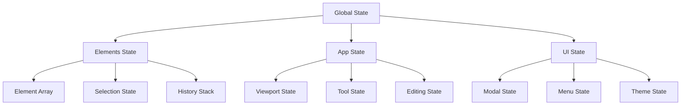

# Chapter 2.5: 状态管理模式分析

## 概述

状态管理是 Excalidraw 架构的核心支柱，决定了应用的数据流向、更新机制和性能表现。本章将深入分析 Excalidraw 的状态管理模式、数据流架构以及如何构建高效的最小化状态系统。

## 状态管理架构概览

### 状态层次结构



## React 状态管理模式

**源文件验证 (2025年1月)**:
- 主要状态管理工具: **Jotai 2.11.0** (原子状态管理库)
- 源文件: `excalidraw-app/app-jotai.ts`, `packages/excalidraw/components/App.tsx`
- Excalidraw 使用 React useState + Jotai atoms 混合架构

### Jotai 原子状态管理

Excalidraw 使用 Jotai 管理部分全局状态：

```typescript
// excalidraw-app/app-jotai.ts (实际源码)
import { atom } from "jotai";

// 协作状态原子
export const collabAPIAtom = atom<CollabAPI | null>(null);
export const collabDialogShownAtom = atom(false);
export const isCollaboratingAtom = atom(false);

// 用户状态原子
export const activeRoomLinkAtom = atom<string | null>(null);
```

### 主要状态容器（React + Jotai 混合）

```typescript
// packages/excalidraw/components/App.tsx (实际源码结构)
export const App = forwardRef<ExcalidrawAPIRefValue, AppProps>((props, ref) => {
  // 核心状态：元素数组（使用 React useState）
  const [elements, setElements] = useState<readonly ExcalidrawElement[]>(() =>
    props.initialData?.elements || []
  );

  // 核心状态：应用状态（使用 React useState）
  const [appState, setAppState] = useState<AppState>(() => ({
    ...getDefaultAppState(),
    ...props.initialData?.appState,
  }));

  // 协作状态（使用 Jotai atoms）
  const [isCollaborating] = useAtom(isCollaboratingAtom);
  const [collabAPI] = useAtom(collabAPIAtom);

  // UI 相关状态
  const [showShortcutsDialog, setShowShortcutsDialog] = useState(false);
  const [isLoadingImageElement, setIsLoadingImageElement] = useState(false);
  const [errorMessage, setErrorMessage] = useState<string | null>(null);

  // 文件处理状态
  const [files, setFiles] = useState<BinaryFiles>({});

  // ... 其他状态
});
```

### 状态更新模式

```typescript
// 不可变状态更新
const updateElements = useCallback((nextElements: readonly ExcalidrawElement[]) => {
  setElements(prevElements => {
    if (prevElements === nextElements) {
      return prevElements; // 避免不必要的更新
    }
    return nextElements;
  });
}, []);

// 应用状态更新
const updateAppState = useCallback((updates: Partial<AppState>) => {
  setAppState(prevAppState => ({
    ...prevAppState,
    ...updates,
  }));
}, []);

// 批量状态更新
const updateScene = useCallback((
  sceneData: {
    elements?: readonly ExcalidrawElement[];
    appState?: Partial<AppState>;
    commitToHistory?: boolean;
  }
) => {
  const { elements: nextElements, appState: nextAppState, commitToHistory = true } = sceneData;

  if (nextElements) {
    updateElements(nextElements);
  }

  if (nextAppState) {
    updateAppState(nextAppState);
  }

  if (commitToHistory && nextElements) {
    // 添加到历史栈
    setHistory(prev => addToHistory(prev, nextElements));
  }
}, [updateElements, updateAppState]);
```

## 历史管理系统

### 历史栈数据结构

```typescript
// packages/excalidraw/history.ts
export interface HistoryEntry {
  elements: readonly ExcalidrawElement[];
  appState: Partial<AppState>;
  timestamp: number;
}

export interface History {
  undoStack: HistoryEntry[];
  redoStack: HistoryEntry[];
}

export const MAX_HISTORY_SIZE = 50;

// 添加到历史记录
export const addToHistory = (
  history: History,
  elements: readonly ExcalidrawElement[],
  appState?: Partial<AppState>
): History => {
  const newEntry: HistoryEntry = {
    elements,
    appState: appState || {},
    timestamp: Date.now(),
  };

  // 检查是否与最后一个条目相同
  const lastEntry = history.undoStack[history.undoStack.length - 1];
  if (lastEntry && elementsEqual(lastEntry.elements, elements)) {
    return history;
  }

  const newUndoStack = [...history.undoStack, newEntry];

  // 限制历史栈大小
  if (newUndoStack.length > MAX_HISTORY_SIZE) {
    newUndoStack.shift();
  }

  return {
    undoStack: newUndoStack,
    redoStack: [], // 新操作清空重做栈
  };
};

// 撤销操作
export const undo = (
  history: History,
  currentElements: readonly ExcalidrawElement[]
): { history: History; elements: readonly ExcalidrawElement[] } => {
  if (history.undoStack.length === 0) {
    return { history, elements: currentElements };
  }

  const previousEntry = history.undoStack[history.undoStack.length - 1];
  const newUndoStack = history.undoStack.slice(0, -1);

  const currentEntry: HistoryEntry = {
    elements: currentElements,
    appState: {},
    timestamp: Date.now(),
  };

  return {
    history: {
      undoStack: newUndoStack,
      redoStack: [...history.redoStack, currentEntry],
    },
    elements: previousEntry.elements,
  };
};
```

### 智能历史合并

```typescript
// 智能合并连续的相似操作
export class SmartHistoryManager {
  private lastActionTime = 0;
  private lastActionType: string | null = null;
  private mergeTimeout = 1000; // 1秒内的连续操作进行合并

  shouldMergeWithLast(
    actionType: string,
    elements: readonly ExcalidrawElement[]
  ): boolean {
    const now = Date.now();
    const timeDiff = now - this.lastActionTime;

    // 时间间隔太长，不合并
    if (timeDiff > this.mergeTimeout) {
      return false;
    }

    // 操作类型不同，不合并
    if (this.lastActionType !== actionType) {
      return false;
    }

    // 特定操作类型的合并逻辑
    switch (actionType) {
      case "drag":
      case "resize":
      case "rotate":
        return true;
      case "text-edit":
        return true;
      default:
        return false;
    }
  }

  recordAction(actionType: string): void {
    this.lastActionTime = Date.now();
    this.lastActionType = actionType;
  }
}
```

## Action 系统

### Action 接口定义

```typescript
// packages/excalidraw/actions/types.ts
export interface ActionResult {
  elements?: readonly ExcalidrawElement[];
  appState?: Partial<AppState>;
  commitToHistory?: boolean;
  replaceFiles?: boolean;
  storeAction?: StoreAction;
}

export interface Action {
  name: string;
  icon?: React.ComponentType<{ size?: number }>;
  label?: string;
  keywords?: string[];
  predicate?: (
    elements: readonly ExcalidrawElement[],
    appState: AppState,
    props: AppProps,
    app: AppClassProperties
  ) => boolean;
  perform: (
    elements: readonly ExcalidrawElement[],
    appState: AppState,
    formData?: any
  ) => ActionResult | Promise<ActionResult>;
  keyTest?: (
    event: React.KeyboardEvent | KeyboardEvent
  ) => boolean;
}
```

### Action 实现示例

```typescript
// packages/excalidraw/actions/actionDeleteSelected.ts
export const actionDeleteSelected: Action = {
  name: "deleteSelected",
  label: "删除选中元素",
  icon: TrashIcon,
  keywords: ["delete", "remove", "删除"],

  predicate: (elements, appState) => {
    return Object.keys(appState.selectedElementIds).length > 0;
  },

  perform: (elements, appState) => {
    const selectedElementIds = appState.selectedElementIds;

    // 过滤掉选中的元素
    const nextElements = elements.filter(
      element => !selectedElementIds[element.id]
    );

    // 清除选择状态
    const nextAppState: Partial<AppState> = {
      selectedElementIds: {},
      selectedGroupIds: {},
    };

    return {
      elements: nextElements,
      appState: nextAppState,
      commitToHistory: true,
    };
  },

  keyTest: (event) => event.key === "Delete" || event.key === "Backspace",
};

// packages/excalidraw/actions/actionDuplicateSelection.ts
export const actionDuplicateSelection: Action = {
  name: "duplicateSelection",
  label: "复制选中元素",
  icon: CopyIcon,
  keywords: ["duplicate", "copy", "复制"],

  perform: (elements, appState) => {
    const selectedElementIds = appState.selectedElementIds;
    const selectedElements = elements.filter(
      element => selectedElementIds[element.id]
    );

    if (selectedElements.length === 0) {
      return {};
    }

    // 创建ID映射用于处理组关系
    const groupIdMapForOperation = new Map<string, string>();

    // 复制元素
    const duplicatedElements = selectedElements.map(element => {
      return duplicateElement(
        appState.editingGroupId,
        groupIdMapForOperation,
        element,
        {
          x: element.x + 20, // 偏移位置
          y: element.y + 20,
        }
      );
    });

    // 构建新的选择状态
    const newSelectedElementIds: Record<string, true> = {};
    duplicatedElements.forEach(element => {
      newSelectedElementIds[element.id] = true;
    });

    return {
      elements: [...elements, ...duplicatedElements],
      appState: {
        selectedElementIds: newSelectedElementIds,
        selectedGroupIds: {},
      },
      commitToHistory: true,
    };
  },

  keyTest: (event) =>
    (event.ctrlKey || event.metaKey) && event.key === "d",
};
```

### Action 注册和调度系统

```typescript
// Action 注册表
export class ActionRegistry {
  private actions = new Map<string, Action>();

  register(action: Action): void {
    this.actions.set(action.name, action);
  }

  get(name: string): Action | undefined {
    return this.actions.get(name);
  }

  getAll(): Action[] {
    return Array.from(this.actions.values());
  }

  // 根据键盘事件查找对应的 Action
  findByKeyTest(event: KeyboardEvent): Action | undefined {
    for (const action of this.actions.values()) {
      if (action.keyTest && action.keyTest(event)) {
        return action;
      }
    }
    return undefined;
  }
}

// Action 执行器
export class ActionExecutor {
  constructor(
    private registry: ActionRegistry,
    private updateScene: (sceneData: any) => void
  ) {}

  async execute(
    actionName: string,
    elements: readonly ExcalidrawElement[],
    appState: AppState,
    formData?: any
  ): Promise<boolean> {
    const action = this.registry.get(actionName);
    if (!action) {
      console.warn(`Action '${actionName}' not found`);
      return false;
    }

    // 检查前置条件
    if (action.predicate && !action.predicate(elements, appState, {}, {})) {
      return false;
    }

    try {
      const result = await action.perform(elements, appState, formData);

      if (result) {
        this.updateScene(result);
      }

      return true;
    } catch (error) {
      console.error(`Error executing action '${actionName}':`, error);
      return false;
    }
  }
}
```

## 状态订阅和响应式更新

### 状态监听器系统

```typescript
// 状态变化监听器
export class StateSubscription {
  private listeners = new Map<string, Set<(value: any) => void>>();
  private currentValues = new Map<string, any>();

  subscribe<T>(key: string, listener: (value: T) => void): () => void {
    if (!this.listeners.has(key)) {
      this.listeners.set(key, new Set());
    }

    this.listeners.get(key)!.add(listener);

    // 立即调用一次，传递当前值
    if (this.currentValues.has(key)) {
      listener(this.currentValues.get(key));
    }

    // 返回取消订阅函数
    return () => {
      const keyListeners = this.listeners.get(key);
      if (keyListeners) {
        keyListeners.delete(listener);
        if (keyListeners.size === 0) {
          this.listeners.delete(key);
        }
      }
    };
  }

  notify<T>(key: string, value: T): void {
    this.currentValues.set(key, value);

    const keyListeners = this.listeners.get(key);
    if (keyListeners) {
      keyListeners.forEach(listener => listener(value));
    }
  }
}

// React Hook 封装
export function useStateSubscription<T>(
  subscription: StateSubscription,
  key: string,
  defaultValue: T
): T {
  const [value, setValue] = useState<T>(defaultValue);

  useEffect(() => {
    return subscription.subscribe(key, setValue);
  }, [subscription, key]);

  return value;
}
```

### 性能优化的状态更新

```typescript
// 使用 memo 和 useMemo 优化渲染
const ElementRenderer = React.memo(({
  element,
  appState,
}: {
  element: ExcalidrawElement;
  appState: AppState;
}) => {
  // 只在元素或相关状态变化时重新计算
  const isSelected = useMemo(() => {
    return appState.selectedElementIds[element.id] || false;
  }, [appState.selectedElementIds, element.id]);

  const bounds = useMemo(() => {
    return getElementBounds(element);
  }, [element.x, element.y, element.width, element.height, element.angle]);

  // 渲染逻辑...
});

// 批量状态更新优化
export const useBatchedUpdates = () => {
  const [pendingUpdates, setPendingUpdates] = useState<Array<() => void>>([]);

  const batchUpdate = useCallback((updateFn: () => void) => {
    setPendingUpdates(prev => [...prev, updateFn]);
  }, []);

  // 使用 requestIdleCallback 延迟执行批量更新
  useEffect(() => {
    if (pendingUpdates.length > 0) {
      const timeoutId = requestIdleCallback(() => {
        startTransition(() => {
          pendingUpdates.forEach(update => update());
          setPendingUpdates([]);
        });
      });

      return () => cancelIdleCallback(timeoutId);
    }
  }, [pendingUpdates]);

  return batchUpdate;
};
```

## 最小化状态管理系统

### 简化的状态管理器

```typescript
// 最小化状态管理实现
export class MinimalStateManager {
  private state: {
    elements: MinimalElement[];
    selectedIds: Set<string>;
    activeTool: string;
    viewport: { x: number; y: number; zoom: number };
  };

  private listeners: Set<(state: typeof this.state) => void> = new Set();
  private history: Array<typeof this.state> = [];
  private historyIndex = -1;

  constructor() {
    this.state = {
      elements: [],
      selectedIds: new Set(),
      activeTool: "selection",
      viewport: { x: 0, y: 0, zoom: 1 },
    };
  }

  // 获取当前状态
  getState() {
    return { ...this.state };
  }

  // 更新状态
  updateState(updates: Partial<typeof this.state>, addToHistory = true): void {
    const oldState = { ...this.state };
    this.state = { ...this.state, ...updates };

    // 添加到历史记录
    if (addToHistory) {
      this.addToHistory(oldState);
    }

    // 通知监听器
    this.notifyListeners();
  }

  // 订阅状态变化
  subscribe(listener: (state: typeof this.state) => void): () => void {
    this.listeners.add(listener);
    return () => this.listeners.delete(listener);
  }

  // 撤销
  undo(): boolean {
    if (this.historyIndex >= 0) {
      this.state = { ...this.history[this.historyIndex] };
      this.historyIndex--;
      this.notifyListeners();
      return true;
    }
    return false;
  }

  // 重做
  redo(): boolean {
    if (this.historyIndex < this.history.length - 1) {
      this.historyIndex++;
      this.state = { ...this.history[this.historyIndex + 1] };
      this.notifyListeners();
      return true;
    }
    return false;
  }

  // 元素操作方法
  addElement(element: MinimalElement): void {
    this.updateState({
      elements: [...this.state.elements, element],
    });
  }

  removeElement(id: string): void {
    this.updateState({
      elements: this.state.elements.filter(el => el.id !== id),
      selectedIds: new Set(Array.from(this.state.selectedIds).filter(selectedId => selectedId !== id)),
    });
  }

  updateElement(id: string, updates: Partial<MinimalElement>): void {
    this.updateState({
      elements: this.state.elements.map(el =>
        el.id === id ? { ...el, ...updates } : el
      ),
    });
  }

  selectElement(id: string, multiSelect = false): void {
    const newSelectedIds = multiSelect
      ? new Set([...this.state.selectedIds, id])
      : new Set([id]);

    this.updateState({
      selectedIds: newSelectedIds,
    });
  }

  clearSelection(): void {
    this.updateState({
      selectedIds: new Set(),
    });
  }

  setActiveTool(tool: string): void {
    this.updateState({
      activeTool: tool,
    });
  }

  private addToHistory(state: typeof this.state): void {
    // 移除当前位置之后的历史记录
    this.history = this.history.slice(0, this.historyIndex + 1);

    // 添加新状态到历史记录
    this.history.push({ ...state });
    this.historyIndex++;

    // 限制历史记录大小
    if (this.history.length > 50) {
      this.history.shift();
      this.historyIndex--;
    }
  }

  private notifyListeners(): void {
    this.listeners.forEach(listener => listener(this.state));
  }
}
```

### 与 React 集成的 Hook

```typescript
// React Hook 集成
export function useMinimalStateManager(): {
  state: ReturnType<MinimalStateManager['getState']>;
  actions: {
    addElement: (element: MinimalElement) => void;
    removeElement: (id: string) => void;
    updateElement: (id: string, updates: Partial<MinimalElement>) => void;
    selectElement: (id: string, multiSelect?: boolean) => void;
    clearSelection: () => void;
    setActiveTool: (tool: string) => void;
    undo: () => boolean;
    redo: () => boolean;
  };
} {
  const [manager] = useState(() => new MinimalStateManager());
  const [state, setState] = useState(() => manager.getState());

  useEffect(() => {
    return manager.subscribe(setState);
  }, [manager]);

  const actions = useMemo(() => ({
    addElement: (element: MinimalElement) => manager.addElement(element),
    removeElement: (id: string) => manager.removeElement(id),
    updateElement: (id: string, updates: Partial<MinimalElement>) =>
      manager.updateElement(id, updates),
    selectElement: (id: string, multiSelect = false) =>
      manager.selectElement(id, multiSelect),
    clearSelection: () => manager.clearSelection(),
    setActiveTool: (tool: string) => manager.setActiveTool(tool),
    undo: () => manager.undo(),
    redo: () => manager.redo(),
  }), [manager]);

  return { state, actions };
}
```

## 状态持久化

### 本地存储集成

```typescript
export class StatePersistence {
  private storageKey: string;

  constructor(storageKey: string = "minimal-excalidraw-state") {
    this.storageKey = storageKey;
  }

  save(state: any): void {
    try {
      const serialized = JSON.stringify({
        ...state,
        timestamp: Date.now(),
      });
      localStorage.setItem(this.storageKey, serialized);
    } catch (error) {
      console.error("Failed to save state:", error);
    }
  }

  load(): any | null {
    try {
      const serialized = localStorage.getItem(this.storageKey);
      if (!serialized) return null;

      const parsed = JSON.parse(serialized);

      // 检查数据是否过期（例如7天）
      const maxAge = 7 * 24 * 60 * 60 * 1000;
      if (Date.now() - parsed.timestamp > maxAge) {
        this.clear();
        return null;
      }

      return parsed;
    } catch (error) {
      console.error("Failed to load state:", error);
      return null;
    }
  }

  clear(): void {
    localStorage.removeItem(this.storageKey);
  }
}

// 自动保存 Hook
export function useAutoSave(
  state: any,
  persistence: StatePersistence,
  debounceMs = 2000
): void {
  const debouncedSave = useMemo(
    () => debounce((stateToSave: any) => {
      persistence.save(stateToSave);
    }, debounceMs),
    [persistence, debounceMs]
  );

  useEffect(() => {
    debouncedSave(state);
  }, [state, debouncedSave]);
}
```

## 实践任务

### 1. 状态管理分析工具

```typescript
// 状态变化分析器
export class StateAnalyzer {
  private stateHistory: any[] = [];
  private changeLog: Array<{
    timestamp: number;
    changes: any;
    type: string;
  }> = [];

  recordStateChange(oldState: any, newState: any, type: string): void {
    this.stateHistory.push({ ...newState });

    // 分析变化
    const changes = this.diffStates(oldState, newState);
    if (Object.keys(changes).length > 0) {
      this.changeLog.push({
        timestamp: Date.now(),
        changes,
        type,
      });
    }

    // 限制历史记录大小
    if (this.stateHistory.length > 100) {
      this.stateHistory.shift();
      this.changeLog.shift();
    }
  }

  private diffStates(oldState: any, newState: any): any {
    const diff: any = {};

    for (const key in newState) {
      if (oldState[key] !== newState[key]) {
        diff[key] = {
          old: oldState[key],
          new: newState[key],
        };
      }
    }

    return diff;
  }

  getAnalytics(): {
    totalChanges: number;
    changesByType: Record<string, number>;
    averageChangeSize: number;
    mostChangedKeys: Array<{ key: string; count: number }>;
  } {
    const changesByType: Record<string, number> = {};
    const keyChangeCount: Record<string, number> = {};
    let totalChangeSize = 0;

    this.changeLog.forEach(entry => {
      changesByType[entry.type] = (changesByType[entry.type] || 0) + 1;

      Object.keys(entry.changes).forEach(key => {
        keyChangeCount[key] = (keyChangeCount[key] || 0) + 1;
      });

      totalChangeSize += Object.keys(entry.changes).length;
    });

    const mostChangedKeys = Object.entries(keyChangeCount)
      .map(([key, count]) => ({ key, count }))
      .sort((a, b) => b.count - a.count)
      .slice(0, 10);

    return {
      totalChanges: this.changeLog.length,
      changesByType,
      averageChangeSize: totalChangeSize / this.changeLog.length || 0,
      mostChangedKeys,
    };
  }
}
```

### 2. 完整的最小化示例

```html
<!DOCTYPE html>
<html>
<head>
    <title>Minimal State Management Demo</title>
    <style>
        body { font-family: Arial, sans-serif; margin: 20px; }
        #canvas { border: 1px solid #ccc; cursor: crosshair; }
        .toolbar { margin: 10px 0; }
        .toolbar button { margin-right: 10px; padding: 5px 10px; }
        .toolbar button.active { background-color: #007acc; color: white; }
        .info { margin-top: 10px; }
    </style>
</head>
<body>
    <div class="toolbar">
        <button id="tool-select" class="active">Select</button>
        <button id="tool-rectangle">Rectangle</button>
        <button id="tool-ellipse">Circle</button>
        <button id="tool-line">Line</button>
        <button id="delete-selected">Delete Selected</button>
        <button id="undo">Undo</button>
        <button id="redo">Redo</button>
    </div>

    <canvas id="canvas" width="800" height="600"></canvas>

    <div class="info">
        <div>Selected: <span id="selected-count">0</span> elements</div>
        <div>Total: <span id="total-count">0</span> elements</div>
        <div>Active Tool: <span id="active-tool">selection</span></div>
    </div>

    <script>
        // 使用前面定义的 MinimalStateManager
        const canvas = document.getElementById('canvas');
        const ctx = canvas.getContext('2d');
        const stateManager = new MinimalStateManager();
        const persistence = new StatePersistence();

        let isDrawing = false;
        let startPoint = { x: 0, y: 0 };
        let currentElement = null;

        // 订阅状态变化
        stateManager.subscribe((state) => {
            render(state);
            updateUI(state);
            persistence.save(state);
        });

        // 加载保存的状态
        const savedState = persistence.load();
        if (savedState && savedState.elements) {
            stateManager.updateState({
                elements: savedState.elements,
            }, false);
        }

        // 工具栏事件
        document.querySelectorAll('[id^="tool-"]').forEach(button => {
            button.addEventListener('click', (e) => {
                const tool = e.target.id.replace('tool-', '');
                stateManager.setActiveTool(tool);
                updateToolbar(tool);
            });
        });

        document.getElementById('delete-selected').addEventListener('click', () => {
            const state = stateManager.getState();
            state.selectedIds.forEach(id => {
                stateManager.removeElement(id);
            });
        });

        document.getElementById('undo').addEventListener('click', () => {
            stateManager.undo();
        });

        document.getElementById('redo').addEventListener('click', () => {
            stateManager.redo();
        });

        // Canvas 事件处理
        canvas.addEventListener('mousedown', handleMouseDown);
        canvas.addEventListener('mousemove', handleMouseMove);
        canvas.addEventListener('mouseup', handleMouseUp);

        function handleMouseDown(e) {
            const rect = canvas.getBoundingClientRect();
            const point = {
                x: e.clientX - rect.left,
                y: e.clientY - rect.top
            };

            const state = stateManager.getState();

            if (state.activeTool === 'select') {
                // 选择模式
                const hitElement = findElementAt(point, state.elements);
                if (hitElement) {
                    stateManager.selectElement(hitElement.id, e.ctrlKey);
                } else {
                    stateManager.clearSelection();
                }
            } else {
                // 绘制模式
                isDrawing = true;
                startPoint = point;

                currentElement = {
                    id: Date.now().toString(),
                    type: state.activeTool,
                    x: point.x,
                    y: point.y,
                    width: 0,
                    height: 0,
                    strokeColor: '#000000',
                    backgroundColor: 'transparent',
                    strokeWidth: 2,
                };
            }
        }

        function handleMouseMove(e) {
            if (!isDrawing || !currentElement) return;

            const rect = canvas.getBoundingClientRect();
            const point = {
                x: e.clientX - rect.left,
                y: e.clientY - rect.top
            };

            const width = point.x - startPoint.x;
            const height = point.y - startPoint.y;

            currentElement.x = width < 0 ? point.x : startPoint.x;
            currentElement.y = height < 0 ? point.y : startPoint.y;
            currentElement.width = Math.abs(width);
            currentElement.height = Math.abs(height);

            // 临时渲染
            const state = stateManager.getState();
            render({ ...state, elements: [...state.elements, currentElement] });
        }

        function handleMouseUp(e) {
            if (isDrawing && currentElement) {
                if (currentElement.width > 5 && currentElement.height > 5) {
                    stateManager.addElement(currentElement);
                }
            }
            isDrawing = false;
            currentElement = null;
        }

        function findElementAt(point, elements) {
            for (let i = elements.length - 1; i >= 0; i--) {
                const element = elements[i];
                if (point.x >= element.x &&
                    point.x <= element.x + element.width &&
                    point.y >= element.y &&
                    point.y <= element.y + element.height) {
                    return element;
                }
            }
            return null;
        }

        function render(state) {
            ctx.clearRect(0, 0, canvas.width, canvas.height);

            state.elements.forEach(element => {
                ctx.save();

                ctx.strokeStyle = element.strokeColor;
                ctx.fillStyle = element.backgroundColor;
                ctx.lineWidth = element.strokeWidth;

                // 绘制选中高亮
                if (state.selectedIds.has(element.id)) {
                    ctx.strokeStyle = '#007acc';
                    ctx.lineWidth = 3;
                }

                switch (element.type) {
                    case 'rectangle':
                        ctx.strokeRect(element.x, element.y, element.width, element.height);
                        break;
                    case 'ellipse':
                        ctx.beginPath();
                        ctx.ellipse(
                            element.x + element.width / 2,
                            element.y + element.height / 2,
                            element.width / 2,
                            element.height / 2,
                            0, 0, 2 * Math.PI
                        );
                        ctx.stroke();
                        break;
                }

                ctx.restore();
            });
        }

        function updateUI(state) {
            document.getElementById('selected-count').textContent = state.selectedIds.size;
            document.getElementById('total-count').textContent = state.elements.length;
            document.getElementById('active-tool').textContent = state.activeTool;
        }

        function updateToolbar(activeTool) {
            document.querySelectorAll('[id^="tool-"]').forEach(btn => {
                btn.classList.remove('active');
            });
            document.getElementById(`tool-${activeTool}`).classList.add('active');
        }

        // 键盘快捷键
        document.addEventListener('keydown', (e) => {
            if ((e.ctrlKey || e.metaKey) && e.key === 'z') {
                e.preventDefault();
                if (e.shiftKey) {
                    stateManager.redo();
                } else {
                    stateManager.undo();
                }
            }

            if (e.key === 'Delete' || e.key === 'Backspace') {
                const state = stateManager.getState();
                state.selectedIds.forEach(id => {
                    stateManager.removeElement(id);
                });
            }
        });

        // 初始渲染
        render(stateManager.getState());
    </script>
</body>
</html>
```

## 小结

通过本章分析，我们深入了解了：

1. **状态架构**：React 状态管理的最佳实践
2. **历史系统**：撤销/重做功能的实现原理
3. **Action 模式**：命令模式在状态管理中的应用
4. **性能优化**：批量更新和渲染优化策略
5. **状态持久化**：本地存储和自动保存机制
6. **最小化设计**：简化但功能完整的状态管理系统

至此，我们完成了 Excalidraw 项目架构分析的第二章。下一章我们将开始分析渲染系统的具体实现，了解如何高效地将状态转换为可视化内容。