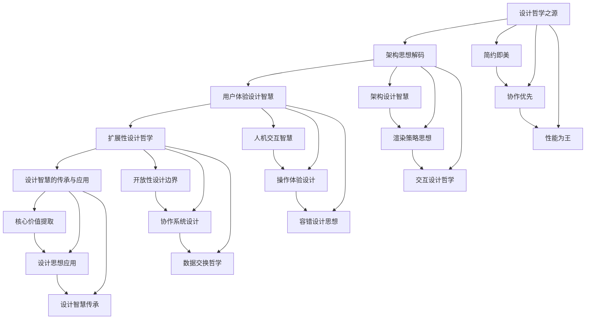

# Excalidraw 设计思想深度解析
## 从产品哲学到设计智慧的系统性学习指南

---

## 🎨 为什么要学习 Excalidraw 的设计思想？

### 一个深刻的问题

在这个功能过载的时代，为什么一个**功能极简**的画板工具能够获得：
- 🌟 **GitHub 80k+ Stars**
- 👥 **数百万用户**的选择
- 💝 **开发者与设计师**的一致喜爱
- 🚀 **Y Combinator 投资**的认可

**答案不在技术的复杂性，而在设计思想的深度。**

### Excalidraw 的设计智慧

这个看似简单的工具背后，蕴含着**深刻的产品设计智慧**：

#### 🎯 **简约主义的力量**
- **做减法的艺术**：为什么放弃图层、模板、高级功能？
- **认知负担最小化**：如何让工具"消失"，让创意"显现"？
- **手绘美学哲学**：为什么"不完美"反而更完美？

#### 🤝 **协作优先的价值观**
- **实时协作的设计挑战**：如何平衡性能与体验？
- **冲突解决的设计哲学**：技术方案如何体现人文关怀？
- **开源的战略智慧**：为什么开源是最好的商业策略？

#### ⚡ **性能体验的设计艺术**
- **60fps 的哲学意义**：为什么流畅性比功能更重要？
- **技术选择的价值导向**：Canvas vs SVG 背后的深层考虑
- **简单架构的复杂智慧**：如何用简单的方案解决复杂的问题？

---

## 🎓 这套教程适合谁？

### 不再是技术入门，而是思维进阶

**如果你是以下人群，这套教程将为你带来根本性的思维升级：**

#### 🎯 **产品经理 & 设计师**
- 想要理解**优秀产品背后的设计哲学**
- 需要掌握**产品决策的思考框架**
- 希望建立**设计价值观的判断标准**

#### 👨‍💻 **技术负责人 & 架构师**
- 想要学习**技术选择背后的设计思考**
- 需要平衡**功能复杂度与用户体验**
- 希望建立**技术为设计服务的理念**

#### 🚀 **创业者 & 产品负责人**
- 想要理解**简约产品的商业价值**
- 需要学习**产品定位的战略思考**
- 希望掌握**MVP 设计的方法论**

#### 🎨 **交互设计师 & UI 设计师**
- 想要深入理解**交互设计的人文关怀**
- 需要掌握**用户体验的设计原则**
- 希望学习**设计约束的价值创造**

---

## 🧠 学习这套教程你将获得什么？

### 从技能学习到思维重塑

**这不是一个技术教程，而是一次设计思维的深度训练**

#### 💡 **设计哲学的洞察力**
- **理解优秀产品的本质特征**：什么让好产品脱颖而出？
- **掌握设计决策的思考逻辑**：面临选择时如何系统思考？
- **建立产品价值观的判断体系**：如何评判设计的好坏？

#### 🏗️ **架构思维的系统性**
- **学会用设计思想指导技术选择**：技术如何服务于用户价值？
- **掌握复杂性管理的设计原则**：如何化繁为简？
- **理解约束条件下的创新方法**：限制如何激发创造力？

#### 🎭 **用户体验的深度理解**
- **掌握交互设计的人文关怀**：如何让技术更有温度？
- **学会性能体验的设计平衡**：如何在约束中创造价值？
- **理解协作体验的设计挑战**：如何设计多人协作的和谐？

#### 🔧 **实践应用的方法论**
- **获得可复用的设计原则**：如何应用到自己的项目？
- **建立设计评估的标准体系**：如何判断设计决策的优劣？
- **形成持续进化的设计思维**：如何保持设计敏感度？

---

## 🗺️ 学习路线：思想到实践的系统性旅程

---

## 📚 教程架构：五大篇章的设计思想之旅

### 🎨 **第一篇：设计哲学之源**
> 探寻 Excalidraw 成功背后的根本原因

#### Chapter 1: 简约即美 - 核心设计哲学
**核心问题**：为什么简约设计比功能丰富更有价值？
- 手绘美学的哲学意义
- 做减法的设计艺术
- 认知负担最小化的设计原则
- 功能约束下的创新空间

#### Chapter 2: 协作优先 - 产品价值观
**核心问题**：如何在产品设计中体现协作优先的理念？
- 实时协作的设计挑战与解决方案
- 开源文化对产品设计的影响
- 数据主权的设计体现
- 社区驱动的产品进化

#### Chapter 3: 性能为王 - 技术哲学
**核心问题**：如何平衡功能丰富性和性能体验？
- 60fps 的哲学意义与实现策略
- 技术选择的用户价值导向
- 简单架构的复杂智慧
- 性能约束下的设计创新

---

### 🏗️ **第二篇：架构思想解码**
> 深入理解优秀架构设计的思考逻辑

#### Chapter 4: 架构设计智慧
**核心问题**：什么样的架构设计能够支撑产品长期发展？
- 单向数据流的设计哲学
- 状态管理的复杂度控制
- 模块化设计的边界艺术
- 可维护性优先的架构原则

#### Chapter 5: 渲染策略思想
**核心问题**：如何设计高性能的渲染系统？
- 双画布架构的设计智慧
- 按需渲染的效率哲学
- 视口管理的用户体验设计
- 渲染优化的性能平衡艺术

#### Chapter 6: 交互设计哲学
**核心问题**：如何设计直觉化的用户交互？
- 工具系统的简化设计思想
- 状态驱动vs对象驱动的选择
- 快捷键设计的认知心理学
- 交互反馈的即时性设计

---

### 🎭 **第三篇：用户体验设计智慧**
> 掌握卓越用户体验背后的设计思考

#### Chapter 7: 人机交互智慧
**核心问题**：如何让技术更有人文温度？
- 多输入设备的统一抽象设计
- 手势识别的直觉化设计
- 无障碍设计的人文关怀
- 跨平台交互的一致性设计

#### Chapter 8: 操作体验设计
**核心问题**：如何设计让用户愉悦的操作体验？
- 选择与变换的操作逻辑设计
- 视觉反馈的心理学应用
- 操作容错的宽容设计
- 学习曲线的优化设计

#### Chapter 9: 容错设计思想
**核心问题**：如何设计对用户宽容的系统？
- 撤销重做的设计哲学
- 错误恢复的用户体验设计
- 数据安全的设计保障
- 操作误区的预防设计

---

### 🔧 **第四篇：扩展性设计哲学**
> 学习如何设计既简单又灵活的系统

#### Chapter 10: 开放性设计边界
**核心问题**：如何在开放与封闭之间找到平衡？
- 插件架构的设计哲学
- API 设计的简洁性原则
- 扩展点的战略选择
- 向后兼容的设计承诺

#### Chapter 11: 协作系统设计
**核心问题**：如何设计优秀的多人协作体验？
- 实时同步的技术哲学
- 冲突解决的设计策略
- 协作权限的简化设计
- 协作可视化的设计艺术

#### Chapter 12: 数据交换哲学
**核心问题**：如何设计开放的数据生态？
- 数据格式的标准化设计
- 导入导出的用户体验
- 数据迁移的平滑设计
- 生态集成的开放策略

---

### 💡 **第五篇：设计智慧的传承与应用**
> 将学到的设计思想应用到实践中

#### Chapter 13: 核心价值提取
**核心问题**：如何识别和提取产品的核心价值？
- MVP 设计的价值识别方法
- 功能优先级的判断框架
- 核心用户路径的设计专注
- 价值传递的设计策略

#### Chapter 14: 设计思想应用
**核心问题**：如何将设计智慧应用到自己的项目？
- 设计决策的思考框架
- 用户研究的设计转化
- 原型验证的设计迭代
- 设计评估的标准体系

#### Chapter 15: 设计智慧传承
**核心问题**：如何建立持续进化的设计能力？
- 设计思维的训练方法
- 设计敏感度的培养途径
- 设计团队的文化建设
- 设计知识的沉淀与传承

---

## 🎯 学习成果：从技能到智慧的跃升

### 传统技术教程 vs 设计思想教程

| 维度 | 传统技术教程 | 本设计思想教程 |
|------|-------------|--------------|
| **学习重心** | 技术实现细节 | 设计思考过程 |
| **知识层次** | 具体技能学习 | 抽象智慧获得 |
| **应用范围** | 特定技术栈 | 通用设计原则 |
| **价值持续性** | 技术更新易过时 | 设计智慧长期有效 |
| **思维层次** | 实现层面思考 | 战略层面思考 |
| **职业发展** | 技术专家路径 | 产品设计领导力 |

### 完成学习后的核心能力

#### 🧠 **设计思维能力**
- 能够从设计哲学高度思考产品问题
- 具备系统性的设计决策分析能力
- 掌握复杂问题的简化设计方法
- 建立用户价值导向的思考习惯

#### 🎯 **产品判断能力**
- 能够快速识别产品设计的核心问题
- 具备设计方案优劣的评判标准
- 掌握产品功能取舍的决策框架
- 建立长期产品发展的战略眼光

#### 🏗️ **架构设计能力**
- 能够设计支撑业务发展的技术架构
- 具备平衡复杂度与可维护性的能力
- 掌握技术选择的用户价值导向
- 建立约束条件下的创新思维

#### 🤝 **团队协作能力**
- 能够用设计语言统一团队认知
- 具备跨职能团队的沟通协调能力
- 掌握设计文化的团队建设方法
- 建立持续学习进化的团队机制

---

## 🚀 开始你的设计思想学习之旅

### 推荐学习方式

#### 📖 **深度阅读**
- 每章设置思考时间，不求快速完成
- 结合自己的项目经验进行对比思考
- 记录学习过程中的设计洞察
- 与同事或朋友讨论其中的设计观点

#### 🎯 **实践应用**
- 用学到的设计原则评估现有项目
- 在新项目中尝试应用这些设计思想
- 建立自己的设计决策文档
- 持续优化和进化设计方法

#### 🤝 **交流分享**
- 在团队中分享学到的设计智慧
- 参与设计相关的社区讨论
- 写作输出加深对设计思想的理解
- 指导他人学习设计思维

---

## 💝 特别说明

### 这不是一个技术教程

**如果你期待的是：**
- ❌ Canvas API 的详细讲解
- ❌ React 开发的技术指导
- ❌ 性能优化的实现技巧
- ❌ 功能开发的代码示例

**那么这套教程可能不适合你。**

### 这是一个思想解析指南

**如果你追求的是：**
- ✅ 产品设计的深度思考
- ✅ 架构设计的智慧积累
- ✅ 用户体验的设计洞察
- ✅ 团队协作的理念升级

**那么这套教程将为你带来根本性的思维提升。**

---

## 🎨 开始第一章：简约即美的设计哲学

**准备好开始一次思想的深度旅程了吗？**

[👉 开始学习 Chapter 1: 简约即美 - 核心设计哲学](./01-simplicity-design-philosophy.md)

---

> 💡 **记住**：伟大的产品不是因为技术复杂而成功，而是因为设计智慧而深入人心。
>
> **让我们一起探索 Excalidraw 成功背后的设计思想，收获可以受用终生的产品设计智慧。**

---

**最后更新**：2025-09-26
**版本**：Design Philosophy Guide v1.0
**目标**：传授设计智慧，而非技术技巧