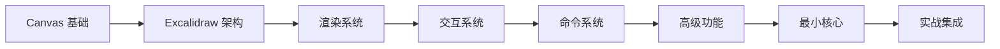

# Excalidraw 开发指南 - 从零开始掌握画板技术

## 📌 项目介绍

### 为什么要学习 Excalidraw？

Excalidraw 是目前最受欢迎的开源白板应用之一，它的成功源于：
- **极简的设计理念**：手绘风格让图表更有亲和力
- **流畅的用户体验**：即使在复杂场景下也能保持 60fps
- **完善的功能体系**：从基础绘图到实时协作一应俱全
- **优秀的代码架构**：模块化设计，易于扩展和维护

### 本指南适合谁？

- 🎯 **Canvas 零基础的前端工程师**
- 🎯 **需要在项目中集成画板功能的开发者**
- 🎯 **想要深入理解图形编辑器实现原理的技术爱好者**
- 🎯 **计划开发自己的绘图应用的创业者**

### 学习目标

通过本指南的学习，你将：
1. **掌握 Canvas 技术栈**：从基础 API 到高级优化技巧
2. **理解 Excalidraw 架构**：深入源码，理解设计决策
3. **实现最小画板核心**：提取核心功能，打造自己的画板库

## 🗺️ 学习路线图



## 📚 章节详解

### 第一章：Canvas 基础入门

#### 学习目标
从零开始掌握 Canvas 2D 绘图技术，为理解 Excalidraw 打下坚实基础。

#### 核心内容
| 文档 | 主要内容 | 实战项目 |
|------|----------|----------|
| `01-canvas-basics.md` | Canvas 与 SVG/DOM 对比、坐标系统、上下文 | 基础画布 |
| `02-canvas-drawing.md` | 路径 API、图形绘制、样式系统 | 简单画图工具 |
| `03-canvas-transform.md` | 变换矩阵、状态管理、图像合成 | 图形变换器 |
| `04-canvas-interaction.md` | 事件处理、坐标转换、碰撞检测 | 交互式编辑器 |
| `05-canvas-optimization.md` | 性能优化、脏矩形、离屏渲染 | 高性能画板 |

#### 学习成果
- ✅ 能独立实现一个简单的画图应用
- ✅ 理解 Canvas 性能优化的核心技巧
- ✅ 掌握图形交互的基本原理

### 第二章：Excalidraw 项目架构

#### 学习目标
深入理解 Excalidraw 的项目组织方式和架构设计理念。

#### 核心内容
| 文档 | 主要内容 | 关键源码 |
|------|----------|----------|
| `06-excalidraw-structure.md` | Monorepo、包管理、构建系统 | `packages/` 目录结构 |
| `07-data-model.md` | Element、AppState、Scene 设计 | `element/types.ts` |
| `08-component-architecture.md` | React 组件、状态管理、Hook 设计 | `components/App.tsx` |

#### 架构图解
```
┌─────────────────────────────────────────────┐
│              用户界面层 (UI Layer)           │
│  工具栏 | 属性面板 | 画布 | 菜单 | 对话框     │
└─────────────────────────────────────────────┘
                      ↓
┌─────────────────────────────────────────────┐
│            应用逻辑层 (App Layer)            │
│  App State | Actions | History | Tools      │
└─────────────────────────────────────────────┘
                      ↓
┌─────────────────────────────────────────────┐
│           渲染引擎层 (Render Layer)          │
│  Scene | Renderer | Cache | Viewport        │
└─────────────────────────────────────────────┘
                      ↓
┌─────────────────────────────────────────────┐
│           数据模型层 (Data Layer)            │
│  Elements | Bindings | Files | Library      │
└─────────────────────────────────────────────┘
```

### 第三章：渲染系统深度解析

#### 学习目标
掌握 Excalidraw 的高性能渲染机制和优化策略。

#### 核心内容
| 文档 | 主要内容 | 性能指标 | 状态 |
|------|----------|----------|------|
| `11-rendering-engine.md` | 渲染管线、场景图、视口管理 | 60fps@1000元素 | ✅ 完成 |
| `12-shape-rendering.md` | RoughJS、手绘算法、图形缓存 | 首次渲染<16ms | ✅ 完成 |
| `13-render-optimization.md` | 分层、虚拟化、批处理 | 重绘<8ms | ✅ 完成 |

#### 渲染流程
```javascript
// 简化的渲染流程
function render(scene, viewport) {
  // 1. 计算可见元素
  const visibleElements = cullElements(scene.elements, viewport);

  // 2. 分层渲染
  renderStaticLayer(visibleElements.static);   // 静态层（缓存）
  renderDynamicLayer(visibleElements.dynamic); // 动态层（实时）
  renderUILayer(scene.ui);                     // UI层（覆盖）

  // 3. 合成最终图像
  composeLayers();
}
```

### 第四章：交互系统实现

#### 学习目标
理解复杂交互的实现原理，掌握工具系统设计模式。

#### 核心内容
| 文档 | 主要内容 | 交互类型 | 状态 |
|------|----------|----------|------|
| `14-tool-system.md` | 工具抽象、状态机、快捷键 | 选择/绘制/编辑 | ✅ 完成 |
| `15-gesture-handling.md` | 事件处理、手势识别、多点触控 | 拖拽/缩放/旋转 | ✅ 完成 |
| `16-selection-transform.md` | 选择算法、变换手柄、约束系统 | 单选/多选/框选 | ✅ 完成 |

#### 工具系统架构
```typescript
interface Tool {
  name: string;
  icon: string;
  cursor: string;

  onPointerDown(event: PointerEvent): void;
  onPointerMove(event: PointerEvent): void;
  onPointerUp(event: PointerEvent): void;
  onKeyDown(event: KeyboardEvent): void;
}

class SelectionTool implements Tool {
  // 选择工具实现
}

class DrawingTool implements Tool {
  // 绘图工具实现
}
```

### 第五章：Action 与命令系统

#### 学习目标
掌握 Excalidraw 的命令模式实现和历史管理机制。

#### 核心内容
| 文档 | 主要内容 | 设计模式 | 状态 |
|------|----------|----------|------|
| `17-action-system.md` | Action 架构、注册机制、批处理 | 命令模式 | ✅ 完成 |
| `18-history-management.md` | 历史栈、状态快照、内存优化 | 备忘录模式 | ✅ 完成 |

#### Action 示例
```typescript
const deleteSelectedElements: Action = {
  name: "deleteSelectedElements",
  perform: (elements, appState) => {
    const selectedIds = new Set(appState.selectedElementIds);
    return {
      elements: elements.filter(el => !selectedIds.has(el.id)),
      appState: { ...appState, selectedElementIds: {} }
    };
  },
  keyTest: (event) => event.key === "Delete"
};
```

### 第六章：高级功能实现

#### 学习目标
了解 Excalidraw 的扩展功能实现，包括协作、导出等。

#### 核心内容
| 文档 | 主要内容 | 技术栈 | 状态 |
|------|----------|---------|------|
| `19-collaboration-system.md` | 实时协作、CRDT、冲突解决 | WebSocket/WebRTC | ✅ 完成 |
| `21-import-export.md` | 数据格式、SVG/PNG 导出 | Canvas API | ✅ 完成 |
| `20-plugin-architecture.md` | 插件接口、生命周期、主题 | 策略模式 | ✅ 完成 |

### 第七章：最小核心拆解

#### 学习目标
提取 Excalidraw 的核心功能，打造轻量级画板库。

#### 核心内容
| 文档 | 主要内容 | 目标指标 | 状态 |
|------|----------|----------|------|
| `22-minimal-core.md` | 功能裁剪、依赖分析、核心实现 | <50KB | ✅ 完成 |
| `23-performance-core.md` | 性能优化、内存管理、缓存策略 | 零依赖 | ✅ 完成 |
| `24-extensibility-core.md` | 插件化架构、扩展设计、主题系统 | 全框架 | ✅ 完成 |

#### 最小核心功能集
```javascript
// 最小 API 设计
class MinimalBoard {
  constructor(canvas) {
    this.canvas = canvas;
    this.elements = [];
  }

  // 核心方法
  addElement(type, props) {}
  updateElement(id, props) {}
  deleteElement(id) {}

  // 渲染
  render() {}

  // 交互
  on(event, handler) {}

  // 导出
  toJSON() {}
  toSVG() {}
}
```

### 第八章：最佳实践与总结

#### 学习目标
总结最佳实践，建立自己的画板开发知识体系。

#### 核心内容
| 文档 | 主要内容 | 实用价值 | 状态 |
|------|----------|----------|------|
| `25-development-workflow.md` | 工程化、测试、CI/CD | 生产级别 | ✅ 完成 |
| `26-debugging-optimization.md` | 性能监控、调试技巧、优化策略 | 性能保障 | ✅ 完成 |
| `27-ecosystem-integration.md` | 生态集成、框架适配、云服务 | 持续成长 | ✅ 完成 |

## 🎯 最小核心功能规划

### 必备功能（MVP）
| 功能 | 说明 | 优先级 | 预计代码量 |
|------|------|--------|-----------|
| **基础绘制** | 矩形、圆形、线条、箭头 | P0 | ~500行 |
| **选择系统** | 单选、多选、框选 | P0 | ~300行 |
| **基础变换** | 移动、删除 | P0 | ~200行 |
| **撤销重做** | 历史记录管理 | P0 | ~150行 |
| **数据导出** | JSON 格式 | P0 | ~100行 |
| **视图控制** | 缩放、平移 | P1 | ~200行 |

### 扩展功能
| 功能 | 说明 | 优先级 | 依赖库 |
|------|------|--------|--------|
| **手绘风格** | RoughJS 集成 | P2 | roughjs |
| **文本编辑** | 文本元素支持 | P2 | - |
| **高级变换** | 旋转、缩放、翻转 | P2 | - |
| **图片支持** | 图片导入和显示 | P3 | - |
| **导出图片** | PNG/SVG 导出 | P3 | - |

## 💡 核心技术要点

### 1. 坐标系统管理
```javascript
class CoordinateSystem {
  // 屏幕坐标 → Canvas 坐标
  screenToCanvas(screenX, screenY) {
    const rect = this.canvas.getBoundingClientRect();
    return {
      x: (screenX - rect.left) / this.zoom - this.offsetX,
      y: (screenY - rect.top) / this.zoom - this.offsetY
    };
  }

  // Canvas 坐标 → 场景坐标
  canvasToScene(canvasX, canvasY) {
    return {
      x: canvasX * this.devicePixelRatio,
      y: canvasY * this.devicePixelRatio
    };
  }
}
```

### 2. 元素数据结构
```typescript
interface ExcalidrawElement {
  id: string;
  type: "rectangle" | "ellipse" | "arrow" | "text";
  x: number;
  y: number;
  width: number;
  height: number;
  angle: number;
  strokeColor: string;
  backgroundColor: string;
  fillStyle: "hachure" | "solid" | "cross-hatch";
  strokeWidth: number;
  roughness: number;
  opacity: number;
  seed: number; // 用于随机手绘效果
}
```

### 3. 渲染优化技巧
```javascript
class RenderOptimizer {
  constructor() {
    this.staticCache = new Map();  // 静态元素缓存
    this.dirtyRects = [];          // 脏矩形列表
  }

  // 增量渲染
  renderIncremental(elements) {
    // 1. 识别变化的元素
    const changed = this.detectChanges(elements);

    // 2. 计算脏矩形
    const dirtyRect = this.calculateDirtyRect(changed);

    // 3. 只重绘脏矩形区域
    this.clearRect(dirtyRect);
    this.renderElements(changed, dirtyRect);
  }

  // 分层渲染
  renderLayered(elements) {
    // 背景层（网格、水印等）
    this.renderBackground();

    // 静态层（未选中的元素）
    this.renderStatic(elements.filter(e => !e.selected));

    // 动态层（选中的元素）
    this.renderDynamic(elements.filter(e => e.selected));

    // UI层（选择框、手柄等）
    this.renderUI();
  }
}
```

### 4. 碰撞检测算法
```javascript
// AABB 碰撞检测
function isPointInElement(x, y, element) {
  const { x: ex, y: ey, width, height, angle } = element;

  // 如果有旋转，先反向旋转点
  if (angle) {
    const cos = Math.cos(-angle);
    const sin = Math.sin(-angle);
    const dx = x - ex;
    const dy = y - ey;
    x = ex + dx * cos - dy * sin;
    y = ey + dx * sin + dy * cos;
  }

  // AABB 检测
  return x >= ex && x <= ex + width &&
         y >= ey && y <= ey + height;
}

// 矩形选择
function getElementsInRectangle(rect, elements) {
  return elements.filter(element => {
    // 检查元素是否与选择框相交
    return !(element.x > rect.x + rect.width ||
             element.x + element.width < rect.x ||
             element.y > rect.y + rect.height ||
             element.y + element.height < rect.y);
  });
}
```

## 🛠️ 开发环境配置

### 环境要求
- Node.js >= 14.0.0
- Yarn >= 1.22.0
- Git >= 2.0.0
- 推荐 VS Code + 相关插件

### 快速开始
```bash
# 1. 克隆项目
git clone https://github.com/excalidraw/excalidraw.git
cd excalidraw

# 2. 安装依赖
yarn install

# 3. 启动开发服务器
yarn start
# 访问 http://localhost:3000

# 4. 运行测试
yarn test:app     # 应用测试
yarn test:update  # 更新快照
yarn test:code    # 代码质量

# 5. 类型检查
yarn test:typecheck

# 6. 构建项目
yarn build:app    # 构建应用
yarn build:esm    # 构建 ESM 包
```

### VS Code 推荐配置
```json
{
  "editor.formatOnSave": true,
  "editor.defaultFormatter": "esbenp.prettier-vscode",
  "typescript.tsdk": "node_modules/typescript/lib",
  "eslint.validate": [
    "javascript",
    "javascriptreact",
    "typescript",
    "typescriptreact"
  ]
}
```

### 推荐插件
- ESLint - 代码检查
- Prettier - 代码格式化
- TypeScript Vue Plugin - TS 支持
- GitLens - Git 增强
- Canvas Snippets - Canvas 代码片段

## 📊 性能基准

### Excalidraw 性能指标
| 场景 | 元素数量 | FPS | 内存占用 | 渲染时间 |
|------|---------|-----|---------|----------|
| 轻量 | 100 | 60 | ~50MB | <8ms |
| 正常 | 500 | 60 | ~100MB | <12ms |
| 复杂 | 1000 | 55+ | ~150MB | <16ms |
| 极限 | 5000 | 30+ | ~300MB | <33ms |

### 优化技巧对比
| 优化技术 | 性能提升 | 实现难度 | 适用场景 |
|---------|---------|---------|---------|
| 脏矩形 | 40% | 中 | 局部更新 |
| 分层渲染 | 60% | 低 | 静态内容多 |
| 虚拟化 | 80% | 高 | 大量元素 |
| 离屏Canvas | 30% | 低 | 复杂图形 |
| WebWorker | 20% | 高 | 计算密集 |

## 📚 参考资源

### 官方资源
- [Excalidraw 官网](https://excalidraw.com)
- [GitHub 仓库](https://github.com/excalidraw/excalidraw)
- [NPM 包](https://www.npmjs.com/package/@excalidraw/excalidraw)
- [官方文档](https://docs.excalidraw.com)
- [官方博客](https://blog.excalidraw.com)

### 技术文档
- [MDN Canvas API](https://developer.mozilla.org/zh-CN/docs/Web/API/Canvas_API)
- [Canvas 最佳实践](https://developer.mozilla.org/zh-CN/docs/Web/API/Canvas_API/Tutorial/Optimizing_canvas)
- [React 性能优化](https://react.dev/learn/render-and-commit)
- [TypeScript 手册](https://www.typescriptlang.org/docs/)

### 相关库
- [RoughJS](https://roughjs.com/) - 手绘风格图形库
- [Perfect Freehand](https://github.com/steveruizok/perfect-freehand) - 完美手写算法
- [Fabric.js](http://fabricjs.com/) - Canvas 库对比参考
- [Paper.js](http://paperjs.org/) - 矢量图形脚本框架

### 学习资料
- [Canvas Deep Dive](https://joshondesign.com/p/books/canvasdeepdive/)
- [HTML5 Canvas Cookbook](https://www.packtpub.com/product/html5-canvas-cookbook/9781849691369)
- [Excalidraw 架构解析](https://www.youtube.com/watch?v=fix2-4QqLTY)

## 🤝 社区与支持

### 获取帮助
- GitHub Issues：技术问题和 Bug 报告
- Discord 社区：实时交流和讨论
- Stack Overflow：搜索 `excalidraw` 标签

### 贡献指南
1. Fork 项目
2. 创建功能分支
3. 提交变更
4. 推送到分支
5. 创建 Pull Request

### 行为准则
- 尊重他人观点
- 提供建设性反馈
- 保持专业态度
- 遵守开源协议

## 📝 学习笔记模板

```markdown
# 章节名称

## 学习目标
- [ ] 目标1
- [ ] 目标2

## 核心概念
### 概念1
定义：
原理：
应用：

## 代码实践
\`\`\`javascript
// 代码示例
\`\`\`

## 源码分析
文件路径：
关键函数：
设计模式：

## 实战练习
任务：
解决方案：

## 思考题
1. 问题1？
2. 问题2？

## 总结
- 要点1
- 要点2
```

---

**最后更新**：2025-09-25
**版本**：v2.0
**作者**：dev-guide 学习小组
**许可**：MIT License

> 💡 **提示**：本指南是一个持续更新的项目，欢迎提出建议和贡献内容！