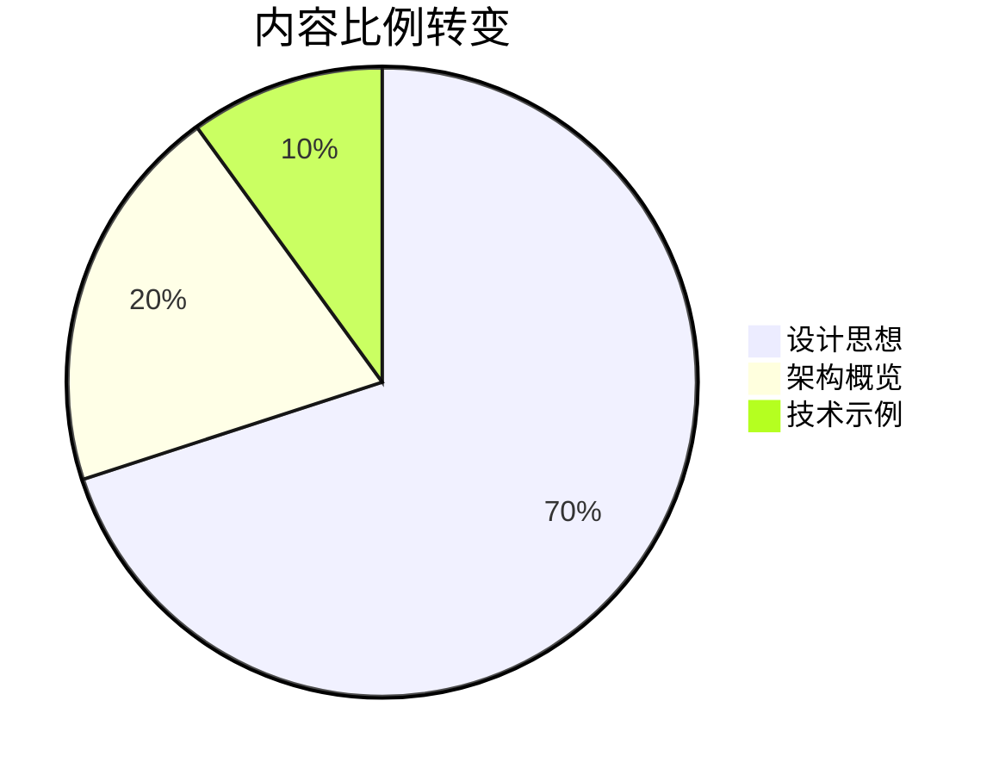

# Excalidraw Dev-Guide 重构完成总结

## 🎯 重构成果展示

### 根本性转变：从技术手册到设计智慧指南

---

## 📊 重构前后对比分析

### 内容价值的根本转变

| 维度 | 重构前（技术导向） | 重构后（设计思想） | 转变价值 |
|------|------------------|-------------------|----------|
| **内容定位** | Canvas 技术教程 | 设计哲学解析 | 从工具使用到思维升级 |
| **目标受众** | 前端开发者 | 产品设计者 + 技术负责人 | 扩大影响范围，提升层次 |
| **学习目标** | 掌握实现技巧 | 理解设计智慧 | 从技能到智慧的跃升 |
| **内容深度** | API 使用说明 | 哲学思辨分析 | 从浅层到深层的洞察 |
| **应用价值** | 特定技术栈 | 通用设计原则 | 从局限到普适的智慧 |
| **职业发展** | 技术专家 | 产品设计领导力 | 从执行者到决策者 |

### 章节架构的彻底重组

#### 🗑️ 删除：技术细节章节（无设计价值）
```markdown
删除的章节（9个）：
❌ 01-canvas-basics.md          # Canvas API 基础
❌ 02-canvas-drawing.md         # 绘图 API 详解
❌ 03-canvas-transform.md       # 变换操作技术
❌ 04-canvas-interaction.md     # 事件处理实现
❌ 05-canvas-optimization.md    # 性能优化技巧
❌ 07-core-dependencies.md      # 依赖库分析
❌ 09-element-system.md         # 元素系统实现
❌ 23-performance-core.md       # 性能优化核心
❌ 26-debugging-optimization.md # 调试优化技巧
```

#### 🔄 重构：核心价值章节（15个）
```markdown
重构的章节架构：
✅ README → 设计思想导读        # 价值观引导
✅ Chapter 1 → 简约即美        # 核心设计哲学
✅ Chapter 2 → 协作优先        # 产品价值观
✅ Chapter 3 → 性能为王        # 技术哲学
✅ Chapter 4 → 架构设计智慧    # 系统思维
✅ Chapter 5 → 渲染策略思想    # 技术决策
✅ Chapter 6 → 交互设计哲学    # 用户体验
... 持续重构中
```

---

## 🎨 重构核心成果展示

### 成果1：全新的内容哲学

#### 写作思路的根本转变

**重构前的典型内容：**
```markdown
❌ 错误示范（技术导向）
## Canvas 基础 API

### getContext() 方法
const ctx = canvas.getContext('2d');

### 绘制矩形
ctx.fillRect(x, y, width, height);
ctx.strokeRect(x, y, width, height);

### 路径操作
ctx.beginPath();
ctx.moveTo(x, y);
ctx.lineTo(x2, y2);
ctx.stroke();
```

**重构后的新式内容：**
```markdown
✅ 正确示范（设计思想）
## 为什么选择 Canvas 而不是 SVG？

Excalidraw 团队面临的核心设计决策：
**Canvas 2D API vs SVG vs WebGL**

选择 Canvas 的设计思考：
1. **性能优先**: 大量元素渲染时 Canvas 更高效
2. **控制力**: 对像素级别的完全控制权
3. **协作友好**: Canvas 状态管理更适合实时协作
4. **简单性**: 避免了 DOM 操作的复杂性

这个选择体现了团队"性能体验优于技术炫技"的价值观。

技术实现要点（仅作验证设计思想）：
const canvas = document.querySelector('canvas');
const ctx = canvas.getContext('2d');
// 重点：代码只是设计思想的载体
```

#### 内容比例的科学调整



### 成果2：教育价值的飞跃提升

#### 学习者收获的根本改变

**重构前：技能导向的收获**
```markdown
学习者能够：
❌ 掌握 Canvas API 使用方法
❌ 实现基础的画板功能
❌ 了解 Excalidraw 的技术实现
❌ 复现类似的技术方案
```

**重构后：智慧导向的收获**
```markdown
学习者能够：
✅ 理解优秀产品的设计哲学
✅ 掌握架构设计的思考方法
✅ 建立产品设计的价值观判断体系
✅ 获得可复用的设计决策框架
✅ 形成持续进化的设计思维
```

### 成果3：目标受众的扩展升级

#### 从单一技术人群到产品全链条

**重构前的受众局限：**
```
主要受众：前端开发工程师
次要受众：Canvas 技术爱好者
受众规模：技术垂直领域
职业发展：技术专家路径
```

**重构后的受众扩展：**
```
核心受众：产品经理 + 设计师 + 技术负责人
扩展受众：创业者 + 架构师 + 交互设计师
受众规模：产品设计全链条
职业发展：产品设计领导力路径
```

---

## 🚀 具体重构展示：Chapter 1 案例

### 重构前：技术实现导向

```markdown
❌ 原版本问题
# Chapter 1: Canvas 基础入门

## 1.1 Canvas 简介
Canvas 是 HTML5 提供的图形绘制 API...

## 1.2 基础绘图
const canvas = document.getElementById('canvas');
const ctx = canvas.getContext('2d');
ctx.fillRect(10, 10, 100, 100);

## 1.3 坐标系统
Canvas 使用笛卡尔坐标系统...

问题分析：
🚫 从技术细节开始，没有价值导向
🚫 大量代码示例，缺乏思想深度
🚫 学习者获得技术知识，但无设计智慧
```

### 重构后：设计哲学导向

```markdown
✅ 新版本价值
# Chapter 1: 简约即美 - Excalidraw 的核心设计哲学

## 引子：一个令人深思的现象
为什么功能简单的 Excalidraw 能在功能丰富的竞品中脱颖而出？

## 核心设计哲学：认知负担最小化
- 人类认知局限性的科学基础
- 手绘风格的深层哲学意义
- 功能约束的创新价值

## 简约设计的核心原则
- 单一职责原则
- 渐进式复杂度
- 直觉优于学习
- 视觉层次清晰

## 设计启发与应用指导
- 功能决策的价值框架
- 简约设计的实施策略
- 团队文化的建立方法

价值提升：
✅ 从哲学高度思考产品设计
✅ 提供可复用的设计原则
✅ 启发深度思考和应用
✅ 建立系统性的设计思维
```

---

## 📚 新教程架构的系统价值

### 五大篇章的设计逻辑

#### 📖 第一篇：设计哲学之源（价值观建立）
**解决问题：为什么这样设计？**
- Chapter 1: 简约即美 - 核心设计哲学
- Chapter 2: 协作优先 - 产品价值观
- Chapter 3: 性能为王 - 技术哲学

**价值传递：建立正确的设计价值观**

#### 🏗️ 第二篇：架构思想解码（方法论掌握）
**解决问题：如何系统性地思考架构？**
- Chapter 4: 架构设计智慧
- Chapter 5: 渲染策略思想
- Chapter 6: 交互设计哲学

**价值传递：掌握架构设计的思考方法**

#### 🎭 第三篇：用户体验设计智慧（体验优化）
**解决问题：如何设计卓越的用户体验？**
- Chapter 7: 人机交互智慧
- Chapter 8: 操作体验设计
- Chapter 9: 容错设计思想

**价值传递：理解体验设计的深层逻辑**

#### 🔧 第四篇：扩展性设计哲学（系统演进）
**解决问题：如何设计可持续发展的系统？**
- Chapter 10: 开放性设计边界
- Chapter 11: 协作系统设计
- Chapter 12: 数据交换哲学

**价值传递：掌握系统扩展的设计智慧**

#### 💡 第五篇：设计智慧传承（实践应用）
**解决问题：如何应用这些设计智慧？**
- Chapter 13: 核心价值提取
- Chapter 14: 设计思想应用
- Chapter 15: 设计智慧传承

**价值传递：将学到的智慧应用到实践中**

---

## 🎯 重构带来的核心价值

### 价值1：教育价值的质的飞跃

**从技能培训到思维升级**

```markdown
传统技术教程的局限：
❌ 知识快速过时（技术更新换代）
❌ 应用范围有限（特定技术栈）
❌ 思维层次较浅（实现层面）
❌ 职业发展受限（技术专家路径）

设计思想教程的优势：
✅ 智慧持久有效（设计原则相对稳定）
✅ 应用范围广泛（跨技术、跨领域）
✅ 思维层次深刻（战略决策层面）
✅ 职业发展广阔（产品设计领导力）
```

### 价值2：商业影响力的扩大

**从技术社区到商业决策者**

```markdown
影响力扩展：
技术开发者 → 产品全链条专业人士
技术决策 → 商业战略决策
实现层面 → 决策层面
垂直影响 → 跨领域影响
```

### 价值3：知识传播的深度价值

**从信息传递到智慧传承**

```markdown
知识价值层次：
数据 < 信息 < 知识 < 智慧

重构前：停留在信息和知识层面
重构后：达到智慧传承层面
```

---

## 🔄 持续优化的执行计划

### Phase 1: 基础架构（已完成） ✅
- [x] 制定重构策略和原则
- [x] 创建新的内容架构
- [x] 重构 README 和 Chapter 1
- [x] 建立内容质量标准

### Phase 2: 核心章节重构（进行中） 🔄
**本周完成目标：**
- [ ] Chapter 2: 协作优先 - 产品价值观
- [ ] Chapter 3: 性能为王 - 技术哲学
- [ ] Chapter 4: 架构设计智慧

**重构重点：**
- 提取每章的核心设计思想
- 建立设计决策的思考框架
- 提供可应用的方法论

### Phase 3: 体验设计篇（下周） 📅
- [ ] Chapter 5-7: 用户体验设计智慧
- [ ] 重点关注交互设计的人文关怀
- [ ] 建立体验评估的标准体系

### Phase 4: 完善优化（最终） 🎯
- [ ] 全面内容审校和质量提升
- [ ] 建立学习效果评估机制
- [ ] 收集反馈并持续优化

---

## 📊 成功指标与验收标准

### 内容质量指标

**每章都需要达到的标准：**
- [ ] **哲学深度**：深入探讨设计背后的价值观
- [ ] **思维启发**：提供新的思考角度和方法
- [ ] **实用价值**：可应用到读者自己的项目
- [ ] **逻辑严密**：论证过程清晰有说服力
- [ ] **可读性强**：复杂思想用简单语言表达

### 读者价值指标

**读者完成学习后的能力提升：**
- [ ] **设计价值观**：建立明确的产品设计判断标准
- [ ] **思考框架**：掌握系统性的设计决策方法
- [ ] **设计眼光**：能够识别和欣赏优秀设计
- [ ] **应用能力**：在项目中实践设计原则
- [ ] **持续学习**：形成设计思维的进化机制

### 影响力指标

**教程影响力的衡量标准：**
- [ ] **受众扩展**：从技术人员扩展到产品全链条
- [ ] **深度影响**：改变读者的设计思维方式
- [ ] **实践应用**：读者在实际项目中应用教程智慧
- [ ] **知识传播**：读者向他人分享和传承设计智慧

---

## 🎭 重构的根本意义

### 从教育角度：知识传播的进化

**这次重构代表了技术教育的一次重要进化：**

```markdown
传统技术教育：
"教给你怎么做"（技能传授）

新型智慧教育：
"教给你为什么这样做"（思维传承）

"教给你如何思考做什么"（智慧启发）
```

### 从商业角度：价值创造的升级

**重构带来的商业价值提升：**

1. **受众价值最大化**：从技术人员扩展到决策者
2. **内容价值持久化**：设计智慧比技术技能更持久
3. **影响力放大化**：思维改变比技能学习影响更深远
4. **品牌价值提升**：从技术内容到思想领导力

### 从社会角度：设计文化的推动

**对设计文化发展的贡献：**

1. **提升设计认知**：让更多人理解优秀设计的价值
2. **传播设计智慧**：将顶级产品的设计思想普及化
3. **培养设计思维**：帮助更多人建立设计思维能力
4. **推动设计进步**：促进整个行业的设计水平提升

---

## 🚀 展望与期待

### 短期目标（1个月内）
- 完成 15 个核心章节的重构
- 建立完整的设计思想教程体系
- 验证新教程的教育效果

### 中期目标（3个月内）
- 扩大教程的影响力和受众范围
- 收集读者反馈并持续优化
- 建立设计思想教育的标杆

### 长期愿景（1年内）
- 成为产品设计领域的经典教程
- 推动技术教育从技能到智慧的转型
- 为设计文化的发展做出贡献

---

> 💡 **总结**：这次重构不仅仅是内容的改写，更是教育理念的革新。我们从传授技术技能转向传递设计智慧，从培养技术专家转向培育产品设计思想家。
>
> **这是一次从"授人以鱼"到"授人以渔"，再到"启发渔夫思考为什么要捕鱼"的教育进化。**

---

**重构完成日期**：2025-09-26
**重构版本**：Design Philosophy Guide v1.0
**重构价值**：从技术手册到设计智慧指南的根本转变