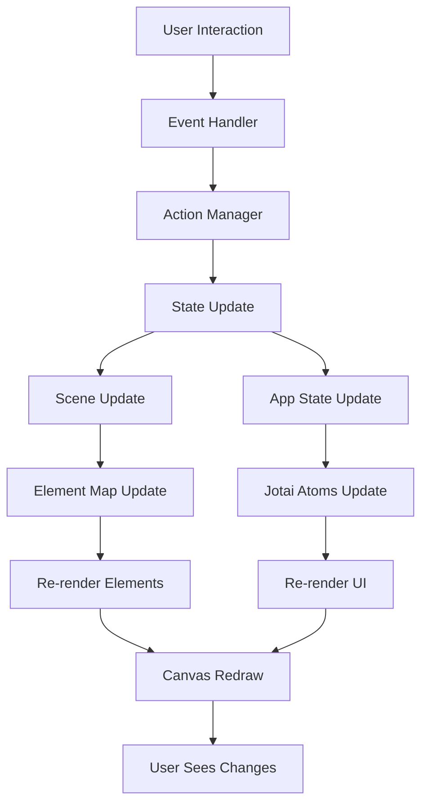

# Excalidraw 状态管理深度解析

Excalidraw 采用了混合状态管理策略，结合 React 内置状态管理和 Jotai 原子化状态管理，实现了高效、可维护的状态流转机制。

## 1. 状态管理架构总览

### 1.1 多层状态设计

```typescript
// Excalidraw 的状态分层设计
interface StateArchitecture {
  // 1. 全局应用状态 (App Component State)
  appState: {
    // 视图状态
    viewBackgroundColor: string;
    scrollX: number;
    scrollY: number;
    zoom: Zoom;
    
    // 工具状态  
    activeTool: ToolType;
    selectedElementIds: Record<string, boolean>;
    selectedGroupIds: Record<string, boolean>;
    
    // 交互状态
    draggingElement: NonDeletedExcalidrawElement | null;
    resizingElement: NonDeletedExcalidrawElement | null;
    editingElement: NonDeletedExcalidrawElement | null;
    
    // UI状态
    openMenu: "canvas" | "shape" | null;
    openSidebar: { name: SidebarName; tab?: SidebarTabName } | null;
    
    // 协作状态
    collaborators: Map<string, Collaborator>;
  };
  
  // 2. 场景数据 (Scene)
  sceneState: {
    elements: readonly ExcalidrawElement[];
    elementsMap: Map<string, ExcalidrawElement>;
    versionNonce: number;
  };
  
  // 3. 原子化状态 (Jotai Atoms)
  atomicState: {
    selectedElementsAtom: ExcalidrawElement[];
    collaboratorsAtom: Map<string, Collaborator>;
    appStateAtom: AppState;
    // ... 更多原子状态
  };
  
  // 4. 本地状态 (Component Local State)
  localState: {
    // 各组件内部状态
    // UI临时状态
    // 表单状态等
  };
}
```

### 1.2 状态流转图



## 2. AppState 详细解析

AppState 是 Excalidraw 的核心状态对象，包含了应用的所有状态信息。

### 2.1 AppState 完整定义

```typescript
// packages/excalidraw/types.ts
export interface AppState {
  // === 视图状态 ===
  viewBackgroundColor: string;        // 画布背景色
  scrollX: number;                   // 水平滚动位置
  scrollY: number;                   // 垂直滚动位置
  zoom: Zoom;                        // 缩放状态 { value: number }
  
  // === 画布尺寸 ===
  width: number;                     // 画布宽度
  height: number;                    // 画布高度
  offsetTop: number;                 // 画布顶部偏移
  offsetLeft: number;                // 画布左侧偏移
  
  // === 工具状态 ===
  activeTool: {
    type: ToolType;                  // 当前工具类型
    lastActiveTool?: ToolType | null; // 上次使用的工具
    locked?: boolean;                // 工具是否锁定
  };
  
  // === 选择状态 ===
  selectedElementIds: Record<string, boolean>;     // 选中的元素ID映射
  selectedGroupIds: Record<string, boolean>;       // 选中的组ID映射
  editingGroupId: string | null;                   // 正在编辑的组ID
  
  // === 绘制状态 ===
  currentItemStrokeColor: string;               // 当前描边颜色
  currentItemBackgroundColor: string;          // 当前填充颜色
  currentItemFillStyle: FillStyle;            // 当前填充样式
  currentItemStrokeWidth: number;             // 当前描边宽度
  currentItemStrokeStyle: StrokeStyle;        // 当前描边样式
  currentItemRoughness: number;               // 当前粗糙度
  currentItemOpacity: number;                 // 当前透明度
  currentItemFontFamily: FontFamilyValues;    // 当前字体
  currentItemFontSize: number;                // 当前字号
  currentItemTextAlign: TextAlign;            // 当前文本对齐
  currentItemRoundness: string;               // 当前圆角设置
  
  // === 箭头设置 ===
  currentItemStartArrowhead: Arrowhead | null;  // 起始箭头
  currentItemEndArrowhead: Arrowhead | null;    // 结束箭头
  
  // === 交互状态 ===
  draggingElement: NonDeletedExcalidrawElement | null;  // 正在拖拽的元素
  resizingElement: NonDeletedExcalidrawElement | null;  // 正在调整大小的元素
  editingElement: NonDeletedExcalidrawElement | null;   // 正在编辑的元素
  selectionElement: NonDeletedExcalidrawElement | null; // 选择框元素
  
  // === 线性元素编辑 ===
  selectedLinearElement: {
    elementId: string;
    selectedPointsIndices: number[];
    lastUncommittedPoint: LocalPoint | null;
    isDragging: boolean;
  } | null;
  
  // === UI状态 ===
  openMenu: "canvas" | "shape" | null;         // 打开的菜单
  openSidebar: {                               // 打开的侧边栏
    name: SidebarName;
    tab?: SidebarTabName;
  } | null;
  openDialog: {                                // 打开的对话框
    name: DialogName;
    data?: any;
  } | null;
  
  // === 模式状态 ===
  isLoading: boolean;                          // 是否正在加载
  errorMessage: string | null;                 // 错误消息
  viewModeEnabled: boolean;                    // 只读模式
  zenModeEnabled: boolean;                     // 专注模式
  gridSize: number | null;                     // 网格大小
  
  // === 协作状态 ===
  collaborators: Map<string, Collaborator>;   // 协作者映射
  
  // === 性能优化 ===
  shouldCacheIgnoreZoom: boolean;              // 是否忽略缩放缓存
  renderInteractiveSceneCallback?: () => void; // 交互场景渲染回调
  
  // === 主题和外观 ===
  theme: Theme;                                // 主题 ("light" | "dark")
  
  // === 快捷键状态 ===
  multiElement: NonDeletedExcalidrawElement | null;    // 多选元素
  isBindingEnabled: boolean;                           // 是否启用绑定
  startBoundElement: NonDeletedExcalidrawElement | null; // 绑定起始元素
  
  // === 历史和撤销 ===
  suggestedBindings: SuggestedBinding[];       // 建议的绑定
  
  // === 其他状态 ===
  pasteDialog: {                               // 粘贴对话框状态
    shown: boolean;
    data: ClipboardData | null;
  };
  
  pendingImageElement: ExcalidrawImageElement | null; // 待处理图片元素
  showHyperlinkPopup: "info" | "editor" | false;      // 超链接弹窗状态
}
```

### 2.2 默认状态工厂

```typescript
// packages/excalidraw/appState.ts

// 默认AppState生成函数
export const getDefaultAppState = (): Omit<AppState, "width" | "height"> => {
  return {
    // 视图默认值
    viewBackgroundColor: DEFAULT_EXPORT_PADDING.viewBackgroundColor,
    scrollX: 0,
    scrollY: 0,
    zoom: { value: 1 as NormalizedZoomValue },
    
    // 画布默认值
    offsetTop: 0,
    offsetLeft: 0,
    
    // 工具默认值
    activeTool: {
      type: "selection" as ToolType,
      lastActiveTool: null,
      locked: false,
    },
    
    // 选择默认值
    selectedElementIds: {},
    selectedGroupIds: {},
    editingGroupId: null,
    
    // 绘制样式默认值
    currentItemStrokeColor: BLACK_COLOR,
    currentItemBackgroundColor: TRANSPARENT_COLOR,
    currentItemFillStyle: DEFAULT_ELEMENT_PROPS.fillStyle,
    currentItemStrokeWidth: DEFAULT_ELEMENT_PROPS.strokeWidth,
    currentItemStrokeStyle: DEFAULT_ELEMENT_PROPS.strokeStyle,
    currentItemRoughness: DEFAULT_ELEMENT_PROPS.roughness,
    currentItemOpacity: DEFAULT_ELEMENT_PROPS.opacity,
    currentItemFontFamily: DEFAULT_FONT_FAMILY,
    currentItemFontSize: DEFAULT_FONT_SIZE,
    currentItemTextAlign: DEFAULT_TEXT_ALIGN,
    currentItemRoundness: "round",
    
    // 箭头默认值
    currentItemStartArrowhead: null,
    currentItemEndArrowhead: "arrow",
    
    // 交互状态默认值
    draggingElement: null,
    resizingElement: null,
    editingElement: null,
    selectionElement: null,
    selectedLinearElement: null,
    
    // UI状态默认值
    openMenu: null,
    openSidebar: null,
    openDialog: null,
    
    // 模式默认值
    isLoading: false,
    errorMessage: null,
    viewModeEnabled: false,
    zenModeEnabled: false,
    gridSize: null,
    
    // 协作默认值
    collaborators: new Map(),
    
    // 性能默认值
    shouldCacheIgnoreZoom: false,
    
    // 主题默认值
    theme: THEME.LIGHT,
    
    // 其他默认值
    multiElement: null,
    isBindingEnabled: true,
    startBoundElement: null,
    suggestedBindings: [],
    pasteDialog: { shown: false, data: null },
    pendingImageElement: null,
    showHyperlinkPopup: false,
  };
};

// 状态清理函数
export const clearAppStateForLocalStorage = (appState: AppState): Partial<AppState> => {
  const {
    collaborators,
    ...exportedState
  } = appState;
  
  return {
    ...exportedState,
    // 清理不需要持久化的状态
    collaborators: new Map(),
    isLoading: false,
    errorMessage: null,
    draggingElement: null,
    resizingElement: null,
    editingElement: null,
    selectionElement: null,
    selectedLinearElement: null,
    multiElement: null,
    pasteDialog: { shown: false, data: null },
    pendingImageElement: null,
  };
};

// 状态合并函数
export const restoreAppState = (
  savedState: any,
  localState?: Partial<AppState>
): AppState => {
  const defaultState = getDefaultAppState();
  
  return {
    ...defaultState,
    ...localState,
    ...savedState,
    // 确保某些字段的类型正确性
    selectedElementIds: savedState?.selectedElementIds || {},
    selectedGroupIds: savedState?.selectedGroupIds || {},
    collaborators: new Map(savedState?.collaborators || []),
    zoom: {
      value: Math.max(
        MIN_ZOOM,
        Math.min(MAX_ZOOM, savedState?.zoom?.value || 1)
      ) as NormalizedZoomValue,
    },
  };
};
```

## 3. Scene 场景管理

Scene 是管理所有画布元素的核心类，提供了元素的增删改查和版本控制功能。

### 3.1 Scene 类完整实现

```typescript
// packages/element/src/Scene.ts

export class Scene {
  // 私有属性
  private elements = new Map<string, OrderedExcalidrawElement>();
  private nonDeletedElements: OrderedExcalidrawElement[] = [];
  private elementsInOrder: OrderedExcalidrawElement[] = [];
  private selectedElementsCache: {
    selectedElementIds: AppState["selectedElementIds"] | null;
    elements: OrderedExcalidrawElement[] | null;
  } = {
    selectedElementIds: null,
    elements: null,
  };
  
  private nonDeletedElementsCache: OrderedExcalidrawElement[] | null = null;
  private versionNonce: number = randomInteger();
  
  // 构造函数
  constructor(elements?: readonly ExcalidrawElement[]) {
    if (elements) {
      this.replaceAllElements(elements);
    }
  }

  // === 核心方法 ===

  // 获取场景版本标识
  getSceneNonce(): number {
    return this.versionNonce;
  }

  // 获取所有元素（包括已删除）
  getElementsIncludingDeleted(): readonly OrderedExcalidrawElement[] {
    return this.elementsInOrder;
  }

  // 获取未删除的元素
  getNonDeletedElements(): readonly OrderedExcalidrawElement[] {
    if (this.nonDeletedElementsCache) {
      return this.nonDeletedElementsCache;
    }

    this.nonDeletedElementsCache = this.elementsInOrder.filter(
      (element) => !element.isDeleted
    );
    
    return this.nonDeletedElementsCache;
  }

  // 获取元素映射
  getNonDeletedElementsMap(): NonDeletedElementsMap {
    return toBrandedType(
      new Map(
        this.getNonDeletedElements().map((element) => [element.id, element])
      )
    );
  }

  // 获取指定元素
  getElement(id: string): OrderedExcalidrawElement | null {
    return this.elements.get(id) || null;
  }

  // 获取选中的元素（带缓存）
  getSelectedElements(selectedElementIds: AppState["selectedElementIds"]): readonly NonDeletedExcalidrawElement[] {
    // 缓存优化
    if (this.selectedElementsCache.selectedElementIds === selectedElementIds) {
      return this.selectedElementsCache.elements!;
    }

    const selectedElements = this.getNonDeletedElements().filter((element) =>
      selectedElementIds[element.id]
    );

    // 更新缓存
    this.selectedElementsCache = {
      selectedElementIds,
      elements: selectedElements,
    };

    return selectedElements;
  }

  // === 元素操作方法 ===

  // 替换所有元素
  replaceAllElements(nextElements: readonly ExcalidrawElement[]): void {
    this.elements.clear();
    this.elementsInOrder.length = 0;
    this.nonDeletedElementsCache = null;
    this.selectedElementsCache = { selectedElementIds: null, elements: null };

    nextElements.forEach((element, index) => {
      if (element.index === null) {
        // 为没有索引的元素生成索引
        element = newElementWith(element, {
          index: generateFractionalIndex(
            index === 0 ? null : nextElements[index - 1]?.index || null,
            index === nextElements.length - 1 ? null : nextElements[index + 1]?.index || null
          ) as FractionalIndex,
        });
      }
      
      this.elements.set(element.id, element as OrderedExcalidrawElement);
      this.elementsInOrder.push(element as OrderedExcalidrawElement);
    });

    // 按索引排序
    this.elementsInOrder.sort((a, b) => {
      if (a.index && b.index) {
        return compareIndices(a.index, b.index);
      }
      return 0;
    });

    this.informMutation();
  }

  // 添加或更新元素
  insertElements(elements: readonly ExcalidrawElement[]): void {
    if (!elements.length) {
      return;
    }

    elements.forEach((element) => {
      this.insertElement(element);
    });
  }

  // 插入单个元素
  insertElement(element: ExcalidrawElement, index?: number): void {
    const existingElement = this.elements.get(element.id);
    
    if (existingElement) {
      // 更新现有元素
      const updatedElement = newElementWith(element, {
        version: element.version || existingElement.version + 1,
      });
      
      this.elements.set(element.id, updatedElement as OrderedExcalidrawElement);
      
      // 更新数组中的元素
      const arrayIndex = this.elementsInOrder.findIndex(el => el.id === element.id);
      if (arrayIndex !== -1) {
        this.elementsInOrder[arrayIndex] = updatedElement as OrderedExcalidrawElement;
      }
    } else {
      // 插入新元素
      let insertIndex = index;
      
      if (insertIndex === undefined) {
        insertIndex = this.elementsInOrder.length;
      }
      
      // 生成索引
      const newIndex = generateFractionalIndex(
        insertIndex > 0 ? this.elementsInOrder[insertIndex - 1]?.index || null : null,
        insertIndex < this.elementsInOrder.length ? this.elementsInOrder[insertIndex]?.index || null : null
      ) as FractionalIndex;
      
      const elementWithIndex = newElementWith(element, { index: newIndex }) as OrderedExcalidrawElement;
      
      this.elements.set(element.id, elementWithIndex);
      this.elementsInOrder.splice(insertIndex, 0, elementWithIndex);
    }

    this.informMutation();
  }

  // 删除元素
  deleteElements(elementIds: readonly string[]): void {
    let didChange = false;

    elementIds.forEach((elementId) => {
      const element = this.elements.get(elementId);
      if (element && !element.isDeleted) {
        const deletedElement = newElementWith(element, { isDeleted: true });
        this.elements.set(elementId, deletedElement as OrderedExcalidrawElement);
        
        // 更新数组
        const arrayIndex = this.elementsInOrder.findIndex(el => el.id === elementId);
        if (arrayIndex !== -1) {
          this.elementsInOrder[arrayIndex] = deletedElement as OrderedExcalidrawElement;
        }
        
        didChange = true;
      }
    });

    if (didChange) {
      this.informMutation();
    }
  }

  // 更新元素
  updateElement<TElement extends ExcalidrawElement>(
    elementId: string,
    updates: Partial<TElement>,
    shouldInformMutation = true
  ): void {
    const element = this.elements.get(elementId);
    if (!element) {
      return;
    }

    const updatedElement = newElementWith(element, updates);
    this.elements.set(elementId, updatedElement as OrderedExcalidrawElement);

    // 更新数组
    const arrayIndex = this.elementsInOrder.findIndex(el => el.id === elementId);
    if (arrayIndex !== -1) {
      this.elementsInOrder[arrayIndex] = updatedElement as OrderedExcalidrawElement;
    }

    if (shouldInformMutation) {
      this.informMutation();
    }
  }

  // 批量更新元素
  updateElements(updates: { id: string; updates: Partial<ExcalidrawElement> }[]): void {
    let didChange = false;

    updates.forEach(({ id, updates: elementUpdates }) => {
      const element = this.elements.get(id);
      if (element) {
        this.updateElement(id, elementUpdates, false);
        didChange = true;
      }
    });

    if (didChange) {
      this.informMutation();
    }
  }

  // === 索引和排序方法 ===

  // 移动元素到指定位置
  moveElements(
    elementIds: readonly string[],
    targetIndex: number,
    direction: "before" | "after" = "after"
  ): void {
    const elementsToMove = elementIds
      .map(id => this.elements.get(id))
      .filter(Boolean) as OrderedExcalidrawElement[];

    if (elementsToMove.length === 0) {
      return;
    }

    // 从原位置移除
    elementsToMove.forEach(element => {
      const index = this.elementsInOrder.findIndex(el => el.id === element.id);
      if (index !== -1) {
        this.elementsInOrder.splice(index, 1);
      }
    });

    // 计算新索引
    const targetElement = this.elementsInOrder[targetIndex];
    const prevElement = direction === "after" 
      ? targetElement 
      : this.elementsInOrder[targetIndex - 1];
    const nextElement = direction === "after"
      ? this.elementsInOrder[targetIndex + 1]
      : targetElement;

    // 为移动的元素生成新索引
    elementsToMove.forEach((element, i) => {
      const newIndex = generateFractionalIndex(
        i === 0 ? prevElement?.index || null : elementsToMove[i - 1].index,
        i === elementsToMove.length - 1 ? nextElement?.index || null : null
      ) as FractionalIndex;

      const updatedElement = newElementWith(element, { index: newIndex }) as OrderedExcalidrawElement;
      this.elements.set(element.id, updatedElement);
    });

    // 重新构建排序数组
    this.rebuildElementsInOrder();
    this.informMutation();
  }

  // 重建元素顺序数组
  private rebuildElementsInOrder(): void {
    this.elementsInOrder = Array.from(this.elements.values()).sort((a, b) => {
      if (a.index && b.index) {
        return compareIndices(a.index, b.index);
      }
      return 0;
    });
  }

  // === 查询方法 ===

  // 获取指定边界内的元素
  getElementsInBounds(bounds: {
    x1: number;
    y1: number;
    x2: number;
    y2: number;
  }): readonly NonDeletedExcalidrawElement[] {
    return this.getNonDeletedElements().filter(element => {
      const [elementX1, elementY1, elementX2, elementY2] = getElementAbsoluteCoords(element);
      
      return !(
        elementX2 < bounds.x1 ||
        elementX1 > bounds.x2 ||
        elementY2 < bounds.y1 ||
        elementY1 > bounds.y2
      );
    });
  }

  // 获取指定类型的元素
  getElementsByType(type: ExcalidrawElement["type"]): readonly NonDeletedExcalidrawElement[] {
    return this.getNonDeletedElements().filter(element => element.type === type);
  }

  // 获取指定组的元素
  getElementsInGroup(groupId: GroupId): readonly NonDeletedExcalidrawElement[] {
    return this.getNonDeletedElements().filter(element => 
      element.groupIds.includes(groupId)
    );
  }

  // === 版本控制方法 ===

  // 获取场景版本哈希
  getVersionHash(): string {
    let hash = 5381;
    for (const element of this.elementsInOrder) {
      hash = (hash << 5) + hash + element.versionNonce;
    }
    return hash.toString(36);
  }

  // 检查是否有变化
  hasChangedSince(versionNonce: number): boolean {
    return this.versionNonce !== versionNonce;
  }

  // === 缓存和优化方法 ===

  // 清除缓存
  private clearCache(): void {
    this.nonDeletedElementsCache = null;
    this.selectedElementsCache = { selectedElementIds: null, elements: null };
  }

  // 通知变更
  private informMutation(): void {
    this.versionNonce = randomInteger();
    this.clearCache();
    
    // 触发重新渲染
    this.onSceneUpdated?.();
  }

  // 场景更新回调
  private onSceneUpdated?: () => void;

  // 设置更新回调
  onUpdate(callback: () => void): void {
    this.onSceneUpdated = callback;
  }

  // === 序列化和反序列化 ===

  // 导出场景数据
  exportScene(): {
    elements: readonly ExcalidrawElement[];
    versionNonce: number;
  } {
    return {
      elements: this.getElementsIncludingDeleted(),
      versionNonce: this.versionNonce,
    };
  }

  // 从数据恢复场景
  static fromExportedScene(data: {
    elements: readonly ExcalidrawElement[];
    versionNonce?: number;
  }): Scene {
    const scene = new Scene(data.elements);
    if (data.versionNonce !== undefined) {
      scene.versionNonce = data.versionNonce;
    }
    return scene;
  }

  // === 调试和统计方法 ===

  // 获取统计信息
  getStats(): {
    totalElements: number;
    deletedElements: number;
    visibleElements: number;
    elementsByType: Record<string, number>;
  } {
    const elementsByType: Record<string, number> = {};
    let deletedCount = 0;

    this.elementsInOrder.forEach(element => {
      elementsByType[element.type] = (elementsByType[element.type] || 0) + 1;
      if (element.isDeleted) {
        deletedCount++;
      }
    });

    return {
      totalElements: this.elementsInOrder.length,
      deletedElements: deletedCount,
      visibleElements: this.elementsInOrder.length - deletedCount,
      elementsByType,
    };
  }

  // 验证场景一致性
  validate(): {
    isValid: boolean;
    errors: string[];
  } {
    const errors: string[] = [];

    // 检查索引唯一性
    const indices = new Set<string>();
    for (const element of this.elementsInOrder) {
      if (element.index) {
        if (indices.has(element.index)) {
          errors.push(`Duplicate index found: ${element.index}`);
        }
        indices.add(element.index);
      }
    }

    // 检查Map和数组的一致性
    if (this.elements.size !== this.elementsInOrder.length) {
      errors.push("Element map and array sizes don't match");
    }

    // 检查元素ID一致性
    for (const element of this.elementsInOrder) {
      if (!this.elements.has(element.id)) {
        errors.push(`Element ${element.id} missing from map`);
      }
    }

    return {
      isValid: errors.length === 0,
      errors,
    };
  }
}
```

### 3.2 分数索引系统

```typescript
// packages/element/src/fractionalIndex.ts

// 分数索引用于维护元素的顺序，支持任意位置的插入而不需要重新排序所有元素
export type FractionalIndex = string & { _brand: "FractionalIndex" };

// 基础字符集（按字典序排列）
const BASE_CHARS = "0123456789ABCDEFGHIJKLMNOPQRSTUVWXYZabcdefghijklmnopqrstuvwxyz";
const BASE = BASE_CHARS.length;

// 生成分数索引
export const generateFractionalIndex = (
  before: FractionalIndex | null,
  after: FractionalIndex | null
): FractionalIndex => {
  // 情况1: 没有前后约束，返回中间值
  if (!before && !after) {
    return "a0" as FractionalIndex;
  }

  // 情况2: 只有前约束，在末尾插入
  if (before && !after) {
    return incrementIndex(before);
  }

  // 情况3: 只有后约束，在开头插入  
  if (!before && after) {
    return decrementIndex(after);
  }

  // 情况4: 前后都有约束，生成中间值
  return getMiddleIndex(before!, after!);
};

// 获取两个索引之间的中间值
const getMiddleIndex = (
  before: FractionalIndex,
  after: FractionalIndex
): FractionalIndex => {
  // 确保before < after
  if (compareIndices(before, after) >= 0) {
    throw new Error("Invalid index order");
  }

  // 转换为数字数组进行计算
  const beforeDigits = indexToDigits(before);
  const afterDigits = indexToDigits(after);

  // 计算中间值
  const middleDigits = calculateMiddleDigits(beforeDigits, afterDigits);
  
  return digitsToIndex(middleDigits);
};

// 索引转数字数组
const indexToDigits = (index: FractionalIndex): number[] => {
  const digits: number[] = [];
  
  for (let i = 0; i < index.length; i++) {
    const char = index[i];
    const digit = BASE_CHARS.indexOf(char);
    
    if (digit === -1) {
      throw new Error(`Invalid character in index: ${char}`);
    }
    
    digits.push(digit);
  }
  
  return digits;
};

// 数字数组转索引
const digitsToIndex = (digits: number[]): FractionalIndex => {
  let result = "";
  
  for (const digit of digits) {
    if (digit < 0 || digit >= BASE) {
      throw new Error(`Invalid digit: ${digit}`);
    }
    result += BASE_CHARS[digit];
  }
  
  return result as FractionalIndex;
};

// 计算两个数字数组的中间值
const calculateMiddleDigits = (
  before: number[],
  after: number[]
): number[] => {
  const maxLength = Math.max(before.length, after.length);
  const result: number[] = [];
  let carry = 0;

  // 从高位开始计算
  for (let i = 0; i < maxLength; i++) {
    const beforeDigit = i < before.length ? before[i] : 0;
    const afterDigit = i < after.length ? after[i] : BASE - 1;
    
    // 如果相邻位置相同，继续下一位
    if (beforeDigit === afterDigit) {
      result.push(beforeDigit);
      continue;
    }
    
    // 计算中间值
    const sum = beforeDigit + afterDigit + carry;
    const middleDigit = Math.floor(sum / 2);
    
    result.push(middleDigit);
    
    // 如果和是奇数，需要在下一位补偿
    if (sum % 2 === 1) {
      carry = BASE;
    } else {
      carry = 0;
    }
    
    break;
  }
  
  // 如果还有进位，继续处理
  while (carry > 0) {
    const digit = Math.floor(carry / 2);
    result.push(digit);
    carry = (carry % 2) * BASE;
  }

  return result;
};

// 递增索引
const incrementIndex = (index: FractionalIndex): FractionalIndex => {
  const digits = indexToDigits(index);
  let carry = 1;
  
  // 从末位开始递增
  for (let i = digits.length - 1; i >= 0; i--) {
    digits[i] += carry;
    
    if (digits[i] < BASE) {
      carry = 0;
      break;
    }
    
    digits[i] = 0;
  }
  
  // 如果还有进位，在前面添加新位
  if (carry > 0) {
    digits.unshift(carry);
  }
  
  return digitsToIndex(digits);
};

// 递减索引
const decrementIndex = (index: FractionalIndex): FractionalIndex => {
  const digits = indexToDigits(index);
  
  // 如果第一位大于0，直接递减
  if (digits[0] > 0) {
    digits[0]--;
    return digitsToIndex(digits);
  }
  
  // 否则在前面插入新的最高位
  return digitsToIndex([BASE - 1, ...digits]);
};

// 比较两个索引
export const compareIndices = (
  a: FractionalIndex,
  b: FractionalIndex
): number => {
  const minLength = Math.min(a.length, b.length);
  
  // 逐字符比较
  for (let i = 0; i < minLength; i++) {
    const aDigit = BASE_CHARS.indexOf(a[i]);
    const bDigit = BASE_CHARS.indexOf(b[i]);
    
    if (aDigit !== bDigit) {
      return aDigit - bDigit;
    }
  }
  
  // 如果前缀相同，比较长度
  return a.length - b.length;
};

// 批量生成连续索引
export const generateNIndices = (
  count: number,
  before: FractionalIndex | null = null,
  after: FractionalIndex | null = null
): FractionalIndex[] => {
  if (count <= 0) {
    return [];
  }
  
  if (count === 1) {
    return [generateFractionalIndex(before, after)];
  }
  
  const indices: FractionalIndex[] = [];
  
  // 生成足够的分割点
  let currentBefore = before;
  let currentAfter = after;
  
  for (let i = 0; i < count; i++) {
    // 计算当前区间
    const segmentSize = count - i;
    
    if (segmentSize === 1) {
      // 最后一个元素
      indices.push(generateFractionalIndex(currentBefore, currentAfter));
    } else {
      // 生成中间分割点
      const splitPoint = generateFractionalIndex(currentBefore, currentAfter);
      indices.push(splitPoint);
      currentBefore = splitPoint;
    }
  }
  
  return indices;
};

// 验证索引有效性
export const validateFractionalIndex = (index: FractionalIndex): boolean => {
  if (!index || index.length === 0) {
    return false;
  }
  
  // 检查字符有效性
  for (const char of index) {
    if (BASE_CHARS.indexOf(char) === -1) {
      return false;
    }
  }
  
  return true;
};

// 索引重整（当索引过长时优化）
export const consolidateIndices = (
  elements: ExcalidrawElement[]
): Map<string, FractionalIndex> => {
  const updates = new Map<string, FractionalIndex>();
  
  if (elements.length <= 1) {
    return updates;
  }
  
  // 按当前索引排序
  const sortedElements = elements.sort((a, b) => {
    if (!a.index || !b.index) return 0;
    return compareIndices(a.index, b.index);
  });
  
  // 检查是否需要重整
  const needsConsolidation = sortedElements.some(element => 
    element.index && element.index.length > 10 // 索引过长
  );
  
  if (!needsConsolidation) {
    return updates;
  }
  
  // 重新生成简化索引
  const newIndices = generateNIndices(elements.length);
  
  sortedElements.forEach((element, index) => {
    if (element.index !== newIndices[index]) {
      updates.set(element.id, newIndices[index]);
    }
  });
  
  return updates;
};
```

## 4. Jotai 原子化状态管理

Excalidraw 使用 Jotai 进行原子化状态管理，将复杂状态分解为独立的原子单元。

### 4.1 核心原子定义

```typescript
// packages/excalidraw/editor-jotai.ts

import { atom, createStore } from "jotai";
import { atomWithStorage, atomWithReset } from "jotai/utils";

// 全局 Jotai Store
export const editorJotaiStore = createStore();

// === 基础状态原子 ===

// 应用状态原子
export const appStateAtom = atom<AppState | null>(null);

// 元素原子
export const elementsAtom = atom<readonly ExcalidrawElement[]>([]);

// 选中元素ID原子
export const selectedElementIdsAtom = atom<AppState["selectedElementIds"]>({});

// 协作者原子
export const collaboratorsAtom = atom<Map<string, Collaborator>>(new Map());

// === 派生原子（基于其他原子计算得出）===

// 选中的元素原子（派生）
export const selectedElementsAtom = atom((get) => {
  const elements = get(elementsAtom);
  const selectedElementIds = get(selectedElementIdsAtom);
  
  return elements.filter((element) => selectedElementIds[element.id]);
});

// 选中元素数量原子（派生）
export const selectedElementsCountAtom = atom((get) => {
  return get(selectedElementsAtom).length;
});

// 选中元素边界原子（派生）
export const selectedElementsBoundsAtom = atom((get) => {
  const selectedElements = get(selectedElementsAtom);
  
  if (selectedElements.length === 0) {
    return null;
  }
  
  return getCommonBounds(selectedElements);
});

// 可见元素原子（派生）
export const visibleElementsAtom = atom((get) => {
  const elements = get(elementsAtom);
  const appState = get(appStateAtom);
  
  if (!appState) return [];
  
  return elements.filter(element => 
    !element.isDeleted && 
    isElementInViewport(element, appState.width, appState.height, {
      zoom: appState.zoom,
      scrollX: appState.scrollX,
      scrollY: appState.scrollY,
    })
  );
});

// === UI 状态原子 ===

// 侧边栏原子
export const sidebarAtom = atom<{
  name: SidebarName;
  tab?: SidebarTabName;
} | null>(null);

// 对话框原子
export const dialogAtom = atom<{
  name: DialogName;
  data?: any;
} | null>(null);

// 菜单原子
export const menuAtom = atom<"canvas" | "shape" | null>(null);

// 工具栏状态原子
export const toolbarStateAtom = atom({
  activeTool: "selection" as ToolType,
  lastActiveTool: null as ToolType | null,
  locked: false,
});

// === 编辑状态原子 ===

// 正在编辑的元素原子
export const editingElementAtom = atom<NonDeletedExcalidrawElement | null>(null);

// 正在拖拽的元素原子
export const draggingElementAtom = atom<NonDeletedExcalidrawElement | null>(null);

// 正在调整大小的元素原子
export const resizingElementAtom = atom<NonDeletedExcalidrawElement | null>(null);

// 多选元素原子
export const multiElementAtom = atom<NonDeletedExcalidrawElement | null>(null);

// === 样式状态原子 ===

// 当前样式设置原子
export const currentItemStyleAtom = atom({
  strokeColor: "#000000",
  backgroundColor: "transparent",
  fillStyle: "hachure" as FillStyle,
  strokeWidth: 1,
  strokeStyle: "solid" as StrokeStyle,
  roughness: 1,
  opacity: 100,
  fontFamily: 1 as FontFamilyValues,
  fontSize: 20,
  textAlign: "left" as TextAlign,
  startArrowhead: null as Arrowhead | null,
  endArrowhead: "arrow" as Arrowhead | null,
});

// 主题原子
export const themeAtom = atomWithStorage("excalidraw-theme", "light" as Theme);

// === 视图状态原子 ===

// 缩放原子
export const zoomAtom = atom({
  value: 1 as NormalizedZoomValue,
});

// 滚动位置原子
export const scrollPositionAtom = atom({
  scrollX: 0,
  scrollY: 0,
});

// 视口尺寸原子
export const viewportSizeAtom = atom({
  width: 0,
  height: 0,
});

// 背景色原子
export const viewBackgroundColorAtom = atomWithStorage(
  "excalidraw-background-color",
  "#ffffff"
);

// === 模式状态原子 ===

// 只读模式原子
export const viewModeEnabledAtom = atom(false);

// 专注模式原子
export const zenModeEnabledAtom = atom(false);

// 网格模式原子
export const gridModeEnabledAtom = atom(false);

// 网格大小原子
export const gridSizeAtom = atom<number | null>(null);

// === 协作状态原子 ===

// 在线状态原子
export const isOnlineAtom = atom(true);

// 协作模式原子
export const isCollaboratingAtom = atom(false);

// 当前用户原子
export const currentUserAtom = atom<{
  id: string;
  name: string;
  color: string;
} | null>(null);

// === 历史状态原子 ===

// 可以撤销原子（派生）
export const canUndoAtom = atom(false);

// 可以重做原子（派生）
export const canRedoAtom = atom(false);

// === 性能状态原子 ===

// 渲染统计原子
export const renderStatsAtom = atom({
  elementsRendered: 0,
  renderTime: 0,
  fps: 0,
});

// === 文件状态原子 ===

// 二进制文件原子
export const filesAtom = atom<BinaryFiles>({});

// 待处理图片元素原子
export const pendingImageElementAtom = atom<ExcalidrawImageElement | null>(null);

// === 组合原子（用于复杂操作）===

// 场景状态原子（组合多个基础原子）
export const sceneStateAtom = atom(
  (get) => ({
    elements: get(elementsAtom),
    selectedElementIds: get(selectedElementIdsAtom),
    appState: get(appStateAtom),
    files: get(filesAtom),
  }),
  (get, set, update: {
    elements?: readonly ExcalidrawElement[];
    selectedElementIds?: AppState["selectedElementIds"];
    appState?: Partial<AppState>;
    files?: BinaryFiles;
  }) => {
    if (update.elements !== undefined) {
      set(elementsAtom, update.elements);
    }
    if (update.selectedElementIds !== undefined) {
      set(selectedElementIdsAtom, update.selectedElementIds);
    }
    if (update.appState !== undefined) {
      const currentAppState = get(appStateAtom);
      set(appStateAtom, currentAppState ? { ...currentAppState, ...update.appState } : null);
    }
    if (update.files !== undefined) {
      set(filesAtom, update.files);
    }
  }
);

// === 动作原子（包含读写逻辑）===

// 选择元素动作原子
export const selectElementsAtom = atom(
  null,
  (get, set, elementIds: string[]) => {
    const newSelectedElementIds: AppState["selectedElementIds"] = {};
    elementIds.forEach(id => {
      newSelectedElementIds[id] = true;
    });
    set(selectedElementIdsAtom, newSelectedElementIds);
  }
);

// 添加元素动作原子
export const addElementsAtom = atom(
  null,
  (get, set, newElements: ExcalidrawElement[]) => {
    const currentElements = get(elementsAtom);
    set(elementsAtom, [...currentElements, ...newElements]);
  }
);

// 删除选中元素动作原子
export const deleteSelectedElementsAtom = atom(
  null,
  (get, set) => {
    const elements = get(elementsAtom);
    const selectedElementIds = get(selectedElementIdsAtom);
    
    const updatedElements = elements.map(element => {
      if (selectedElementIds[element.id]) {
        return { ...element, isDeleted: true };
      }
      return element;
    });
    
    set(elementsAtom, updatedElements);
    set(selectedElementIdsAtom, {});
  }
);

// === 持久化原子 ===

// 用户偏好原子（持久化到 localStorage）
export const userPreferencesAtom = atomWithStorage("excalidraw-preferences", {
  theme: "light" as Theme,
  language: "en",
  showWelcomeScreen: true,
  autoSaveEnabled: true,
  gridMode: false,
  snapToGrid: true,
});

// 最近使用的颜色原子（持久化）
export const recentColorsAtom = atomWithStorage<string[]>("excalidraw-recent-colors", []);

// === 重置原子 ===

// 重置选择原子
export const resetSelectionAtom = atomWithReset(selectedElementIdsAtom);

// 重置视图原子
export const resetViewAtom = atom(
  null,
  (get, set) => {
    set(zoomAtom, { value: 1 as NormalizedZoomValue });
    set(scrollPositionAtom, { scrollX: 0, scrollY: 0 });
  }
);

// === 原子工具函数 ===

// 批量更新原子
export const batchUpdateAtoms = (updates: Array<() => void>) => {
  editorJotaiStore.set(atom(null, (get, set) => {
    updates.forEach(update => update());
  }), null);
};

// 获取原子值的工具函数
export const getAtomValue = <T>(targetAtom: Atom<T>): T => {
  return editorJotaiStore.get(targetAtom);
};

// 设置原子值的工具函数
export const setAtomValue = <T>(targetAtom: WritableAtom<T, any>, value: T) => {
  editorJotaiStore.set(targetAtom, value);
};

// === Provider 组件 ===

// Jotai Provider 组件
export const EditorJotaiProvider: React.FC<{
  store?: Store;
  children: React.ReactNode;
}> = ({ store = editorJotaiStore, children }) => {
  return <Provider store={store}>{children}</Provider>;
};
```

### 4.2 原子使用模式

```typescript
// 在组件中使用原子的各种模式

// 1. 基本读写模式
function ElementCounter() {
  const [elements] = useAtom(elementsAtom);
  
  return <div>Total elements: {elements.length}</div>;
}

// 2. 只读模式（性能优化）
function SelectedCount() {
  const count = useAtomValue(selectedElementsCountAtom);
  
  return <div>Selected: {count}</div>;
}

// 3. 只写模式（不触发重渲染）
function ClearSelectionButton() {
  const clearSelection = useSetAtom(selectElementsAtom);
  
  return (
    <button onClick={() => clearSelection([])}>
      Clear Selection
    </button>
  );
}

// 4. 动作模式
function DeleteButton() {
  const deleteSelected = useSetAtom(deleteSelectedElementsAtom);
  
  return (
    <button onClick={() => deleteSelected()}>
      Delete Selected
    </button>
  );
}

// 5. 派生状态模式
function SelectionInfo() {
  const selectedElements = useAtomValue(selectedElementsAtom);
  const bounds = useAtomValue(selectedElementsBoundsAtom);
  
  if (selectedElements.length === 0) {
    return <div>No selection</div>;
  }
  
  return (
    <div>
      <div>Selected: {selectedElements.length} elements</div>
      {bounds && (
        <div>
          Bounds: {bounds[0]}, {bounds[1]} - {bounds[2]}, {bounds[3]}
        </div>
      )}
    </div>
  );
}

// 6. 复杂状态更新模式
function StylePanel() {
  const [currentStyle, setCurrentStyle] = useAtom(currentItemStyleAtom);
  const selectedElements = useAtomValue(selectedElementsAtom);
  const updateElements = useSetAtom(atom(
    null,
    (get, set, styleUpdates: Partial<typeof currentStyle>) => {
      const elements = get(elementsAtom);
      const selectedIds = get(selectedElementIdsAtom);
      
      const updatedElements = elements.map(element => {
        if (selectedIds[element.id]) {
          return { ...element, ...styleUpdates };
        }
        return element;
      });
      
      set(elementsAtom, updatedElements);
      set(currentItemStyleAtom, { ...currentStyle, ...styleUpdates });
    }
  ));
  
  const handleColorChange = (color: string) => {
    updateElements({ strokeColor: color });
  };
  
  return (
    <div>
      <input 
        type="color" 
        value={currentStyle.strokeColor}
        onChange={(e) => handleColorChange(e.target.value)}
      />
    </div>
  );
}

// 7. 条件原子模式
function ConditionalRenderer() {
  const isCollaborating = useAtomValue(isCollaboratingAtom);
  const collaborators = useAtomValue(collaboratorsAtom);
  
  // 使用条件原子
  const shouldShowCollaborators = useAtomValue(
    useMemo(
      () => atom((get) => get(isCollaboratingAtom) && get(collaboratorsAtom).size > 0),
      []
    )
  );
  
  if (!shouldShowCollaborators) {
    return null;
  }
  
  return (
    <div>
      {Array.from(collaborators.values()).map(collaborator => (
        <div key={collaborator.id}>{collaborator.username}</div>
      ))}
    </div>
  );
}

// 8. 异步原子模式
const saveToServerAtom = atom(
  null,
  async (get, set) => {
    const elements = get(elementsAtom);
    const appState = get(appStateAtom);
    
    try {
      const response = await fetch('/api/save', {
        method: 'POST',
        body: JSON.stringify({ elements, appState }),
      });
      
      if (!response.ok) {
        throw new Error('Save failed');
      }
      
      // 更新保存状态
      set(atom({ lastSaved: Date.now(), hasUnsavedChanges: false }));
    } catch (error) {
      set(atom({ error: error.message }));
    }
  }
);

function SaveButton() {
  const [saving, setSaving] = useState(false);
  const saveToServer = useSetAtom(saveToServerAtom);
  
  const handleSave = async () => {
    setSaving(true);
    try {
      await saveToServer();
    } finally {
      setSaving(false);
    }
  };
  
  return (
    <button onClick={handleSave} disabled={saving}>
      {saving ? 'Saving...' : 'Save'}
    </button>
  );
}
```

### 4.3 原子调试和开发工具

```typescript
// 原子调试工具

// 1. 原子值变化监听器
export const createAtomLogger = <T>(
  targetAtom: Atom<T>,
  name: string
) => {
  return atom(
    (get) => {
      const value = get(targetAtom);
      console.log(`[Atom ${name}]:`, value);
      return value;
    }
  );
};

// 2. 原子性能监视器
export const createAtomPerformanceMonitor = <T>(
  targetAtom: Atom<T>,
  name: string
) => {
  let lastTime = performance.now();
  let updateCount = 0;
  
  return atom(
    (get) => {
      const startTime = performance.now();
      const value = get(targetAtom);
      const endTime = performance.now();
      
      updateCount++;
      const timeSinceLastUpdate = startTime - lastTime;
      lastTime = endTime;
      
      console.log(`[Atom Performance ${name}]:`, {
        value,
        readTime: endTime - startTime,
        timeSinceLastUpdate,
        updateCount,
      });
      
      return value;
    }
  );
};

// 3. 原子依赖分析器
export const analyzeAtomDependencies = () => {
  const dependencies = new Map<string, string[]>();
  
  // 这里需要与 Jotai 内部API集成来追踪依赖关系
  // 简化实现
  return {
    getDependencies: (atomName: string) => dependencies.get(atomName) || [],
    getAllDependencies: () => Object.fromEntries(dependencies),
  };
};

// 4. 原子时间旅行调试器
class AtomTimeTravel {
  private history: Array<{
    timestamp: number;
    atomName: string;
    value: any;
  }> = [];
  
  private maxHistorySize = 100;
  
  record<T>(atomName: string, value: T) {
    this.history.push({
      timestamp: Date.now(),
      atomName,
      value: JSON.parse(JSON.stringify(value)), // 深拷贝
    });
    
    // 保持历史大小限制
    if (this.history.length > this.maxHistorySize) {
      this.history.shift();
    }
  }
  
  getHistory() {
    return [...this.history];
  }
  
  getAtomHistory(atomName: string) {
    return this.history.filter(entry => entry.atomName === atomName);
  }
  
  revertToSnapshot(timestamp: number) {
    const snapshot = this.history.find(entry => entry.timestamp === timestamp);
    if (!snapshot) {
      throw new Error(`No snapshot found for timestamp ${timestamp}`);
    }
    
    // 这里需要实现原子值的回滚逻辑
    console.log('Reverting to snapshot:', snapshot);
  }
}

// 5. 原子状态导出工具
export const exportAtomState = () => {
  const state = {
    elements: getAtomValue(elementsAtom),
    selectedElementIds: getAtomValue(selectedElementIdsAtom),
    appState: getAtomValue(appStateAtom),
    currentStyle: getAtomValue(currentItemStyleAtom),
    collaborators: Array.from(getAtomValue(collaboratorsAtom).entries()),
    timestamp: Date.now(),
  };
  
  return JSON.stringify(state, null, 2);
};

// 6. 原子状态导入工具
export const importAtomState = (stateJson: string) => {
  try {
    const state = JSON.parse(stateJson);
    
    if (state.elements) {
      setAtomValue(elementsAtom, state.elements);
    }
    
    if (state.selectedElementIds) {
      setAtomValue(selectedElementIdsAtom, state.selectedElementIds);
    }
    
    if (state.appState) {
      setAtomValue(appStateAtom, state.appState);
    }
    
    if (state.currentStyle) {
      setAtomValue(currentItemStyleAtom, state.currentStyle);
    }
    
    if (state.collaborators) {
      setAtomValue(collaboratorsAtom, new Map(state.collaborators));
    }
    
    console.log('State imported successfully');
  } catch (error) {
    console.error('Failed to import state:', error);
  }
};

// 开发环境下暴露调试工具到全局
if (process.env.NODE_ENV === 'development') {
  (window as any).excalidrawDebugAtoms = {
    exportState: exportAtomState,
    importState: importAtomState,
    timeTravel: new AtomTimeTravel(),
    analyzeDependencies: analyzeAtomDependencies,
  };
}
```

## 5. 状态同步和一致性

### 5.1 状态同步机制

```typescript
// packages/excalidraw/state-sync.ts

// 状态同步管理器
export class StateSyncManager {
  private syncCallbacks = new Set<() => void>();
  private batchedUpdates = new Set<() => void>();
  private syncTimeout: NodeJS.Timeout | null = null;
  
  // 注册同步回调
  onSync(callback: () => void): () => void {
    this.syncCallbacks.add(callback);
    return () => this.syncCallbacks.delete(callback);
  }
  
  // 批量同步状态
  batchSync(updateFn: () => void) {
    this.batchedUpdates.add(updateFn);
    
    if (this.syncTimeout) {
      clearTimeout(this.syncTimeout);
    }
    
    this.syncTimeout = setTimeout(() => {
      this.flushSync();
    }, 0);
  }
  
  // 立即同步
  immediateSync() {
    this.flushSync();
  }
  
  private flushSync() {
    if (this.syncTimeout) {
      clearTimeout(this.syncTimeout);
      this.syncTimeout = null;
    }
    
    // 执行所有批量更新
    this.batchedUpdates.forEach(updateFn => updateFn());
    this.batchedUpdates.clear();
    
    // 通知所有同步回调
    this.syncCallbacks.forEach(callback => callback());
  }
}

// 全局状态同步实例
export const globalStateSyncManager = new StateSyncManager();

// App状态与Jotai原子的双向同步
export const createAppStateSync = (
  app: App,
  atoms: {
    appState: WritableAtom<AppState | null, any>;
    elements: WritableAtom<readonly ExcalidrawElement[], any>;
    selectedElementIds: WritableAtom<AppState["selectedElementIds"], any>;
  }
) => {
  // App状态更新时同步到原子
  const syncAppStateToAtoms = () => {
    const appState = app.state;
    const elements = app.scene.getNonDeletedElements();
    
    globalStateSyncManager.batchSync(() => {
      setAtomValue(atoms.appState, appState);
      setAtomValue(atoms.elements, elements);
      setAtomValue(atoms.selectedElementIds, appState.selectedElementIds);
    });
  };
  
  // 原子更新时同步到App状态
  const syncAtomsToAppState = () => {
    const atomAppState = getAtomValue(atoms.appState);
    const atomElements = getAtomValue(atoms.elements);
    
    if (atomAppState && atomElements) {
      app.setState(atomAppState);
      app.scene.replaceAllElements(atomElements);
    }
  };
  
  // 监听App状态变化
  const unsubscribeAppState = app.onStateChange(syncAppStateToAtoms);
  
  // 监听原子变化
  const unsubscribeAtoms = editorJotaiStore.sub(atoms.appState, syncAtomsToAppState);
  
  return () => {
    unsubscribeAppState();
    unsubscribeAtoms();
  };
};
```

### 5.2 状态一致性验证

```typescript
// 状态一致性检查器
export class StateConsistencyChecker {
  private inconsistencies: string[] = [];
  
  // 检查App状态与Scene的一致性
  checkAppStateSceneConsistency(
    appState: AppState,
    scene: Scene
  ): { isConsistent: boolean; errors: string[] } {
    this.inconsistencies = [];
    
    // 检查选中元素是否存在
    const elements = scene.getNonDeletedElementsMap();
    Object.keys(appState.selectedElementIds).forEach(elementId => {
      if (!elements.has(elementId)) {
        this.inconsistencies.push(`Selected element ${elementId} not found in scene`);
      }
    });
    
    // 检查编辑元素是否存在
    if (appState.editingElement && !elements.has(appState.editingElement.id)) {
      this.inconsistencies.push(`Editing element ${appState.editingElement.id} not found in scene`);
    }
    
    // 检查拖拽元素是否存在
    if (appState.draggingElement && !elements.has(appState.draggingElement.id)) {
      this.inconsistencies.push(`Dragging element ${appState.draggingElement.id} not found in scene`);
    }
    
    return {
      isConsistent: this.inconsistencies.length === 0,
      errors: [...this.inconsistencies],
    };
  }
  
  // 检查原子状态一致性
  checkAtomConsistency(): { isConsistent: boolean; errors: string[] } {
    this.inconsistencies = [];
    
    const elements = getAtomValue(elementsAtom);
    const selectedElementIds = getAtomValue(selectedElementIdsAtom);
    const selectedElements = getAtomValue(selectedElementsAtom);
    
    // 检查选中元素派生状态
    const expectedSelectedElements = elements.filter(el => selectedElementIds[el.id]);
    if (selectedElements.length !== expectedSelectedElements.length) {
      this.inconsistencies.push('Selected elements atom inconsistent with selected IDs');
    }
    
    // 检查更多一致性...
    
    return {
      isConsistent: this.inconsistencies.length === 0,
      errors: [...this.inconsistencies],
    };
  }
  
  // 自动修复不一致状态
  autoFixInconsistencies(
    appState: AppState,
    scene: Scene
  ): { fixed: boolean; appState: AppState } {
    const elements = scene.getNonDeletedElementsMap();
    let needsFixing = false;
    let fixedAppState = appState;
    
    // 修复选中元素
    const validSelectedElementIds: AppState["selectedElementIds"] = {};
    Object.keys(appState.selectedElementIds).forEach(elementId => {
      if (elements.has(elementId)) {
        validSelectedElementIds[elementId] = true;
      } else {
        needsFixing = true;
      }
    });
    
    if (needsFixing) {
      fixedAppState = {
        ...fixedAppState,
        selectedElementIds: validSelectedElementIds,
      };
    }
    
    // 修复编辑元素
    if (fixedAppState.editingElement && !elements.has(fixedAppState.editingElement.id)) {
      fixedAppState = {
        ...fixedAppState,
        editingElement: null,
      };
      needsFixing = true;
    }
    
    return {
      fixed: needsFixing,
      appState: fixedAppState,
    };
  }
}

// 全局一致性检查器
export const globalConsistencyChecker = new StateConsistencyChecker();
```

## 6. 性能优化策略

### 6.1 状态更新优化

```typescript
// 状态更新性能优化工具

// 节流状态更新
export const createThrottledStateUpdater = <T>(
  updateFn: (value: T) => void,
  delay: number = 16 // 60fps
) => {
  let timeoutId: NodeJS.Timeout | null = null;
  let lastValue: T | undefined;
  
  return (value: T) => {
    lastValue = value;
    
    if (timeoutId) {
      return;
    }
    
    timeoutId = setTimeout(() => {
      if (lastValue !== undefined) {
        updateFn(lastValue);
        lastValue = undefined;
      }
      timeoutId = null;
    }, delay);
  };
};

// 防抖状态更新
export const createDebouncedStateUpdater = <T>(
  updateFn: (value: T) => void,
  delay: number = 300
) => {
  let timeoutId: NodeJS.Timeout | null = null;
  
  return (value: T) => {
    if (timeoutId) {
      clearTimeout(timeoutId);
    }
    
    timeoutId = setTimeout(() => {
      updateFn(value);
      timeoutId = null;
    }, delay);
  };
};

// 批量状态更新
export const createBatchedStateUpdater = () => {
  const updates: Array<() => void> = [];
  let isScheduled = false;
  
  const flush = () => {
    while (updates.length > 0) {
      const update = updates.shift();
      if (update) {
        update();
      }
    }
    isScheduled = false;
  };
  
  return (updateFn: () => void) => {
    updates.push(updateFn);
    
    if (!isScheduled) {
      isScheduled = true;
      requestAnimationFrame(flush);
    }
  };
};

// 智能状态更新（基于变化检测）
export const createSmartStateUpdater = <T>(
  updateFn: (value: T) => void,
  compareFn: (a: T, b: T) => boolean = (a, b) => a === b
) => {
  let lastValue: T | undefined;
  
  return (value: T) => {
    if (lastValue === undefined || !compareFn(lastValue, value)) {
      updateFn(value);
      lastValue = value;
    }
  };
};
```

### 6.2 内存管理

```typescript
// 状态内存管理工具

// 状态缓存管理
export class StateCache {
  private cache = new Map<string, { value: any; timestamp: number }>();
  private maxSize = 100;
  private ttl = 5 * 60 * 1000; // 5分钟
  
  set<T>(key: string, value: T): void {
    // 清理过期缓存
    this.cleanup();
    
    // 如果超出大小限制，删除最旧的条目
    if (this.cache.size >= this.maxSize) {
      const oldestKey = this.cache.keys().next().value;
      this.cache.delete(oldestKey);
    }
    
    this.cache.set(key, {
      value: JSON.parse(JSON.stringify(value)), // 深拷贝
      timestamp: Date.now(),
    });
  }
  
  get<T>(key: string): T | null {
    const entry = this.cache.get(key);
    if (!entry) {
      return null;
    }
    
    // 检查是否过期
    if (Date.now() - entry.timestamp > this.ttl) {
      this.cache.delete(key);
      return null;
    }
    
    return entry.value;
  }
  
  has(key: string): boolean {
    return this.get(key) !== null;
  }
  
  delete(key: string): void {
    this.cache.delete(key);
  }
  
  clear(): void {
    this.cache.clear();
  }
  
  private cleanup(): void {
    const now = Date.now();
    const keysToDelete: string[] = [];
    
    this.cache.forEach((entry, key) => {
      if (now - entry.timestamp > this.ttl) {
        keysToDelete.push(key);
      }
    });
    
    keysToDelete.forEach(key => this.cache.delete(key));
  }
  
  // 获取缓存统计
  getStats() {
    return {
      size: this.cache.size,
      maxSize: this.maxSize,
      hitRate: 0, // 需要实现命中率统计
    };
  }
}

// 全局状态缓存
export const globalStateCache = new StateCache();

// 弱引用状态管理（避免内存泄漏）
export class WeakStateManager {
  private refs = new WeakMap<object, Map<string, any>>();
  
  set<T>(target: object, key: string, value: T): void {
    if (!this.refs.has(target)) {
      this.refs.set(target, new Map());
    }
    
    this.refs.get(target)!.set(key, value);
  }
  
  get<T>(target: object, key: string): T | undefined {
    const map = this.refs.get(target);
    return map ? map.get(key) : undefined;
  }
  
  has(target: object, key: string): boolean {
    const map = this.refs.get(target);
    return map ? map.has(key) : false;
  }
  
  delete(target: object, key: string): void {
    const map = this.refs.get(target);
    if (map) {
      map.delete(key);
    }
  }
}
```

## 总结

Excalidraw 的状态管理系统展现了现代前端应用状态管理的最佳实践：

1. **分层设计** - 将状态按职责和作用域分层管理
2. **混合策略** - 结合React状态和Jotai原子化管理
3. **性能优先** - 通过缓存、批量更新、节流防抖优化性能
4. **类型安全** - 完整的TypeScript类型定义
5. **一致性保证** - 多重验证机制确保状态一致性
6. **开发友好** - 丰富的调试工具和开发辅助功能

这套状态管理架构不仅支撑了Excalidraw复杂的功能需求，也为二次开发提供了灵活可扩展的基础。