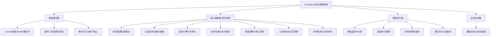
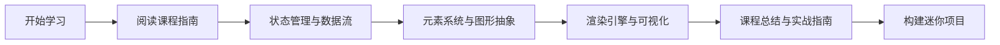
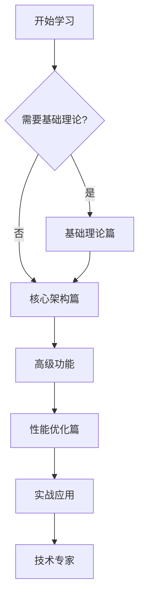
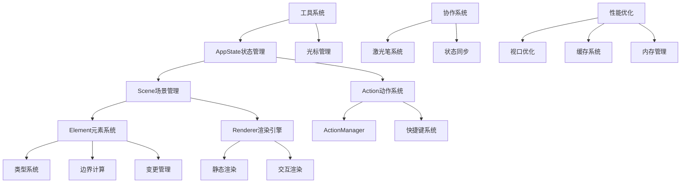
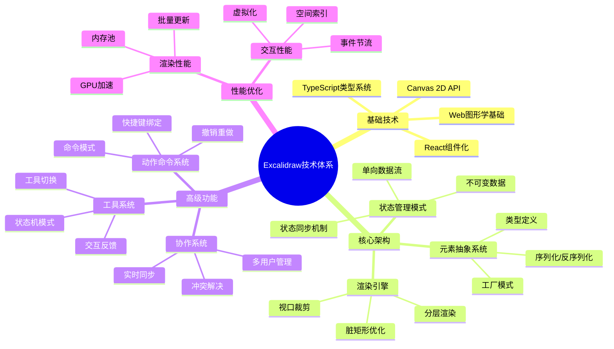
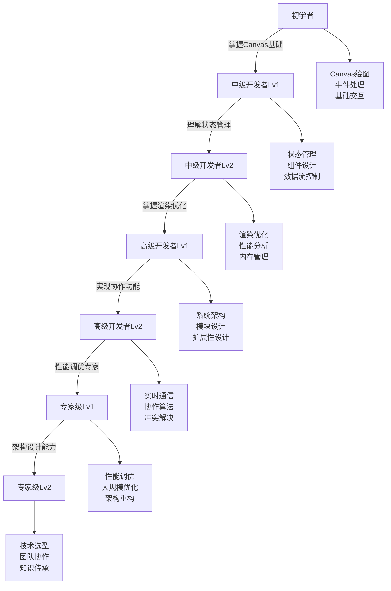
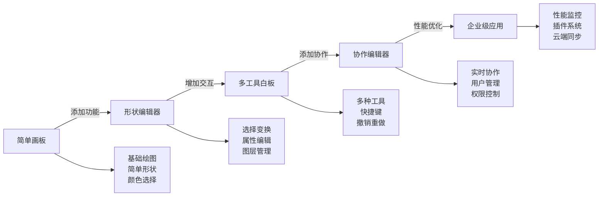
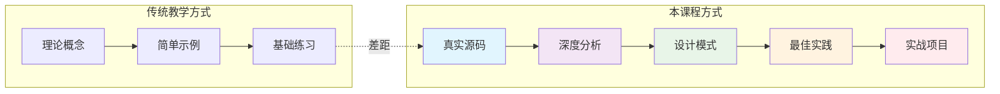

# Excalidraw技术课程架构图

## 📊 课程整体结构

## 🔥 核心学习路径

### 路径1：快速掌握（推荐新手）

### 路径2：全面深入（推荐进阶）

## 🏗️ 技术架构依赖关系

### 核心系统依赖图

## 📚 知识体系图谱

### 前端图形应用知识体系

## 🎯 技能提升路径

### 从入门到精通的技能树

## 🔧 实战项目进阶路线

### 项目复杂度递进

## 📈 学习进度追踪

### 建议的学习里程碑

```mermaid
gantt
    title Excalidraw技术学习时间线
    dateFormat  X
    axisFormat %d周
    
    section 基础阶段
    课程指南阅读        :active, guide, 0, 2d
    Canvas基础学习      :canvas, after guide, 3d
    状态管理理解        :state, after canvas, 4d
    
    section 核心阶段  
    元素系统掌握        :element, after state, 5d
    渲染引擎学习        :render, after element, 5d
    动作系统理解        :action, after render, 4d
    
    section 高级阶段
    场景管理学习        :scene, after action, 4d
    工具系统掌握        :tools, after scene, 4d
    协作系统理解        :collab, after tools, 5d
    
    section 实战阶段
    性能优化学习        :perf, after collab, 6d
    项目实践构建        :project, after perf, 10d
    技能综合应用        :master, after project, 5d
```

## 🌟 课程特色亮点

### 真实源码 vs 理论教学

### 学习深度对比

| 维度 | 传统教程 | 本课程 |
|------|----------|---------|
| **代码来源** | 示例代码 | 生产环境真实代码 |
| **复杂度** | 简化版本 | 完整系统架构 |
| **实用性** | 入门级别 | 企业级应用 |
| **深度** | 表面概念 | 底层实现细节 |
| **实战性** | 理论为主 | 源码分析+实践 |

---

*通过这个架构图，你可以更清晰地了解整个课程的学习路径和知识体系。建议保存此图作为学习导航！* 🧭